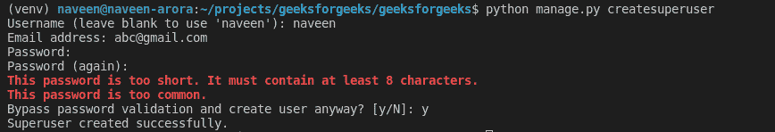
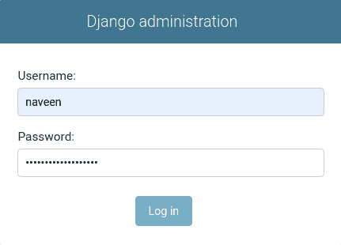
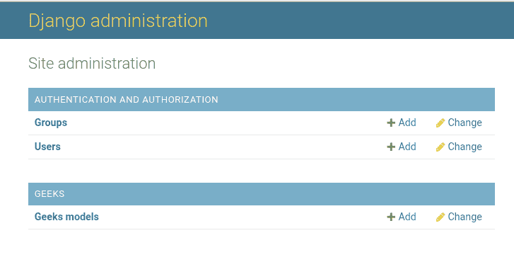
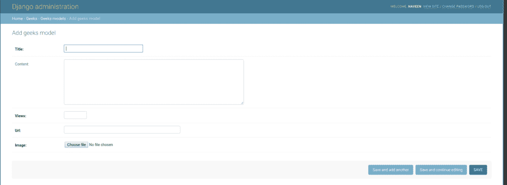

# 姜戈管理界面中的渲染模型

> 原文:[https://www . geesforgeks . org/render-model-in-django-admin-interface/](https://www.geeksforgeeks.org/render-model-in-django-admin-interface/)

在 admin 中渲染模型是指将模型添加到 admin 界面，这样就可以使用 admin 界面轻松操作数据。Django 的 ORM 提供了一个预定义的管理界面，可以通过执行插入、搜索、选择、创建等操作来操作数据。就像普通数据库一样。要开始在模型中输入数据并使用管理界面，需要在 admin.py 中指定或呈现模型。

## 姜戈管理界面解释中的渲染模型

考虑一个名为 geeksforgeeks 的项目，它有一个名为 geeks 的应用程序。让我们初始化一个在博客中有标题、内容、视图、网址、图像等字段的模型。要了解更多关于各种字段及其实现的信息，请访问[姜戈模型数据类型和字段列表](https://www.geeksforgeeks.org/django-model-data-types-and-fields-list/)。

> 请参考以下文章，查看如何在 Django 中创建项目和应用程序。
> 
> *   [如何利用姜戈的 MVT 创建基础项目？](https://www.geeksforgeeks.org/how-to-create-a-basic-project-using-mvt-in-django/)
> *   [如何在姜戈创建 App？](https://www.geeksforgeeks.org/how-to-create-an-app-in-django/)

将以下代码输入**极客** app 的 models.py 文件。

## 蟒蛇 3

```
from django.db import models
from django.db.models import Model
# Create your models here.

class GeeksModel(models.Model):
    title = models.CharField(max_length = 200)
    content = models.TextField(max_length = 200, null = True, blank = True)
    views = models.IntegerField()
    url = models.URLField(max_length = 200)
    image = models.ImageField()
```

可以使用 django shell 轻松创建该模型的实例，但是要访问管理面板并使用管理面板插入、删除或修改数据，需要遵循以下步骤:

*   在开始使用 django 的管理界面之前，需要在 django 中创建超级用户。超级用户就像一个管理员，可以访问和修改一个特定的姜戈项目的一切。要创建超级用户，请在终端中输入以下命令。

```
Python  createsuperuser
```

*   输入您的**姓名**、**邮箱**、**密码**、**确认密码**。



*   现在让我们登录到管理面板



*   是时候在这个管理界面中呈现我们的模型了。转到极客应用程序中的 admin.py 并输入以下代码。从 models.py 导入相应的模型，并将其注册到管理界面。

## 蟒蛇 3

```
from django.contrib import admin

# Register your models here.
from .models import GeeksModel

admin.site.register(GeeksModel)
```

*   现在让我们检查一下我们的管理界面。访问[http://localhost:8000/admin/](http://localhost:8000/admin/)



*   要将数据添加到模型中，点击**添加**，并在必填字段中输入相应的数据。点击保存。



宾果游戏..！！模型极客模型已成功呈现在管理界面中。人们可以在 Django 管理界面中类似地渲染所有类型的模型和任意数量的模型。

#### 另请检查–

*   [使用 __str__ 函数更改对象显示名称–姜戈模型](https://www.geeksforgeeks.org/change-object-display-name-using-__str__-function-django-models-python/)
*   [内置现场验证–姜戈车型](https://www.geeksforgeeks.org/built-in-field-validations-django-models/)