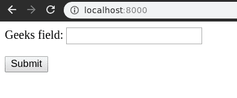
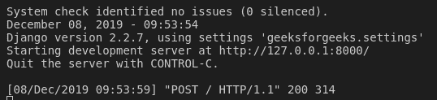

# 必需-姜戈表单域验证

> 原文:[https://www . geesforgeks . org/required-django-form-field-validation/](https://www.geeksforgeeks.org/required-django-form-field-validation/)

姜戈表单中的内置表单字段验证是所有字段预定义的默认验证。每个字段都带有来自姜戈[验证器](https://docs.djangoproject.com/en/2.2/ref/validators/)的一些内置验证。每个字段类构造函数都有一些固定的参数。有些字段类接受额外的、特定于字段的参数，但必须始终接受。

`required`通常用于使该字段可选，即用户不再需要在该字段中输入数据，该字段仍将被接受。让我们检查如何使用项目在字段中要求用户。

**语法**

```
field_name = models.Field(option = value)
```

## 姜戈表单域验证`required`解释

使用示例说明所需的。考虑一个名为`geeksforgeeks`的项目，它有一个名为`geeks`的应用程序。

> 请参考以下文章，查看如何在 Django 中创建项目和应用程序。
> 
> *   [如何利用姜戈的 MVT 创建基础项目？](https://www.geeksforgeeks.org/how-to-create-a-basic-project-using-mvt-in-django/)
> *   [如何在姜戈创建 App？](https://www.geeksforgeeks.org/how-to-create-an-app-in-django/)

将以下代码输入**极客** app 的`forms.py`文件。我们将使用 CharField 对所有字段选项进行实验。

```
from django import forms

class GeeksForm(forms.Form):
    geeks_field = forms.CharField(required = False)
```

将极客应用添加到`INSTALLED_APPS`

```
# Application definition

INSTALLED_APPS = [
    'django.contrib.admin',
    'django.contrib.auth',
    'django.contrib.contenttypes',
    'django.contrib.sessions',
    'django.contrib.messages',
    'django.contrib.staticfiles',
    'geeks',
]
```

现在，为了将这个表单呈现为一个视图，我们需要一个视图和一个映射到该视图的 URL。让我们首先在极客应用的 `views.py`中创建一个视图，

```
from django.shortcuts import render
from .forms import GeeksForm

# Create your views here.
def home_view(request):
    context = {}
    form = GeeksForm(request.POST or None)
    context['form'] = form
    if request.POST:
        if form.is_valid():
            temp = form.cleaned_data.get("geeks_field")
            print(temp)
    return render(request, "home.html", context)
```

这里，我们从 forms.py 导入该特定表单，并在视图中创建它的一个对象，以便它可以在模板中呈现。
现在，要创建一个姜戈表单，你需要创建一个 home.html，在那里你可以按照他们喜欢的方式设计东西。让我们在`home.html`中创建一个表单。

```
<form method = "POST">
    
    {{ form }}
    <input type = "submit" value = "Submit">
</form>
```

最后，在 urls.py 中映射到此视图的 URL

```
from django.urls import path

# importing views from views..py
from .views import home_view

URLpatterns = [
    path('', home_view ),
]
```

让我们运行服务器并检查实际发生了什么，运行

```
Python manage.py runserver
```



因此，通过将“_”替换为“”，创建了一个 `geeks_field` **字符域**。

## 如何在 Django 表单字段中使用必填项？

`required`通常用于使该字段可选，即用户不再需要在该字段中输入数据，该字段仍将被接受。让我们检查如何在使用项目的字段中使用 required。当设置为特定值时，所使用的选项会根据开发人员的要求向字段追加一些验证。

让我们尝试通过我们创建的 Django 网络应用程序使用必需的，访问 [http://localhost:8000/](http://localhost:8000/) 并尝试根据字段上应用的选项或验证输入值。点击提交。



因此，即使极客字段中没有任何数据，字段也会接受表单。这使得`required=False`实施成功。

#### 更多内置表单验证

| 字段选项 | 描述 |
| --- | --- |
| [必需](https://www.geeksforgeeks.org/required-django-form-field-validation/) | 默认情况下，每个字段类都假设该值是必需的，因此要使其不是必需的，您需要设置`required=False` |
| 标签 | label 参数允许您为此字段指定“人性化”标签。当字段显示在表单中时使用。 |
| [标签 _ 后缀](https://www.geeksforgeeks.org/label-django-form-field-validation/) | 标签后缀参数允许您在每个字段的基础上覆盖表单的[标签后缀](https://docs.djangoproject.com/en/2.2/ref/forms/fields/#label-suffix)。 |
| 小部件 | widget 参数允许您指定呈现此字段时要使用的 Widget 类。有关更多信息，请参见[小部件](https://docs.djangoproject.com/en/2.2/ref/forms/widgets/)。 |
| [帮助 _ 文字](https://www.geeksforgeeks.org/help_text-django-form-field-validation/) | 帮助文本参数允许您为此字段指定描述性文本。如果提供 help_text，当字段通过方便的表单方法之一呈现时，它将显示在字段旁边。 |
| [错误信息](https://www.geeksforgeeks.org/error_messages-django-form-field-validation/) | error_messages 参数允许您覆盖该字段将引发的默认消息。传入一个字典，其关键字与您想要覆盖的错误消息相匹配。 |
| [验证器](https://www.geeksforgeeks.org/django-form-field-custom-widgets/) | validators 参数允许您为此字段提供一个验证函数列表。 |
| [本地化](http://localize) | localize 参数允许对表单数据输入以及呈现的输出进行本地化。 |
| [禁用](https://www.geeksforgeeks.org/disabled-django-form-field-validation/)。 | 禁用的布尔参数设置为真时，使用禁用的 HTML 属性禁用表单字段，这样用户就无法编辑它。 |