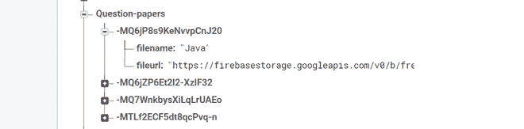

# 从 Firebase 中检索姜戈的 PDF 文件

> 原文:[https://www . geesforgeks . org/retrieve-pdf-file-in-django-from-firebase/](https://www.geeksforgeeks.org/retrieve-pdf-file-in-django-from-firebase/)

[**Firebase**](https://www.geeksforgeeks.org/firebase-introduction/)**是谷歌的一款产品，帮助开发者轻松构建、管理和开发他们的应用。它帮助开发者以更快、更安全的方式构建他们的应用程序。在 firebase 端不需要编程，这使得更有效地使用它的特性变得容易。它提供云存储，并使用 NoSQL 存储数据。**

****Django** 另一方面，是一个基于 Python 的 web 框架，它允许您快速创建 web 应用程序，而没有通常使用其他框架会发现的所有安装或依赖问题。**

**这里我们将学习如何实现一个简单的 Django 应用程序，它可以检索存储在 firebase 中的 PDF 文件。在本文、中，我们将主要关注的姜戈方面。如果你想跟着做，上传一个虚拟的 PDF 到你的 firebase 存储器中。如果您是新加入 firebase 的，请参考[本](https://www.geeksforgeeks.org/create-a-website-using-html-css-and-javascript-that-stores-data-in-firebase/)。**

**在这里，我们将学习如何在 **Firebase** 中使用 Django 检索 PDF。**

### **在姜戈创建项目:**

**使用以下命令创建一个 Django 项目:**

```py
$ django-admin startproject pdffinder
```

**让我们验证一下你的姜戈项目是否有效。如果还没有，请切换到外部项目目录，并运行以下命令:**

```py
$ python manage.py runserver
```

**您将在命令行上看到以下输出:**

```py
Performing system checks...
System check identified no issues (0 silenced).
You have unapplied migrations; your app may not work properly until they are applied.
Run 'python manage.py migrate' to apply them.
April 14, 2021 - 15:50:53
Django version 3.2, using settings 'pdffinder.settings'
Starting development server at http://127.0.0.1:8000/
Quit the server with CONTROL-C.
```

### **将 Firebase 数据库集成到 Django 项目中:**

**现在，我们希望您已经在姜戈创建了一个项目。如果没有，那么参考[如何在姜戈使用 MVT 创建一个基础项目？](https://www.geeksforgeeks.org/how-to-create-a-basic-project-using-mvt-in-django/)由于我们使用 firebase 作为数据库，我们需要安装**。为此，在终端中键入以下命令:****

```py
**$pip install pyrebase4**
```

### ******实施:******

****按照以下步骤从 firebase 检索姜戈的 PDF 文件:****

******第一步:**进入*项目目录。*****

******第二步:**转到**URL . py**文件，创建一个路径，移动到网页上搜索数据。****

## ****计算机编程语言****

```py
**from django.contrib import admin
from django.urls import path
from . import views

urlpatterns = [

    path('search/', views.search),
]**
```

******第三步**:然后移动到**view . py**文件，编写如下函数渲染到 HTML 页面。****

## ****计算机编程语言****

```py
**from django.shortcuts import render
from django.views.decorators.http import require_http_methods
from django.views.decorators.csrf import csrf_exempt
from django.contrib.auth.decorators import login_required
import pyrebase

config={

    "databaseURL": "YOUR DATABASE URL",
    "projectId": "YOUR PROJECT ID",

}

#firebase configuration & authentication
firebase=pyrebase.initialize_app(config)
authe = firebase.auth()
database=firebase.database()

def search(request):
    return render(request, "search.html")**
```

******第 4 步:**然后我们将移动到**search.html**页面，并编写以下代码在 firebase 中搜索数据。评论写在里面，以便更好地理解。****

## ****超文本标记语言****

```py
**
<html lang="en">
   <head>
      <title>Search Page</title>
      <meta name="viewport" content="width=device-width, initial-scale=1.0">
      <link rel="stylesheet" href="https://maxcdn.bootstrapcdn.com/bootstrap/4.5.2/css/bootstrap.min.css">
      <script src="https://ajax.googleapis.com/ajax/libs/jquery/3.5.1/jquery.min.js"></script>
      <script src="https://cdnjs.cloudflare.com/ajax/libs/popper.js/1.16.0/umd/popper.min.js"></script>
      <script src="https://maxcdn.bootstrapcdn.com/bootstrap/4.5.2/js/bootstrap.min.js"></script>
      <link rel='stylesheet' href="">
      <link rel="stylesheet" type="text/css" href="">
   </head>
   <body>
      <div class="container">
         <div class="inner">
            <form method="post" action="/searchusers/">
               

               // Type the name of pdf you want to retrieve
               <input type="text" placeholder="Enter Title..." aria-label="Search.." name="search"
                  id="search">

                // We will be selecting category of search
                // pdf as we want to retrieve odf
               <select name="category" id="category" name="">
                  <option value="">Select Category</option>
                  <option value="Question-papers">Search Pdf</option>
               </select>
               <input type="submit" value="Find">
            </form>
         </div>
      </div>
   </body>
</html>**
```

******第五步:**转到 **urls.py** 文件，创建一个路径，移动到**在 views.py 中的 searchnotes** 功能，搜索数据。****

## ****计算机编程语言****

```py
**from django.contrib import admin
from django.urls import path
from . import views

urlpatterns = [
      path('searchpdf/', views.searchnotes),
]**
```

******第 6 步:**然后转到**view . py**文件，编写以下函数搜索给定名称的 PDF。****

## ****计算机编程语言****

```py
**from django.shortcuts import render
from django.views.decorators.http import require_http_methods
from django.views.decorators.csrf import csrf_exempt
from django.contrib.auth.decorators import login_required
import pyrebase

config = {
    "databaseURL": "********************",
    "projectId": "********************",
}
firebase = pyrebase.initialize_app(config)
authe = firebase.auth()
database = firebase.database()

# function to request a query
# to the firebase database
def searchpdf(request):
    value = request.POST.get("search")
    if value == "":
        return render(request, "search.html")
    title = request.POST["category"]
    if title == "":
        return render(request, "search.html")
    if value is None or title is None:
        print(value, "Value", title)
        return render(request, "search.html")
    else:
        print(value)
        if title == "Question-papers":

            # search
            # for content inside the node Question-papers in firebase
            data = database.child("Question-papers").shallow().get().val()
            id = []

            # if found then append the value of i in id
            for i in data:
                id.append(i)
            for i in id:
                val = (
                    database.child("Question-papers")
                    .child(i)
                    .child("filename")
                    .get()
                    .val()
                )

                # if id is equal to what we are
                # looking for the get the link or
                # return to serach page
                if val == value:
                    requid = i
                    fileurl = (
                        database.child("Question-papers")
                        .child(requid)
                        .child("fileurl")
                        .get()
                        .val()
                    )
                    return render(request, "searchNotes.html",
                                  {"fileurl": fileurl})
                else:
                    return render(request, "search.html")**
```

******第 7 步:**然后我们将移动到**searchnotes.html**页面，当我们从 firebase 获得 PDF 链接时，将显示 PDF。****

## ****计算机编程语言****

```py
**

<html lang="en">
<head>
  <title>Questions & Notes</title>
  <meta name="viewport" content="width=device-width, initial-scale=1.0">
    <link rel="stylesheet" href="Search.css">
  <link rel="stylesheet" href="https://maxcdn.bootstrapcdn.com/bootstrap/4.5.2/css/bootstrap.min.css">
  <script src="https://ajax.googleapis.com/ajax/libs/jquery/3.5.1/jquery.min.js"></script>
  <script src="https://cdnjs.cloudflare.com/ajax/libs/popper.js/1.16.0/umd/popper.min.js"></script>
  <script src="https://maxcdn.bootstrapcdn.com/bootstrap/4.5.2/js/bootstrap.min.js"></script>
        <link rel='stylesheet' href="">

</head>
<body>
<div class="tm-container">
      <div class="tm-main-content text-center">
<embed
    src={{fileurl}}
    type="application/pdf"
    frameBorder="0"
    scrolling="auto"
    height="100%"
    width="100%"
></embed>
      </div>

  <br>
  <script>
    $(document).ready(function(){
      $('.dropdown-submenu a.test').on("click", function(e){
        $(this).next('ul').toggle();
        e.stopPropagation();
        e.preventDefault();
      });
    });
    </script>

</div>
</body>
</html>**
```

******输出代码:******

****<video class="wp-video-shortcode" id="video-589369-1" width="640" height="360" preload="metadata" controls=""><source type="video/mp4" src="https://media.geeksforgeeks.org/wp-content/uploads/20210315002358/20210315_001958.mp4?_=1">[https://media.geeksforgeeks.org/wp-content/uploads/20210315002358/20210315_001958.mp4](https://media.geeksforgeeks.org/wp-content/uploads/20210315002358/20210315_001958.mp4)</video>************