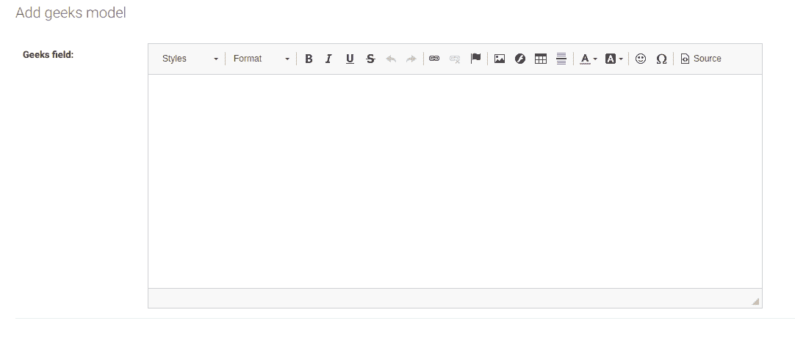

# 法官文场–姜戈模特

> 原文:[https://www.geeksforgeeks.org/richtextfield-django-models/](https://www.geeksforgeeks.org/richtextfield-django-models/)

**RichTextField** 一般用于存储可以存储任何类型数据的段落。富文本是用常见格式选项格式化的文本，如粗体、斜体、图像、纯文本不可用的网址。

**语法:**

```py
field_name=RichTextField()
```

**Django 模型 RichTextField 解释**

使用示例说明 RichTextField。考虑一个名为 geeksforgeeks 的项目，它有一个名为 geeks 的应用程序。

> 请参考以下文章，查看如何在 Django 中创建项目和应用程序。
> 
> *   [如何利用姜戈的 MVT 创建基础项目？](https://www.geeksforgeeks.org/how-to-create-a-basic-project-using-mvt-in-django/)
> *   [如何在姜戈创建 App？](https://www.geeksforgeeks.org/how-to-create-an-app-in-django/)

现在，通过在终端或命令提示符下输入以下命令来安装 django-ckeditor 包。

```py
pip install django-ckeditor
```

转到 settings.py，将 ckeditor 和极客应用程序添加到 INSTALLED_APPS

## 蟒蛇 3

```py
# Application definition
INSTALLED_APPS = [
    'django.contrib.admin',
    'django.contrib.auth',
    'django.contrib.contenttypes',
    'django.contrib.sessions',
    'django.contrib.messages',
    'django.contrib.staticfiles',
    'ckeditor',
    'geeks',
]
```

在极客应用程序的 models.py 文件中输入以下代码。

## 蟒蛇 3

```py
from django.db import models
from django.db.models import Model
from ckeditor.fields import RichTextField

# Create your models here.
class GeeksModel(Model):
    geeks_field = RichTextField()
```

当我们从终端运行 makemigrations 命令时，

```py
python manage.py makemigrations
```

将在 geeks 目录中创建一个名为 migrations 的新文件夹，文件名为 0001_initial.py

## 蟒蛇 3

```py
# Generated by Django 3.2.3 on 2021-05-13 09:40

import ckeditor.fields
from django.db import migrations, models

class Migration(migrations.Migration):

    initial = True

    dependencies = [
    ]

    operations = [
        migrations.CreateModel(
            name='GeeksModel',
            fields=[
                ('id', models.BigAutoField(
                  auto_created=True, primary_key=True,
                  serialize=False, verbose_name='ID')),

                ('geeks_field', ckeditor.fields.RichTextField()),
            ],
        ),
    ]
```

现在快跑，

```py
python manage.py migrate
```

因此，当您在项目上运行迁移时，会创建一个 geeks_field RichTextField。它是存储大数据的字段。转到 admin.py 并注册您的模型。

## 蟒蛇 3

```py
from django.contrib import admin
from .models import GeeksModel

# Register your models here.
admin.site.register(GeeksModel)
```

**如何使用 RichTextField？**

RichTextField 用于在数据库中存储不同类型(图像、URL、粗体文本等)的大型数据。现在让我们在管理服务器中检查它。每当我们点击添加极客模型，我们可以看到一个丰富的文本字段

