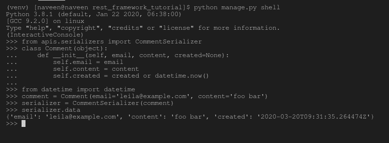

# 序列化程序–姜戈 REST 框架

> 原文:[https://www . geesforgeks . org/serializer-django-rest-framework/](https://www.geeksforgeeks.org/serializers-django-rest-framework/)

Django REST 框架中的序列化程序负责将对象转换为 javascript 和前端框架可以理解的数据类型。序列化程序还提供反序列化，允许在首先验证传入数据后，将解析的数据转换回复杂类型。REST 框架中的序列化程序的工作方式与 Django 的 Form 和 ModelForm 类非常相似。最常用的两个主要序列化程序是[模型序列化程序](https://www.geeksforgeeks.org/modelserializer-in-serializers-django-rest-framework/)和[超链接模型序列化程序](https://www.geeksforgeeks.org/hyperlinkedmodelserializer-in-serializers-django-rest-framework/)。
本文围绕如何在 Django REST 框架中从头开始使用序列化程序来高级序列化程序字段和参数展开。假设你熟悉[如何用 Django REST 框架启动一个项目？](https://www.geeksforgeeks.org/how-to-create-a-basic-api-using-django-rest-framework/)

*   [创建和使用序列化程序](#create-use-serializer)
*   [模型串行器](#modelserializer)
*   [超链接模型序列化器](#hyperlinkedmodelserializer)
*   [串行器字段](#serializer-fields)
*   [序列化程序字段中的核心参数](#core-arguments)

## 创建和使用序列化程序

#### 创建基本序列化程序

要创建基本的序列化程序，需要从 rest_framework 导入序列化程序类，并为序列化程序定义字段，就像在 Django 中创建表单或模型一样。

**例**

## 蟒蛇 3

```py
# import serializer from rest_framework
from rest_framework import serializers

# create a serializer
class CommentSerializer(serializers.Serializer):
    # initialize fields
    email = serializers.EmailField()
    content = serializers.CharField(max_length = 200)
    created = serializers.DateTimeField()
```

通过这种方式，可以根据所需字段为任何特定实体或对象声明序列化程序。序列化程序可用于序列化和反序列化数据。

#### 使用序列化程序序列化数据

现在可以使用 CommentSerializer 来序列化注释或注释列表。同样，使用序列化程序类看起来很像使用表单类。让我们首先创建一个 comment 类来创建一个我们的序列化程序可以理解的 Comment 类型的对象。

## 蟒蛇 3

```py
# import datetime object
from datetime import datetime

# create a class
class Comment(object):
    def __init__(self, email, content, created = None):
        self.email = email
        self.content = content
        self.created = created or datetime.now()
# create a object
comment = Comment(email ='leila@example.com', content ='foo bar')
```

现在我们的对象已经准备好了，让我们试着序列化这个注释对象。运行以下命令，

```py
Python manage.py shell
```

现在运行以下代码

```py
# import comment serializer
>>> from apis.serializers import CommentSerializer

# import datetime for date and time
>>> from datetime import datetime

# create a object
>>> class Comment(object):
...     def __init__(self, email, content, created=None):
...         self.email = email
...         self.content = content
...         self.created = created or datetime.now()
... 

# create a comment object
>>> comment = Comment(email='leila@example.com', content='foo bar')

# serialize the data
>>> serializer = CommentSerializer(comment)

# print serialized data
>>> serializer.data
```

现在让我们检查这个的输出，



要查看更多关于如何创建和使用序列化程序的信息，请访问–[创建和使用序列化程序](http://Creating and Using Serializers)

## 模型串行器

模型序列化程序类提供了一个快捷方式，允许您自动创建一个序列化程序类，该类包含与模型字段相对应的字段。

模型序列化程序类与常规序列化程序类相同，只是:

*   它会根据模型自动为您生成一组字段。
*   它将自动为序列化程序生成验证器，例如 unique_together 验证器。
*   它包括的简单默认实现。创建()和。更新()。

**语法–**

## 蟒蛇 3

```py
class SerializerName(serializers.ModelSerializer):
    class Meta:
        model = ModelName
        fields = List of Fields
```

**示例–**

## 蟒蛇 3

```py
class AccountSerializer(serializers.ModelSerializer):
    class Meta:
        model = Account
        fields = ['id', 'account_name', 'users', 'created']
```

默认情况下，类中的所有模型字段都将映射到相应的序列化程序字段。
要查看如何在项目中使用模型序列化程序，请访问–[序列化程序中的模型序列化程序–姜戈 REST 框架](https://www.geeksforgeeks.org/modelserializer-in-serializers-django-rest-framework/)。

## 超链接模型序列化程序

HyperlinkedModelSerializer 类类似于 ModelSerializer 类，只是它使用超链接来表示关系，而不是主键。默认情况下，序列化程序将包含 url 字段，而不是主键字段。url 字段将使用 HyperlinkedIdentityField 序列化程序字段表示，模型上的任何关系都将使用 HyperlinkedRelatedField 序列化程序字段表示。

**语法–**

## 蟒蛇 3

```py
class SerializerName(serializers.HyperlinkedModelSerializer):
    class Meta:
        model = ModelName
        fields = List of Fields
```

**示例–**

## 蟒蛇 3

```py
class AccountSerializer(serializers.HyperlinkedModelSerializer):
    class Meta:
        model = Account
        fields = ['id', 'account_name', 'users', 'created']
```

要查看如何在项目中使用超链接模型序列化程序，请访问序列化程序–姜戈 REST 框架中的–[超链接模型序列化程序。](https://www.geeksforgeeks.org/hyperlinkedmodelserializer-in-serializers-django-rest-framework/) 

## 序列化字段

<figure class="table">

| 字段名 | 描述 |
| --- | --- |
| [布林栏位](https://www.geeksforgeeks.org/boolean-fields-in-serializers-django-rest-framework/#booleanfield) | 用于包装真值或假值的布尔字段。 |
| [零乌头田](https://www.geeksforgeeks.org/boolean-fields-in-serializers-django-rest-framework/#nullbooleanfield) | 接受真、假和空值的布尔字段。 |
| [夏菲尔德](https://www.geeksforgeeks.org/string-fields-in-serializers-django-rest-framework/#charfield) | CharField 用于存储文本表示。 |
| [EmailField](https://www.geeksforgeeks.org/string-fields-in-serializers-django-rest-framework/#emailfield) | EmailField 也是一种文本表示，它验证文本是有效的电子邮件地址。 |
| [regexffield](https://www.geeksforgeeks.org/string-fields-in-serializers-django-rest-framework/#regexfield) | 正如名称所定义的，RegexField 将字符串与特定的 regex 匹配，否则会引发错误。 |
| 尖叫场 | URLField 基本上是一个正则表达式字段，它根据 URL 匹配模式验证输入。 |
| [斯拉格菲尔德](https://www.geeksforgeeks.org/url-fields-in-serializers-django-rest-framework/#slugfield) | SlugField 是一个 RegexField，它根据模式[a-zA-Z0-9_-]+，验证输入。 |
| ipaddress field | IPAddressField 是确保输入是有效的 IPv4 或 IPv6 字符串的字段。 |
| [整数文件](https://www.geeksforgeeks.org/numeric-fields-in-serializers-django-rest-framework/#integerfield) | IntegerField 基本上是一个整数字段，它根据 Python 的 int 实例验证输入。 |
| [浮动字段](https://www.geeksforgeeks.org/numeric-fields-in-serializers-django-rest-framework/#floatfield) | FloatField 基本上是一个浮动字段，它根据 Python 的 float 实例验证输入。 |
| [十进制字段](https://www.geeksforgeeks.org/numeric-fields-in-serializers-django-rest-framework/#decimalfield) | 十进制字段基本上是一个十进制字段，它根据 Python 的十进制实例验证输入。 |
| [日期时间字段](https://www.geeksforgeeks.org/date-and-time-fields-in-serializers-django-rest-framework/#datetimefield) | DateTimeField 是用于日期和时间表示的序列化程序字段。 |
| 约会场 | 日期字段是用于日期表示的序列化程序字段。 |
| [时间域](https://www.geeksforgeeks.org/date-and-time-fields-in-serializers-django-rest-framework/#timefield) | Timefield 是用于时间表示的序列化程序字段。 |
| 耐久性场 | 持续时间字段是用于持续时间表示的序列化程序字段。 |
| [选择字段](https://www.geeksforgeeks.org/choice-selection-fields-in-serializers-django-rest-framework/#choicefield) | ChoiceField 基本上是一个字符域，它根据一组有限选项中的一个值来验证输入。 |
| [多选择字段](https://www.geeksforgeeks.org/choice-selection-fields-in-serializers-django-rest-framework/#multiplechoicefield) | MultipleChoiceField 基本上是一个字符域，它根据从一组有限的选项中选择的一组零个、一个或多个值来验证输入。 |
| [文件字段](https://www.geeksforgeeks.org/file-upload-fields-in-serializers-django-rest-framework/#filefield) | FileField 基本上是一种文件表示。它执行 Django 的标准文件字段验证。 |
| [图像场](https://www.geeksforgeeks.org/file-upload-fields-in-serializers-django-rest-framework/#imagefield) | ImageField 是一种图像表示。它验证上传的文件内容是否与已知的图像格式相匹配。 |
| 上市场 | 列表字段基本上是一个列表字段，它根据对象列表验证输入。 |
| [JSONField](https://www.geeksforgeeks.org/jsonfield-in-serializers-django-rest-framework/) | JSONField 基本上是一个字段类，用于验证传入的数据结构是否由有效的 JSON 原语组成。 |
| [隐藏字段](https://www.geeksforgeeks.org/hiddenfield-in-serializers-django-rest-framework/) | HiddenField 是一个字段类，它不根据用户输入取值，而是从默认值或可调用值中取值。 |
| 听写场 | DictField 基本上是一个字典字段，它根据对象字典验证输入。 |

</figure>

## 序列化程序字段中的核心参数

Django 中的序列化程序字段与 Django 表单字段和 Django 模型字段相同，因此需要某些参数来操作这些字段的行为。

<figure class="table">

| 争吵 | 描述 |
| --- | --- |
| [只读](https://www.geeksforgeeks.org/core-arguments-in-serializer-fields-django-rest-framework/#read_only) | 将该值设置为 True 以确保在序列化表示时使用该字段，但在反序列化期间创建或更新实例时不使用该字段 |
| [只写 _ 条](https://www.geeksforgeeks.org/core-arguments-in-serializer-fields-django-rest-framework/#write_only) | 将此设置为“真”，以确保该字段可以在更新或创建实例时使用，但在序列化表示时不包括在内。 |
| [必需](https://www.geeksforgeeks.org/core-arguments-in-serializer-fields-django-rest-framework/#required) | 将此设置为 False 还允许在序列化实例时从输出中省略对象属性或字典键。 |
| [默认](https://www.geeksforgeeks.org/core-arguments-in-serializer-fields-django-rest-framework/#default) | 如果设置，这将给出默认值，如果未提供输入值，该默认值将用于该字段。 |
| [允许 _ 空](https://www.geeksforgeeks.org/core-arguments-in-serializer-fields-django-rest-framework/#allow_null) | 通常情况下，如果将“无”传递给序列化程序字段，将会引发错误。如果“无”应被视为有效值，则将此关键字参数设置为“真”。 |
| [来源](https://www.geeksforgeeks.org/core-arguments-in-serializer-fields-django-rest-framework/#source) | 将用于填充字段的属性的名称。 |
| [验证器](https://www.geeksforgeeks.org/core-arguments-in-serializer-fields-django-rest-framework/#validators) | 应该应用于输入字段输入的验证函数列表，这些函数要么引发验证错误，要么简单地返回。 |
| [错误信息](https://www.geeksforgeeks.org/core-arguments-in-serializer-fields-django-rest-framework/#error_messages) | 错误信息的错误代码字典。 |
| 标签 | 一个短文本字符串，可用作 HTML 表单字段或其他描述性元素中的字段名称。 |
| [帮助 _ 文字](https://www.geeksforgeeks.org/core-arguments-in-serializer-fields-django-rest-framework/#help_text) | 一个文本字符串，可用作 HTML 表单字段或其他描述性元素中字段的描述。 |
| [初始](https://www.geeksforgeeks.org/core-arguments-in-serializer-fields-django-rest-framework/#initial) | 应该用于预先填充 HTML 表单字段值的值。 |

</figure>