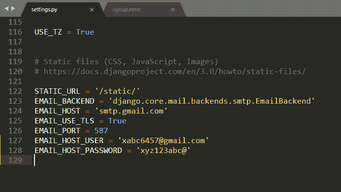
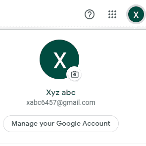
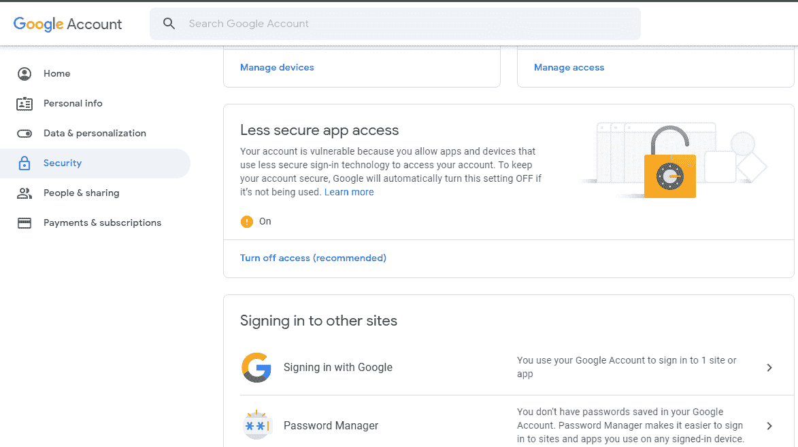

# 在姜戈项目

中设置发送邮件

> 原文:[https://www . geesforgeks . org/setup-sensing-email-in-django-project/](https://www.geeksforgeeks.org/setup-sending-email-in-django-project/)

难道你没有观察到，当你在一些网站上注册时，你会收到来自那个公司或机构的邮件吗？电子邮件将是，验证电子邮件或欢迎电子邮件，帐户创建成功电子邮件或致谢电子邮件等。例如，当您创建一个谷歌帐户时，您收到的第一封邮件可能是这样的:“嗨，Xyz，欢迎来到谷歌。您的新帐户可以访问谷歌的产品、应用和服务……”从您的 Django 应用程序发送这些类型的电子邮件非常容易。
虽然你可以参考[文档](https://docs.djangoproject.com/en/3.0/topics/email/)来了解更多关于在姜戈发送电子邮件的信息，但这是非常精简和容易的。

**如何给你的 Django 应用的注册用户发送简单的邮件**

Django 电子邮件示例。考虑一个名为 geeksforgeeks 的项目，它有一个名为 geeks 的应用程序。参考[这个](https://www.geeksforgeeks.org/django-basics/)创建 Django 项目和应用。现在让我们在 geeksforgeeks 项目中演示一下。在“极客”应用的**设置. py** 文件中，输入以下内容:

```py
EMAIL_BACKEND = 'django.core.mail.backends.smtp.EmailBackend'
EMAIL_HOST = 'smtp.gmail.com'
EMAIL_USE_TLS = True
EMAIL_PORT = 587
EMAIL_HOST_USER = #sender's email-id
EMAIL_HOST_PASSWORD = #password associated with above email-id
```



在上面的代码中，EMail _ HOST _ USER = ' xabc 6457 @ Gmail . com '和 EMail _ HOST _ PASSWORD = ' XYZ 123 ABAC @ '是需要添加发件人邮件 id 和密码的行。xabc6457@gmail.com 和 xyz123abc @只是例子。

现在在我们的应用程序中使用它，移动到**视图。py** 并在顶部添加这些线，如下所示。
T3】

```py
from django.conf import settings
from django.core.mail import send_mail
```

一般邮件都是发给注册的用户，对吗？因此，在注册视图功能中，添加这些行。

```py
subject = 'welcome to GFG world'
message = f'Hi {user.username}, thank you for registering in geeksforgeeks.'
email_from = settings.EMAIL_HOST_USER
recipient_list = [user.email, ]
send_mail( subject, message, email_from, recipient_list )
```

现在我们将了解到底发生了什么。在这里，

*   `subject`指邮件主题。
*   `message`指邮件消息，邮件的正文。
*   `email_from`指发件人的详细信息。这将从 settings.py 文件中获取 EMAIL_HOST_USER，您之前在该文件中添加了这些代码行。
*   `recipient_list`是邮件必须发送到的收件人列表，也就是说，无论谁注册到您的应用程序，他们都会收到电子邮件。
*   `send_mail`是一个内置的 Django 函数，以主题、消息、email_from 和收件人列表为参数，负责发送邮件。

在这些额外的代码行被添加到您的项目后，您现在可以发送电子邮件了。但是如果你正在使用 Gmail，那么当你第一次在你的项目中进行这些更改并运行时，你可能会得到 **SMTP 错误**。

要纠正这一点-
1-转到用发件人的邮件地址注册的谷歌帐户，并选择*管理您的帐户*


2-转到左侧导航的*安全*部分并向下滚动。在*不太安全的应用程序访问*中，打开访问。默认情况下，它是关闭的。


**最后运行应用。**
现在，将任何用户注册到您的应用程序，他们将从您提到的电子邮件帐户接收邮件。