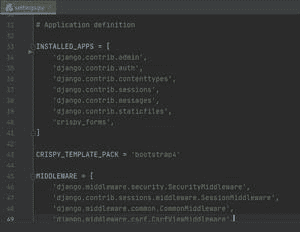
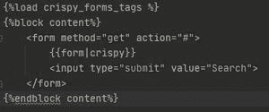
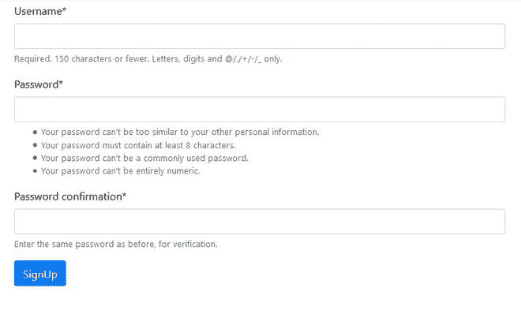

# 用姜戈脆形造型姜戈形

> 原文:[https://www . geesforgeks . org/style-django-forms-with-django-脆皮-forms/](https://www.geeksforgeeks.org/styling-django-forms-with-django-crispy-forms/)

默认情况下，Django 不提供任何 Django 表单样式方法，因此需要花费大量的精力和宝贵的时间来漂亮地设计表单。django-脆皮-表单为我们解决了这个问题。它将让您以一种非常优雅和干燥的方式控制您的 Django 表单的呈现行为。

#### 所需模块:

*   姜戈:[姜戈安装](https://www.geeksforgeeks.org/django-introduction-and-installation/)
*   django-脆皮-形式

#### 安装 django-脆皮-表单:

```
pip install django-crispy-forms

```

**配置姜戈设置:**

在 settings.py 中向 INSTALLED_APPS 添加“脆皮 _ 表单”，

并添加

```
CRISPY_TEMPLATE_PACK = 'bootstrap4'

```

在 INSTALLED_APPS 之后。



到目前为止，我们已经配置了 django-脆皮表单所需的设置。

**在 django 模板中使用 Django-脆皮形式:**

首先，我们需要在 django 模板中加载 django-脆皮-forms 标签。

要加载 django-脆皮表单标签，请添加

```
 

```

在 django 模板的顶部

现在要用 django-脆皮-表单来设计任何表单，请替换

```
{{ form }}

```

随着

```
{{ form|crispy }}

```



答对了，你成功地用 django-脆皮-forms 设计了你的表单。

**现在你可以通过运行服务器**来查看你的 Django 表单中的变化

```
python manage.py runserver

```



使用 django 风格的注册页面示例