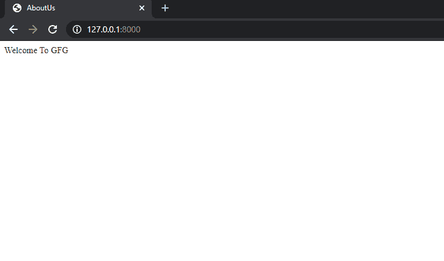

# 模板视图–基于类的通用视图姜戈

> 原文:[https://www . geesforgeks . org/template view-基于类-泛型-view-django/](https://www.geeksforgeeks.org/templateview-class-based-generic-view-django/)

Django 提供了几个基于类的通用视图来完成常见任务。其中最简单的是 TemplateView。它呈现给定的模板，上下文包含在 URL 中捕获的参数。

当您想要在 HTML 页面上呈现一些信息时，应该使用 TemplateView。当您的页面有表单并创建或更新对象时，不应使用 TemplateView。在这种情况下， [FormView](https://www.geeksforgeeks.org/formview-class-based-views-django/?ref=rp) 、 [CreateView](https://www.geeksforgeeks.org/createview-class-based-views-django/?ref=rp) 或 [UpdateView](https://www.geeksforgeeks.org/updateview-class-based-views-django/?ref=rp) 是更好的选择。

TemplateView 最适合以下情况:

*   像静态页面一样显示“关于我们”，几乎不需要任何上下文。尽管如此，在 TemplateView 中使用上下文变量还是很容易的。
*   显示处理 GET 请求并且没有表单的页面。

**说明:**

使用示例说明如何使用模板视图。考虑一个名为 geeksforgeeks 的项目，它有一个名为 geeks 的应用程序。

> 请参考以下文章，查看如何在 Django 中创建项目和应用程序。
> 
> [如何利用姜戈的 MVT 创建基础项目？](https://www.geeksforgeeks.org/how-to-create-a-basic-project-using-mvt-in-django/)
> [](https://www.geeksforgeeks.org/how-to-create-an-app-in-django/)
> 
> [如何在姜戈创建 App？](https://www.geeksforgeeks.org/how-to-create-an-app-in-django/)

让我们使用基类视图视图编写一个视图，然后修改它以使用 TemplateView。TemplateView 将帮助我们避免几行代码。

*   将以下代码输入极客应用程序的 views.py 文件。

## 蟒蛇 3

```
from django.views.generic.base import View
from django.shortcuts import render

class AboutUs(View):
  def get(self, request, *args, **kwargs):
        return render(request, "aboutus.html")
```

*   在极客应用程序中创建一个名为 templates 的文件夹，然后在 templates 文件夹中创建一个名为 aboutus.html 的文件。
*   在 aboutus.html 文件中输入以下代码。

## 超文本标记语言

```
<!DOCTYPE html>
<html>
<head>
<title>AboutUs</title>
</head>
<body>
<h2>Welcome To GFG</h2>
</body>
</html>
```

*   在 geeksforgeeks 项目文件夹的 urls.py 中输入以下代码。

## 蟒蛇 3

```
from django.contrib import admin
from django.urls import path
from geeks.views import AboutUs

urlpatterns = [
    path('admin/', admin.site.urls),
      path('',AboutUs.as_view(),name="aboutus")
]
```

*   运行以下三个命令查看输出。

```
Python manage.py makemigrations
Python manage.py migrate
Python manage.py runserver
```

*   同样的输出可以使用 TemplateView 实现，用下面给出的代码替换极客应用程序的 views.py 文件的代码。

## 蟒蛇 3

```
from django.views.generic.base import TemplateView

class AboutUs(TemplateView):
    template_name = 'aboutus.html'
```

让我们看看 http://localhost:8000/

**输出–**

