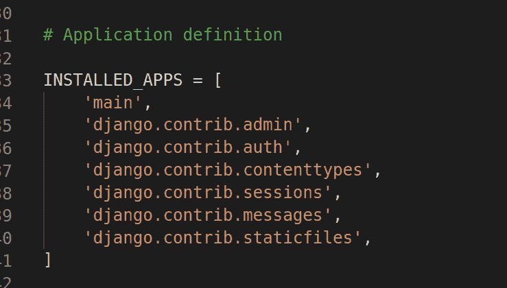
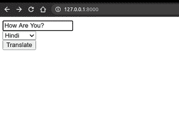
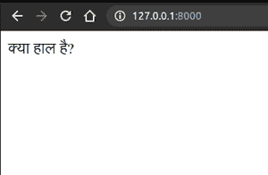
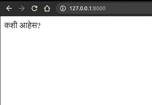

# 使用 Django 的翻译器应用项目

> 原文:[https://www . geesforgeks . org/translator-app-project-using-django/](https://www.geeksforgeeks.org/translator-app-project-using-django/)

Django 是一个高级 Python Web 框架，它鼓励快速开发和干净、实用的设计。它由经验丰富的开发人员构建，解决了许多网络开发的麻烦，因此您可以专注于编写应用程序，而无需重新发明轮子。这是免费的开源软件。

> *参考以下文章，查看如何在 Django 中创建项目和应用。*
> 
> *   [*<u>如何利用姜戈的 MVT 创建基础项目？</u>*](https://www.geeksforgeeks.org/how-to-create-a-basic-project-using-mvt-in-django/)
> *   [*<u>如何在姜戈创建 App？</u>*](https://www.geeksforgeeks.org/how-to-create-an-app-in-django/)

在本文中，我们将使用 Django 制作一个翻译应用程序。

**安装**

```py
pip install django
```

从一种语言到另一种语言的文本翻译对于各种网站来说越来越普遍，因为它们迎合了国际受众。帮助我们做到这一点的 python 包叫做**翻译**。

```py
pip install translate
```

然后创建新项目

```py
django-admin startproject translator
```

```py
cd translator
```

然后在项目中创建新的应用程序

```py
python manage.py startapp main
```

然后在**设置中添加应用名称**



**view . py**

## 蟒蛇 3

```py
from django.shortcuts import render,HttpResponse
from translate import Translator
# Create your views here.

def home(request):
    if request.method == "POST":
        text = request.POST["translate"]
        language = request.POST["language"]
        translator= Translator(to_lang=language)
        translation = translator.translate(text)
        return HttpResponse(translation)
    return render(request,"main/index.html")
```

然后在 app 内部创建目录**模板**。

在创建新目录**主目录**内

创建新文件**index.html**

## 超文本标记语言

```py
<!DOCTYPE html>
<html>
<head>
    <title>GFG</title>
</head>
<body>
<form method="post">
    
    <input type="text" name="translate" required>
    <br>
    <select required name="language">
        <option value="Hindi">Hindi</option>
        <option value="Marathi">Marathi</option>
        <option value="German">German</option>
    </select>
    <br>
    <button type="submit">Translate</button>
</form>
</body>
</html>
```

然后在应用内创建新文件**URL . py**

## 蟒蛇 3

```py
from django.urls import path
from .views import *

urlpatterns = [
    path('',home,name="home"),
]
```

然后在网址**内添加**main . URL**译者/URL . py**

## 蟒蛇 3

```py
from django.contrib import admin
from django.urls import path,include

urlpatterns = [
    path('admin/', admin.site.urls),
    path('',include("main.urls"))
]
```

要运行此应用程序，请打开 cmd 或终端

```py
python manage.py runserver
```

**输出:-**

   