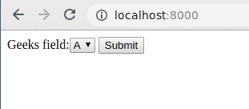
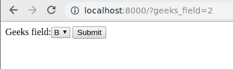
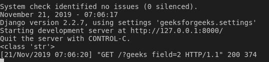

# Typdchoicefield–姜戈表格

> 原文:[https://www . geeksforgeeks . org/typeddchoicefield-django-forms/](https://www.geeksforgeeks.org/typedchoicefield-django-forms/)

Django Forms 中的 TypedChoiceField 是一个类似于 ChoiceField 的字段，用于从可用选项列表中选择特定选项。它用于实现国家、国家等。比如已经定义了信息并且用户必须选择一个的字段。它用于接受用户的文本输入。该输入的默认部件是[选择](https://docs.djangoproject.com/en/2.2/ref/forms/widgets/#django.forms.Select)。它规范化为:字符串。它用于将值强制转换为特定的数据类型。

**TypedChoiceField 有一个额外的必需参数:**

*   **选项:**
    要么是用作该字段选项的二元组的[可迭代](https://docs.python.org/3/glossary.html#term-iterable)，要么是返回这种可迭代的可调用。此参数接受与模型字段的 choices 参数相同的格式。

**TypedChoiceField 有两个可选参数:**

*   **强制:**
    接受一个参数并返回强制值的函数。示例包括内置的 int、float、bool 和其他类型。默认为标识函数。
*   **空值:**
    用来表示“空”的值默认为空字符串；这里没有其他常见的选择。

**语法**

```py
field_name = forms.TypedChoiceField(**options)
```

## Django 表单类型选择字段解释

使用示例说明类型选择字段。考虑一个名为`geeksforgeeks`的项目，它有一个名为`geeks`的应用程序。

> 请参考以下文章，查看如何在 Django 中创建项目和应用程序。
> 
> *   [如何利用姜戈的 MVT 创建基础项目？](https://www.geeksforgeeks.org/how-to-create-a-basic-project-using-mvt-in-django/)
> *   [如何在姜戈创建 App？](https://www.geeksforgeeks.org/how-to-create-an-app-in-django/)

将以下代码输入**极客** app 的`forms.py`文件。

```py
from django import forms

# iterable
GEEKS_CHOICES = (
    (1, "A"),
    (2, "B"),
    (3, "C"),
    (4, "D"),
    (5, "E"),
)

# creating a form 
class GeeksForm(forms.Form):
    geeks_field = forms.TypedChoiceField(
                   choices = GEEKS_CHOICES,
                   coerce = str
                  )
```

将极客应用添加到`INSTALLED_APPS`

```py
# Application definition

INSTALLED_APPS = [
    'django.contrib.admin',
    'django.contrib.auth',
    'django.contrib.contenttypes',
    'django.contrib.sessions',
    'django.contrib.messages',
    'django.contrib.staticfiles',
    'geeks',
]
```

现在要将这个表单呈现为一个视图，我们需要一个视图和一个映射到该 URL 的 URL。让我们首先在极客应用的 `views.py`中创建一个视图，

```py
from django.shortcuts import render
from .forms import GeeksForm

# Create your views here.
def home_view(request):
    context = {}
    context['form'] = GeeksForm()
    return render( request, "home.html", context)
```

这里，我们从 forms.py 导入该特定表单，并在视图中创建它的一个对象，以便它可以在模板中呈现。
现在，要创建一个姜戈表单，你需要创建一个 home.html，在那里你可以按照他们喜欢的方式设计东西。让我们在`home.html`中创建一个表单。

```py
<form method = "GET">
    {{ form }}
    <input type = "submit" value = "Submit">
</form>
```

最后，在 urls.py 中映射到此视图的 URL

```py
from django.urls import path

# importing views from views..py
from .views import home_view

urlpatterns = [
    path('', home_view ),
]
```

让我们运行服务器并检查实际发生了什么，运行

```py
Python manage.py runserver
```



因此，通过将“_”替换为“”，创建了一个 `geeks_field` **类型的“T2”。它是输入字符串选项的字段。**

## 如何使用 TypedChoiceField？

TypedChoiceField 用于输入数据库中的小字符串。可以输入州、国家、城市等。到目前为止，我们已经讨论了如何实现 TypedChoiceField，但是如何在视图中使用它来执行逻辑部分。为了执行一些逻辑，我们需要将输入到字段中的值输入到 python 字符串实例中。
在视图中，

```py
from django.shortcuts import render
from .forms import GeeksForm

# Create your views here.
def home_view(request):
    context ={}
    form = GeeksForm(request.GET or None)
    context['form']= form
    if request.GET and form.is_valid():
        temp = form.cleaned_data.get("geeks_field")
        print(type(temp))
    return render(request, "home.html", context)
```

现在让我们尝试向字段中输入数据。



现在可以使用相应的请求字典来获取这些数据。如果方法是获取，数据将在**请求中可用。获取**和如果发布，**请求。相应地开机自检**。我们使用了表单的**clean _ data**属性从视图中获取数据。在上面的例子中，我们有一个可以用于任何目的的 temp 值。



它将 int 变量 2 显示为字符串类，因为该值是由 TypedChoiceField 强制的。这是选择字段相对于类型选择字段的优势。

## 核心字段参数

核心字段参数是为每个字段提供的参数，用于对特定字段应用某种约束或赋予特定特征。例如，在 TypedChoiceField 中添加参数`required = False`将允许用户将其留空。每个字段类构造函数至少接受这些参数。有些字段类采用额外的、特定于字段的参数，但以下参数应始终被接受:

| 字段选项 | 描述 |
| --- | --- |
| [必需](https://www.geeksforgeeks.org/required-django-form-field-validation/) | 默认情况下，每个字段类都假设该值是必需的，因此要使其不是必需的，您需要设置`required=False` |
| 标签 | label 参数允许您为此字段指定“人性化”标签。当字段显示在表单中时使用。 |
| [标签 _ 后缀](https://www.geeksforgeeks.org/label-django-form-field-validation/) | 标签后缀参数允许您在每个字段的基础上覆盖表单的[标签后缀](https://docs.djangoproject.com/en/2.2/ref/forms/fields/#label-suffix)。 |
| 小部件 | widget 参数允许您指定呈现此字段时要使用的 Widget 类。有关更多信息，请参见[小部件](https://docs.djangoproject.com/en/2.2/ref/forms/widgets/)。 |
| [帮助 _ 文字](https://www.geeksforgeeks.org/help_text-django-form-field-validation/) | 帮助文本参数允许您为此字段指定描述性文本。如果提供 help_text，当字段通过方便的表单方法之一呈现时，它将显示在字段旁边。 |
| [错误信息](https://www.geeksforgeeks.org/error_messages-django-form-field-validation/) | error_messages 参数允许您覆盖该字段将引发的默认消息。传入一个字典，其关键字与您想要覆盖的错误消息相匹配。 |
| [验证器](https://www.geeksforgeeks.org/django-form-field-custom-widgets/) | validators 参数允许您为此字段提供一个验证函数列表。 |
| [本地化](http://localize) | localize 参数允许对表单数据输入以及呈现的输出进行本地化。 |
| [禁用](https://www.geeksforgeeks.org/disabled-django-form-field-validation/)。 | 禁用的布尔参数设置为真时，使用禁用的 HTML 属性禁用表单字段，这样用户就无法编辑它。 |