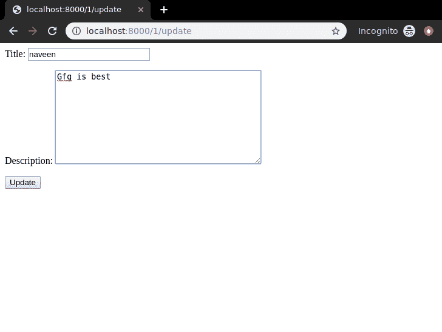
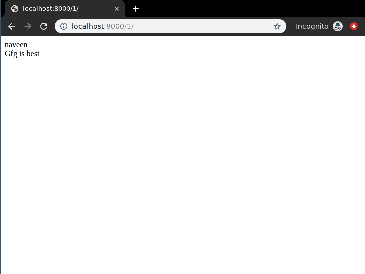

# 更新视图–基于功能的视图姜戈

> 原文:[https://www . geesforgeks . org/update-view-function-based-view-django/](https://www.geeksforgeeks.org/update-view-function-based-views-django/)

更新视图是指用一些额外的细节从数据库中更新表的特定实例的视图(逻辑)。它用于更新数据库中的条目，例如，更新 geeksforgeeks 上的一篇文章。因此更新视图必须显示表单中的旧数据，并且只允许用户从那里更新数据。Django 为 Update Views 提供了非常普通的支持，但是让我们检查一下它是如何通过基于函数的视图手动完成的。本文围绕更新视图展开，涉及到[姜戈表单](https://www.geeksforgeeks.org/django-forms/)、[姜戈模型](https://www.geeksforgeeks.org/django-models/)等概念。

对于更新视图，我们需要一个项目与一些模型和多个实例将被显示。基本上，更新视图是详细视图和创建视图的组合。

### 姜戈更新视图-基于功能的视图

使用示例说明如何创建和使用更新视图。考虑一个名为 geeksforgeeks 的项目，它有一个名为 geeks 的应用程序。

> 请参考以下文章，查看如何在 Django 中创建项目和应用程序。
> 
> *   [如何利用姜戈的 MVT 创建基础项目？](https://www.geeksforgeeks.org/how-to-create-a-basic-project-using-mvt-in-django/)
> *   [如何在姜戈创建 App？](https://www.geeksforgeeks.org/how-to-create-an-app-in-django/)

在你有一个项目和一个应用程序后，让我们创建一个模型，我们将通过我们的视图创建实例。极客/模特。py，

## 蟒蛇 3

```
# import the standard Django Model
# from built-in library
from django.db import models

# declare a new model with a name "GeeksModel"
class GeeksModel(models.Model):

    # fields of the model
    title = models.CharField(max_length = 200)
    description = models.TextField()

    # renames the instances of the model
    # with their title name
    def __str__(self):
        return self.title
```

创建这个模型后，我们需要运行两个命令来为其创建数据库。

```
Python manage.py makemigrations
Python manage.py migrate
```

现在让我们使用 shell 创建这个模型的一些实例，运行 form bash，

```
Python manage.py shell
```

输入以下命令

```
>>> from geeks.models import GeeksModel
>>> GeeksModel.objects.create(
                       title="title1",
                       description="description1").save()
>>> GeeksModel.objects.create(
                       title="title2",
                       description="description2").save()
>>> GeeksModel.objects.create(
                       title="title2",
                       description="description2").save()
```

现在我们已经为后端做好了一切准备。验证实例是否已从[http://localhost:8000/admin/geeks/geeks model/](http://localhost:8000/admin/geeks/geeksmodel/)创建


现在我们将为此模型创建一个 Django 模型表单。有关模型表单–[姜戈模型表单–](https://geeksforgeeks.org/django-modelform-create-form-from-models/)从模型创建表单的更多信息，请参考本文。在 geeks 文件夹中创建一个 forms.py 文件，

## 蟒蛇 3

```
from django import forms
from .models import GeeksModel

# creating a form
class GeeksForm(forms.ModelForm):

    # create meta class
    class Meta:
        # specify model to be used
        model = GeeksModel

        # specify fields to be used
        fields = [
            "title",
            "description"]
```

对于 Update_view，需要一些标识来获取模型的特定实例。通常是唯一主键，如 **id** 。要指定这个标识，我们需要在 urls.py 中定义它。转到极客/URL . py，

## 蟒蛇 3

```
from django.urls import path

# importing views from views..py
from .views import update_view, detail_view

urlpatterns = [
    path('<id>/', detail_view ),
    path('<id>/update', update_view ),
]
```

让我们用解释来创建这些视图。极客/观点。py，

## 蟒蛇 3

```
from django.shortcuts import (get_object_or_404,
                              render,
                              HttpResponseRedirect)

# relative import of forms
from .models import GeeksModel
from .forms import GeeksForm

# after updating it will redirect to detail_View
def detail_view(request, id):
    # dictionary for initial data with
    # field names as keys
    context ={}

    # add the dictionary during initialization
    context["data"] = GeeksModel.objects.get(id = id)

    return render(request, "detail_view.html", context)

# update view for details
def update_view(request, id):
    # dictionary for initial data with
    # field names as keys
    context ={}

    # fetch the object related to passed id
    obj = get_object_or_404(GeeksModel, id = id)

    # pass the object as instance in form
    form = GeeksForm(request.POST or None, instance = obj)

    # save the data from the form and
    # redirect to detail_view
    if form.is_valid():
        form.save()
        return HttpResponseRedirect("/"+id)

    # add form dictionary to context
    context["form"] = form

    return render(request, "update_view.html", context)
```

现在在模板文件夹
中创建以下模板在极客/模板/update_view.html 中，

## 超文本标记语言

```
<div class="main">
    <!-- Create a Form -->
    <form method="POST">
        <!-- Security token by Django -->
        

        <!-- form as paragraph -->
        {{ form.as_p }}

        <input type="submit" value="Update">
    </form>

</div>
```

在极客/模板/detail_view.html 中，

## 超文本标记语言

```
<div class="main">
    <!-- Display attributes of instance -->
    {{ data.title }} <br/>
    {{ data.description }}
</div>
```

我们来看看是否一切正常，访问[http://localhost:8000/1/更新](http://localhost:8000/1/update)。


在这里你可以看到已经从实例中填充了数据的表单，现在你可以轻松编辑和更新这些数据，让我们来检查一下



点击更新完成。

