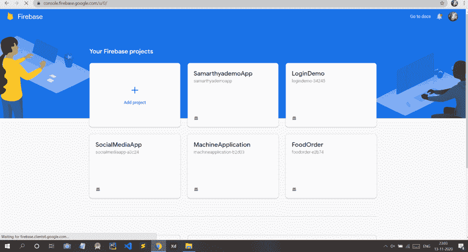
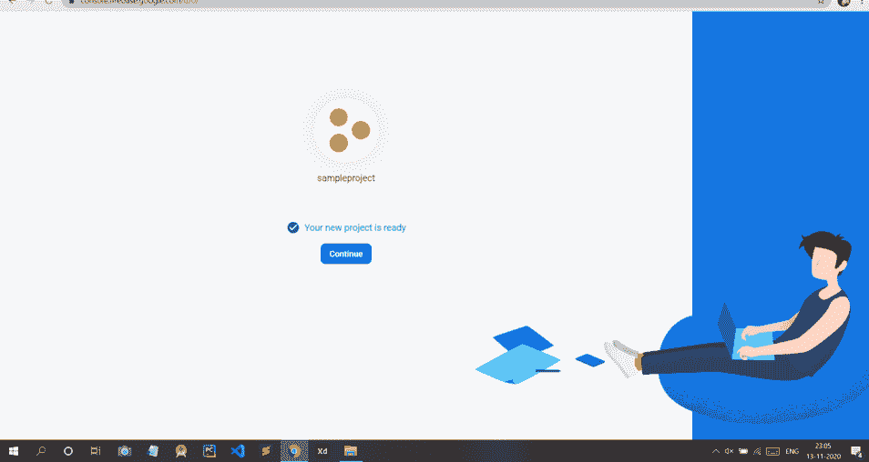
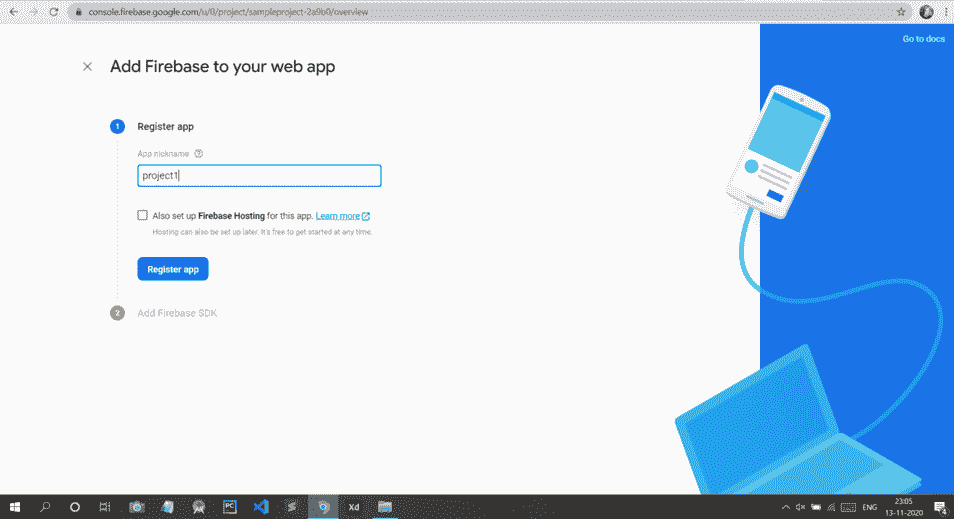
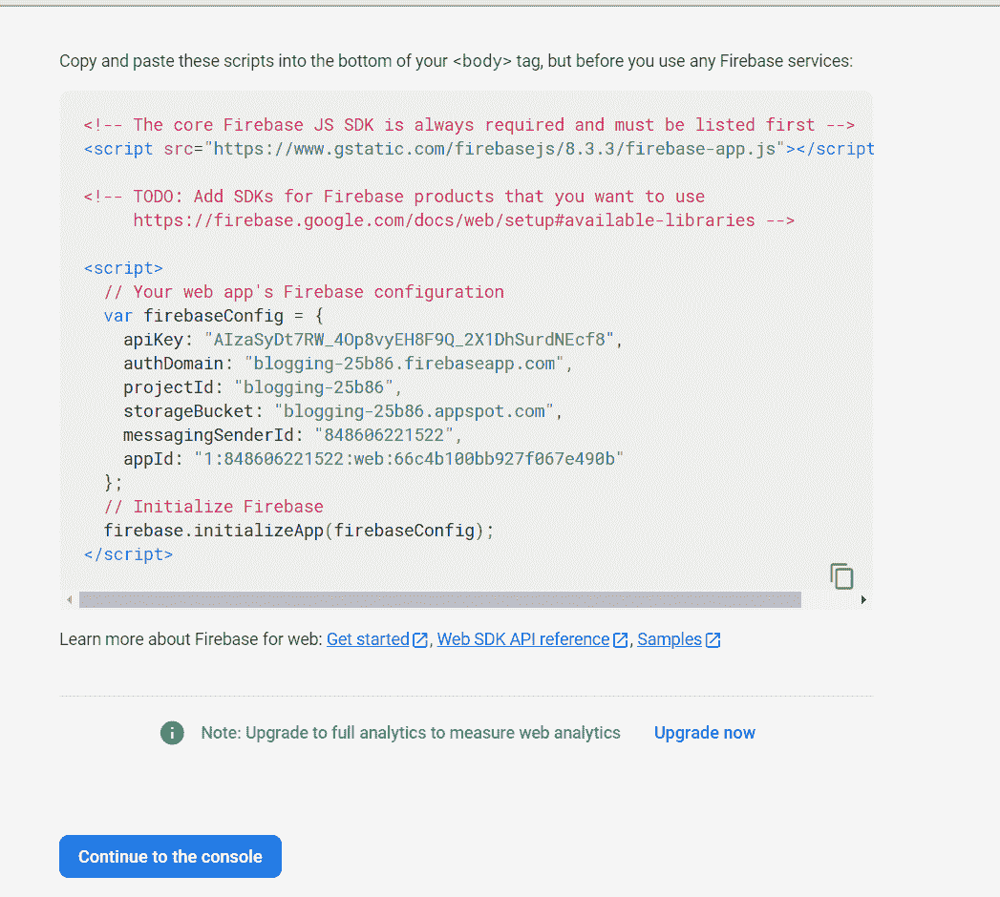
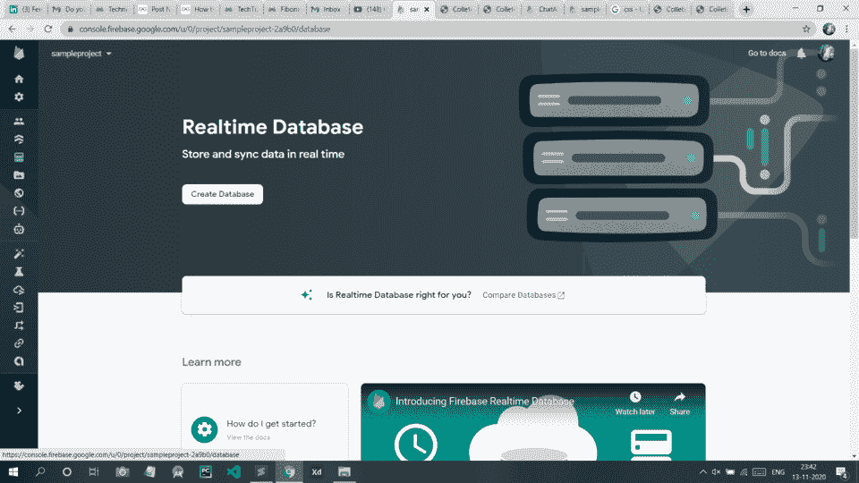
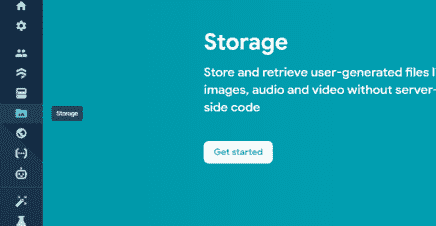
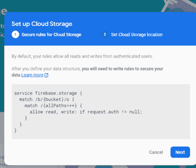
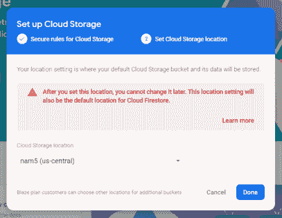

# 使用带 Firebase 的 Django 上传图像

> 原文:[https://www . geesforgeks . org/uploading-image-use-django-with-firebase/](https://www.geeksforgeeks.org/uploading-image-using-django-with-firebase/)

**Firebase** 是谷歌的一款产品，帮助开发者轻松构建、管理和开发他们的应用。它帮助开发者以更快、更安全的方式构建他们的应用程序。在 firebase 端不需要编程，这使得更有效地使用它的特性变得容易。它提供云存储。它使用 NoSQL 存储数据。

在这里，我们将学习如何在 firebase 中使用 Django 上传图像。使用数据库时，我们可能还需要上传一个 pdf 文件。

### **分步实施**

**第一步:**首先，我们要在 Firebase 上创建一个项目来连接我们的静态网页。请访问 Firebase 页面来配置您的项目。访问网站并单击“添加项目”按钮，如下所示:



**第 2 步:**给你的项目命名，然后点击继续按钮。


**步骤 3:** 现在点击继续按钮。


**第 4 步:**现在选择 Firebase 的默认账户，点击创建项目按钮。


**第五步:**现在你的项目创建完毕，你现在可以开始了。



**第六步:**现在点击第三个图标，那就是网页按钮(< / >)。


**第 7 步:**给你的网络项目取一个昵称，点击注册应用按钮。



**第八步:**现在你会看到你的 App 的配置是这样的。把这段代码复制到某个地方，因为我们以后会用到它。



**第 9 步:**点击实时数据库按钮，如图所示。


**第 10 步:**现在点击创建数据库。



**步骤 11:** 现在点击测试模式，然后点击启用。


**第 12 步:**激活火基储存。单击左侧的存储按钮，然后单击开始。



之后，这个盒子会弹出来。点击下一步。



然后点击完成。



### 在姜戈创建项目:

使用以下命令创建一个 Django 项目:

```
$ django-admin startproject imageupload
```

让我们验证一下你的姜戈项目是否有效。如果您还没有进入外部*我的网站*目录，运行以下命令:

```
$ python manage.py runserver
```

您将在命令行上看到以下输出:

```
Performing system checks...
System check identified no issues (0 silenced).
You have unapplied migrations; your app may not work properly until they are applied.
Run 'python manage.py migrate' to apply them.
April 09, 2021 - 15:50:53
Django version 3.2, using settings 'imageupload.settings'
Starting development server at http://127.0.0.1:8000/
Quit the server with CONTROL-C.
```

### 将 Firebase 数据库集成到 Django 项目中:

现在，我们希望您已经在姜戈创建了一个项目。如果没有，那么参考[如何在姜戈使用 MVT 创建一个基础项目？](https://www.geeksforgeeks.org/how-to-create-a-basic-project-using-mvt-in-django/)由于我们使用 firebase 作为数据库，我们需要安装**。为此，在终端中键入以下命令:**

```
$pip install pyrebase4
```

**直接在项目中创建一个 views.py 文件。结构应该是这样的。**

****第 13 步:**转到**URL . py**文件，创建一个路径移动到网页上传图片。**

## **计算机编程语言**

```
from django.contrib import admin
from django.urls import path
from . import views
urlpatterns = [

    path('check/',views.check,name="check"),

]
```

****第 14 步:**然后移动到 views.py 文件，编写如下函数渲染到 html 页面。**

## **计算机编程语言**

```
from django.shortcuts import render
import pyrebase

def check(request):
    return render(request,"check.html")
```

 ****第 15 步:**然后我们将移动到**check.html**页面，并编写以下代码在 firebase 中上传图像。评论写在里面，以便更好地理解。**

## **超文本标记语言**

```
<!DOCTYPE html>
<html lang="en">
<head>
    <meta charset="UTF-8">
    <title>Work</title>
    <style>
     body{
            background-image: url(https://images.unsplash.com/photo-1493723843671-1d655e66ac1c?ixlib=rb-1.2.1&ixid=eyJhcHBfaWQiOjEyMDd9&auto=format&fit=crop&w=1050&q=80);
        }
        div{
        position:absolute;
        right:10px;
        top:5px;
        }
        input{
            margin-top:20px;
            height: 30px;
            width: 150px;
            padding: 12px 20px;
            border-radius: 5px;
            color: black;
        }
        input[type="submit"]{
            background-color: rgba(7, 179, 185, 0.753);
            color: rgb(255, 255, 255);
            border: none;
            border-radius: 5px;
        }
        button{
            background-color: rgba(7, 179, 185, 0.753);
            color: white;
            width: 150px;
            height: 30px;
            border: none;
            border-radius: 5px;
            opacity: 0.3;
        }
    </style>
</head>
<body>
<div>
<button type="button" onclick="location.href='' ">Logout</button>
    </div>
<h2>Add Image</h2>
<form action="/postcreate/" method="post">
    
    <br>
    Title:
    <input type="text" name="work" required><br><br>
    Type Something:
    <textarea rows="5" cols="40" name="progress" required></textarea>
    <br><br>
    Document Upload:
    <input type="file" name="files[]" id="files">
    <input type="hidden" name="url" id="url">
    <button type="button" onclick="uploadimage()">Upload</button><br><br>
    <input type="submit" value="Submit"><br><br>
</form>
</body>
<script src="https://www.gstatic.com/firebasejs/3.7.4/firebase.js"></script>
<script>
    var firebaseConfig = {
    apiKey: "",
    authDomain: "",
    databaseURL:  "",
    storageBucket:  "",
  };
  firebase.initializeApp(firebaseConfig);
  function uploadimage(){
  var storage = firebase.storage();
  var file=document.getElementById("files").files[0];
  var storageref=storage.ref();
  var thisref=storageref.child(file.name).put(file);
  thisref.on('state_changed',function(snapshot) {
  console.log('Done');

  }, function(error) {
  console.log('Error',error);

}, function() {
  // Uploaded completed successfully, now we can get the download URL
  thisref.snapshot.ref.getDownloadURL().then(function(downloadURL) {
    console.log('File available at', downloadURL);
    document.getElementById("url").value=downloadURL;
    alert('uploaded successfully');
  });
});
}
</script>
</html>
```

**现在转到您的项目目录，并使用给定的命令运行我们的项目:**

```
python manage.py runserver
```

****输出:****

**<video class="wp-video-shortcode" id="video-587654-1" width="640" height="360" preload="metadata" controls=""><source type="video/mp4" src="https://media.geeksforgeeks.org/wp-content/uploads/20210315004346/20210315_004203.mp4?_=1">[https://media.geeksforgeeks.org/wp-content/uploads/20210315004346/20210315_004203.mp4](https://media.geeksforgeeks.org/wp-content/uploads/20210315004346/20210315_004203.mp4)</video>**