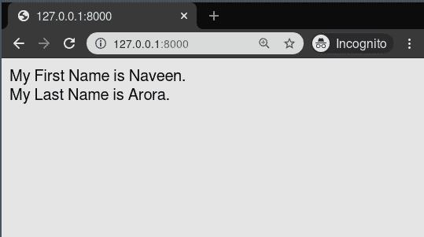

# 变量–姜戈模板

> 原文:[https://www.geeksforgeeks.org/variables-django-templates/](https://www.geeksforgeeks.org/variables-django-templates/)

Django 模板是使用 Django 模板语言标记的文本文档或 Python 字符串。Django 是一个强大的包含电池的框架，为在模板中呈现数据提供了便利。Django 模板不仅允许在视图和模板之间传递数据，还提供了一些有限的编程特性，比如变量、for 循环等。
本文围绕如何在 Template 中使用变量展开。变量从上下文中输出一个值，这是一个类似 dict 的对象，将键映射到值。

**语法:**

```
{{ variable_name }}
```

**示例:**
变量被如下{{ and }}包围:

```
My first name is {{ first_name }}. My last name is {{ last_name }}. 
```

使用{'first_name': 'Naveen '，' last_name': 'Arora'}的上下文，此模板呈现为:

```
My first name is Naveen. My last name is Arora.
```

## 变量-姜戈模板解释

举例说明如何在姜戈模板中使用变量。考虑一个名为 geeksforgeeks 的项目，它有一个名为 geeks 的应用程序。

> 请参考以下文章，查看如何在 Django 中创建项目和应用程序。
> 
> *   [如何利用姜戈的 MVT 创建基础项目？](https://www.geeksforgeeks.org/how-to-create-a-basic-project-using-mvt-in-django/)
> *   [如何在姜戈创建 App？](https://www.geeksforgeeks.org/how-to-create-an-app-in-django/)

现在创建一个视图，我们将通过它传递上下文字典。

## 蟒蛇 3

```
# import render from django
from django.shortcuts import render

# create a function
def geeks_view(request):
    # create a dictionary
    context = {
        "first_name" : "Naveen",
        "last_name"  : "Arora",
    }
    # return response
    return render(request, "geeks.html", context)
```

创建 url 路径以映射到此视图。在极客/URL . py 中，

## 蟒蛇 3

```
from django.urls import path

# importing views from views..py
from .views import geeks_view

urlpatterns = [
    path('', geeks_view),
]
```

在 templates/geeks.html 中创建模板，

## 超文本标记语言

```
My First Name is {{ first_name }}.
<br/>
My Last Name is  {{ last_name }}.
```

让我们检查一下变量是否显示在模板中。

