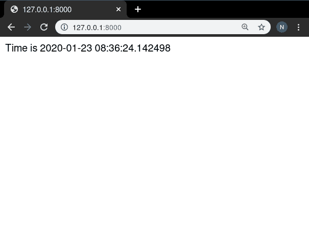
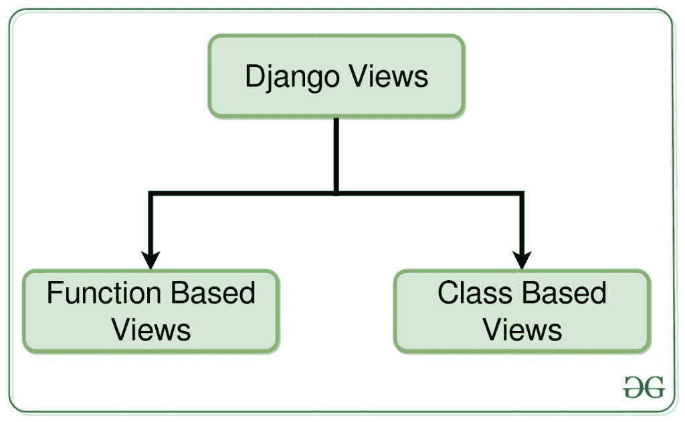

# 姜戈| Python 中的视图

> 原文:[https://www.geeksforgeeks.org/views-in-django-python/](https://www.geeksforgeeks.org/views-in-django-python/)

姜戈视图是姜戈的 [M **V** T 结构的重要参与者之一。根据姜戈文档，视图函数是一个 Python 函数，它接受一个](https://www.geeksforgeeks.org/django-project-mvt-structure/)[网络请求并返回一个网络响应](https://www.geeksforgeeks.org/django-request-and-response-cycle-httprequest-and-httpresponse-objects/)。这个**响应**可以是网页的 HTML 内容，或者是一个重定向，或者是一个 404 错误，或者是一个 XML 文档，或者是一个图像，任何网络浏览器可以显示的东西。

Django 视图是用户界面的一部分——它们通常将模板文件中的 HTML/CSS/Javascript 呈现为您在呈现网页时在浏览器中看到的内容。(注意，如果您已经使用了基于 [MVC(模型-视图-控制器)](https://www.geeksforgeeks.org/mvc-design-pattern/)的其他框架，不要混淆 Django 视图和 MVC 范例中的视图。Django 视图大致对应 MVC 中的控制器，Django 模板对应 MVC 中的视图。)


## 姜戈视图示例

使用示例说明如何创建和使用姜戈视图。考虑一个名为 geeksforgeeks 的项目，它有一个名为 geeks 的应用程序。

> 请参考以下文章，查看如何在 Django 中创建项目和应用程序。
> 
> *   [如何利用姜戈的 MVT 创建基础项目？](https://www.geeksforgeeks.org/how-to-create-a-basic-project-using-mvt-in-django/)
> *   [如何在姜戈创建 App？](https://www.geeksforgeeks.org/how-to-create-an-app-in-django/)

在你准备好一个项目后，我们可以在极客/视图中创建一个视图。

## 蟒蛇 3

```py
# import Http Response from django
from django.http import HttpResponse
# get datetime
import datetime

# create a function
def geeks_view(request):
    # fetch date and time
    now = datetime.datetime.now()
    # convert to string
    html = "Time is {}".format(now)
    # return response
    return HttpResponse(html)
```

让我们一次一行地浏览这段代码:

*   首先，我们从 django.http 模块导入类 **HttpResponse** ，以及 Python 的 datetime 库。
*   接下来，我们定义一个名为 geeks_view 的函数。这是视图功能。每个视图函数都以一个 HttpRequest 对象作为它的第一个参数，它通常被命名为 Request。
*   该视图返回一个包含生成的响应的 HttpResponse 对象。每个视图函数负责返回一个 **HttpResponse** 对象。

有关 HttpRequest 和 HttpResponse 的更多信息，请访问–[Django 请求和响应周期-http Request 和 HttpResponse 对象](https://www.geeksforgeeks.org/django-request-and-response-cycle-httprequest-and-httpresponse-objects/)
让我们开始工作吧。

## 蟒蛇 3

```py
from django.urls import path

# importing views from views..py
from .views import geeks_view

urlpatterns = [
    path('', geeks_view),
]
```

现在，访问 [http://127.0.0.1:8000/](http://127.0.0.1:8000/) ，



要查看如何使用姜戈的 MVT(模型、视图、模板)结构制作基本项目，请访问[创建姜戈项目](https://www.geeksforgeeks.org/django-introduction-set-2-creating-a-project/)。

## 视图的类型

Django 的观点分为两大类

*   基于功能的视图
*   基于类的视图



## 基于函数的视图

基于函数的视图是使用 python 中的函数编写的，该函数接收 HttpRequest 对象作为参数，并返回一个 HttpResponse 对象。基于函数的视图一般分为 4 种基本策略，即 CRUD(创建、检索、更新、删除)。CRUD 是任何开发框架的基础。

### 基于功能的视图示例–

让我们创建一个基于函数的视图列表视图来显示模型的实例。让我们创建一个模型，通过视图来创建实例。极客/模特。py，

## 蟒蛇 3

```py
# import the standard Django Model
# from built-in library
from django.db import models

# declare a new model with a name "GeeksModel"
class GeeksModel(models.Model):

    # fields of the model
    title = models.CharField(max_length = 200)
    description = models.TextField()

    # renames the instances of the model
    # with their title name
    def __str__(self):
        return self.title
```

创建这个模型后，我们需要运行两个命令来为其创建数据库。

```py
Python manage.py makemigrations
Python manage.py migrate
```

现在让我们使用 shell 创建这个模型的一些实例，运行 form bash，

```py
Python manage.py shell
```

输入以下命令

```py
>>> from geeks.models import GeeksModel
>>> GeeksModel.objects.create(
                       title="title1",
                       description="description1").save()
>>> GeeksModel.objects.create(
                       title="title2",
                       description="description2").save()
>>> GeeksModel.objects.create(
                       title="title2",
                       description="description2").save()
```

现在，如果您想在管理面板中看到您的模型及其数据，那么您需要注册您的模型。
让我们注册这个模型。在极客/管理员版中，

## 蟒蛇 3

```py
from django.contrib import admin
from .models import GeeksModel
# Register your models here.
admin.site.register(GeeksModel)
```

现在我们已经为后端做好了一切准备。验证实例是否已从[http://localhost:8000/admin/geeks/geeks model/](http://localhost:8000/admin/geeks/geeksmodel/)创建


让我们为其创建一个视图和模板。极客/观点。py，

## 蟒蛇 3

```py
from django.shortcuts import render

# relative import of forms
from .models import GeeksModel

def list_view(request):
    # dictionary for initial data with
    # field names as keys
    context ={}

    # add the dictionary during initialization
    context["dataset"] = GeeksModel.objects.all()

    return render(request, "list_view.html", context)
```

在 templates/list_view.html 中创建模板，

## 超文本标记语言

```py
<div class="main">

    .

    {{ data.title }}<br/>
    {{ data.description }}<br/>
    <hr/>

    

</div>
```

我们来看看[上有什么 http://localhost:8000/](http://localhost:8000/)


类似地，基于函数的视图可以用创建、更新、检索和删除视图的逻辑来实现。
[**姜戈 CRUD(创建、检索、更新、删除)基于功能的视图:-**](https://www.geeksforgeeks.org/django-crud-create-retrieve-update-delete-function-based-views/)

## 基于类的视图

基于类的视图提供了一种将视图实现为 Python 对象而不是函数的替代方法。它们不会取代基于函数的视图，但与基于函数的视图相比有一定的差异和优势:

*   与特定 HTTP 方法(GET、POST 等)相关的代码的组织。)可以通过单独的方法而不是条件分支来解决。
*   面向对象的技术，如 mixins(多重继承)可以用来将代码分解成可重用的组件。

基于类的视图比基于函数的视图管理起来更简单有效。一个有大量代码行的基于函数的视图可以转换成只有几行代码的基于类的视图。这就是面向对象编程产生影响的地方。

### 基于类的视图示例–

极客/观点。py，

## 蟒蛇 3

```py
from django.views.generic.list import ListView
from .models import GeeksModel

class GeeksList(ListView):

    # specify the model for list view
    model = GeeksModel
```

现在创建一个网址路径来映射视图。在极客/URL . py 中，

## 蟒蛇 3

```py
from django.urls import path

# importing views from views..py
from .views import GeeksList
urlpatterns = [
    path('', GeeksList.as_view()),
]
```

在 templates/geeks model _ list . html 中创建一个模板，

## 超文本标记语言

```py
<ul>
    <!-- Iterate over object_list -->
    
    <!-- Display Objects -->
    <li>{{ object.title }}</li>
    <li>{{ object.description }}</li>

    <hr/>
    <!-- If objet_list is empty  -->
    
    <li>No objects yet.</li>
    
</ul>
```

我们来看看[上有什么 http://localhost:8000/](http://localhost:8000/)T2】


[**姜戈 CRUD(创建、检索、更新、删除)基于类的通用视图:-**](https://www.geeksforgeeks.org/class-based-generic-views-django-create-retrieve-update-delete/)

*   [创建视图–基于类的视图姜戈](https://www.geeksforgeeks.org/createview-class-based-views-django/)
*   [详细视图–基于类的视图姜戈](https://www.geeksforgeeks.org/createview-class-based-views-django/)
*   [更新视图–基于类的视图姜戈](https://www.geeksforgeeks.org/updateview-class-based-views-django/)
*   [删除视图–基于类的视图姜戈](https://www.geeksforgeeks.org/deleteview-class-based-views-django/)
*   [表单视图–基于类的视图姜戈](https://www.geeksforgeeks.org/formview-class-based-views-django/)