# 使用 Django 框架的投票系统项目

> 原文:[https://www . geesforgeks . org/voting-system-project-use-django-framework/](https://www.geeksforgeeks.org/voting-system-project-using-django-framework/)

**项目名称:**使用 Django 框架的 Pollster(投票系统)web 应用
**应用类型(类别):** Web 应用。

**简介:**我们将使用 Django 创建一个民意调查(投票系统)web 应用程序。该应用程序将引导一系列问题以及许多选择。用户将被允许通过选择一个选项对该问题进行投票。根据答案，将计算总投票数，并将其显示给用户。用户也可以直接在网站上查看具体问题的总投票结果。我们还将建立这个项目的管理部分。管理员用户将被允许在应用程序中添加问题和管理问题。

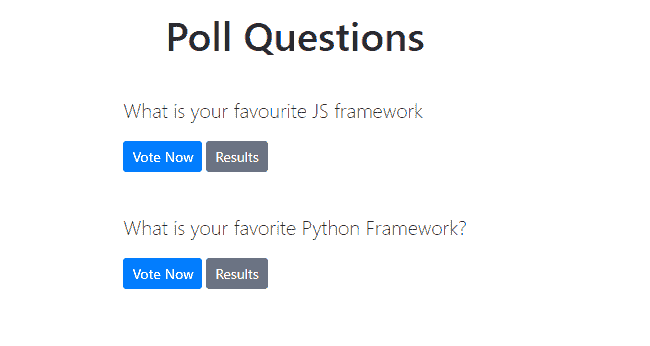

**先决条件:**Python 知识和 Django 框架基础。系统中应该安装 Python。Visual studio 代码或任何代码编辑器来处理应用程序。

**项目使用的技术:** Django 框架和默认自带的 SQLite 数据库。

### 项目的实施

#### 创建项目

**步骤 1:** 在你的目录中创建一个空文件夹**民意测验专家 _ 项目**。
**步骤 2:** 现在切换到您的文件夹，并使用以下命令在该文件夹中创建一个虚拟环境。

```py
pip install pipenv
```

```py
pipenv shell
```

**步骤-3:** 将从上面的步骤在您的文件夹中创建一个**点文件**。现在使用以下命令在您的文件夹中安装 Django。

```py
pipenv install django
```

**步骤-4:** 现在我们需要建立 Django 项目。在您的文件夹中运行以下命令，并启动一个 Django 项目。

```py
django-admin startproject pollster
```

将创建一个名为**民意测验专家**的新文件夹。使用以下命令切换到 poller 文件夹。

```py
cd pollster
```

文件夹结构看起来像这样。

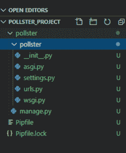

这里可以使用以下命令启动服务器，并在浏览器中使用 ur**http://127 . 0 . 0 . 1:8000/**检查应用程序是否在运行。

```py
python manage.py runserver
```

**步骤 5:** 使用以下命令创建一个应用程序“**投票**

```py
python manage.py startapp polls
```

下面是在项目中创建“投票”应用程序后的文件夹结构。

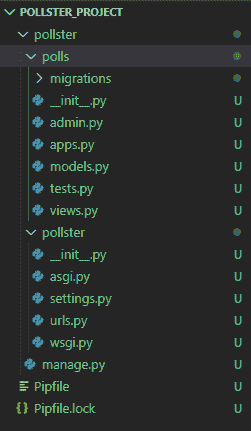

#### 创建模型

**步骤 1:** 在您的 **models.py** 文件中，编写下面给出的代码，在您的数据库中创建两个表。一个是“**问题**”，另一个是“**选择**”。“问题”将有两个“问题文本”字段和一个“发布日期”字段。Choice 有三个字段:“问题”、“choice_text”和“投票”。每个选项都与一个问题相关联。

## 蟒蛇 3

```py
from django.db import models

# Create your models here.

class Question(models.Model):
    question_text = models.CharField(max_length = 200)
    pub_date = models.DateTimeField('date published')

    def __str__(self):
        return self.question_text

class Choice(models.Model):
    question = models.ForeignKey(Question, on_delete = models.CASCADE)
    choice_text = models.CharField(max_length = 200)
    votes = models.IntegerField(default = 0)

    def __str__(self):
        return self.choice_text
```

**步骤-2:** 转到**设置. py** 文件，在列表中，INSTALLED_APPS 写下下面的代码，将该应用程序包含在我们的项目中。这将涉及民意调查- > apps.py - > PollsConfig 类。

## 蟒蛇 3

```py
INSTALLED_APPS = [
    'polls.apps.PollsConfig',
    'django.contrib.admin',
    'django.contrib.auth',
    'django.contrib.contenttypes',
    'django.contrib.sessions',
    'django.contrib.messages',
    'django.contrib.staticfiles',
]
```

**步骤-3:** 我们已经在数据库中进行了更改，并创建了一些表，但是为了反映这些更改，我们需要在这里创建迁移，然后 Django 应用程序将存储对我们模型的更改。运行下面给出的命令来创建迁移。

```py
python manage.py makemigrations polls
```

内部轮询->迁移将创建一个文件 **0001_initial.py** ，您可以在其中找到我们在 models.py 文件中创建的数据库表。现在要插入我们数据库中的所有表，运行下面给出的命令…

```py
python manage.py migrate 
```

#### 创建管理员用户

**步骤-1:** 运行下面给出的命令，创建一个可以登录到管理站点的用户。

```py
python manage.py createsuperuser
```

它会提示我们需要输入的用户名。

```py
Username: geeks123
```

现在它会提示一个电子邮件地址，我们需要再次在这里输入。

```py
Email address: xyz@example.com
```

最后一步是输入密码。我们需要输入两次密码，第二次作为第一次的确认。

```py
Password: ******
Password (again): ******
Superuser created successfully.
```

现在我们可以使用相同的命令**运行服务器，并且我们可以查看我们的管理面板浏览网址**。****

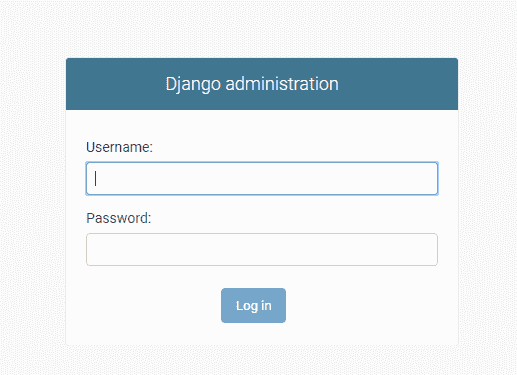

**第 2 步:**在 **admin.py** 文件中，我们将编写下面给出的代码，将每个问题与可供选择的选项对应起来。此外，我们将编写代码来更改站点标题、站点标题和 index_title。完成后，我们可以从管理面板中为问题添加问题和选项。

## 蟒蛇 3

```py
from django.contrib import admin
# Register your models here.
from .models import Question, Choice

# admin.site.register(Question)
# admin.site.register(Choice)

admin.site.site_header = "Pollster Admin"
admin.site.site_title = "Pollster Admin Area"
admin.site.index_title = "Welcome to the Pollster Admin Area"

class ChoiceInLine(admin.TabularInline):
    model = Choice
    extra = 3

class QuestionAdmin(admin.ModelAdmin):
    fieldsets = [(None, {'fields': ['question_text']}), ('Date Information', {
        'fields': ['pub_date'], 'classes': ['collapse']}), ]
    inlines = [ChoiceInLine]

admin.site.register(Question, QuestionAdmin)
```

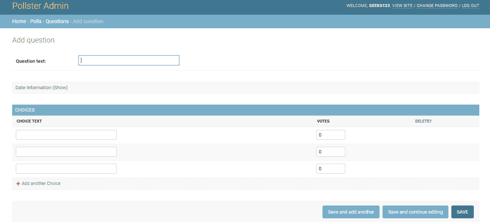

**注意:**我们可以在这里通过为那些问题添加一些问题和选择来测试应用程序。

#### 创建视图

现在我们将创建我们的应用程序的视图，该视图将从我们的数据库中获取数据，并将数据呈现在我们的应用程序的“**模板**”中(我们将在下一节创建“模板”文件夹和该文件夹中的文件)，以向用户显示它。

**Step-1** 打开**view . py**文件，写下下面给出的代码。

## 蟒蛇 3

```py
from django.template import loader
from django.http import HttpResponse, HttpResponseRedirect
from django.shortcuts import get_object_or_404, render
from django.urls import reverse

from .models import Question, Choice

# Get questions and display them

def index(request):
    latest_question_list = Question.objects.order_by('-pub_date')[:5]
    context = {'latest_question_list': latest_question_list}
    return render(request, 'polls / index.html', context)

# Show specific question and choices

def detail(request, question_id):
    try:
        question = Question.objects.get(pk = question_id)
    except Question.DoesNotExist:
        raise Http404("Question does not exist")
    return render(request, 'polls / detail.html', {'question': question})

# Get question and display results

def results(request, question_id):
    question = get_object_or_404(Question, pk = question_id)
    return render(request, 'polls / results.html', {'question': question})

# Vote for a question choice

def vote(request, question_id):
    # print(request.POST['choice'])
    question = get_object_or_404(Question, pk = question_id)
    try:
        selected_choice = question.choice_set.get(pk = request.POST['choice'])
    except (KeyError, Choice.DoesNotExist):
        # Redisplay the question voting form.
        return render(request, 'polls / detail.html', {
            'question': question,
            'error_message': "You didn't select a choice.",
        })
    else:
        selected_choice.votes += 1
        selected_choice.save()
        # Always return an HttpResponseRedirect after successfully dealing
        # with POST data. This prevents data from being posted twice if a
        # user hits the Back button.
        return HttpResponseRedirect(reverse('polls:results', args =(question.id, )))
```

**步骤 2:** 在 poller->polls 文件夹中创建一个文件 **urls.py** ，为我们在 views.py 文件中实现的所有方法定义路由(不要与 poller->poller->URLs . py 文件中的文件混淆)。下面是 urls.py 文件的代码…

## 蟒蛇 3

```py
from django.urls import path
from . import views

app_name = 'polls'
urlpatterns = [
    path('', views.index, name ='index'),
    path('<int:question_id>/', views.detail, name ='detail'),
    path('<int:question_id>/results/', views.results, name ='results'),
    path('<int:question_id>/vote/', views.vote, name ='vote'),
]
```

#### 创建模板

**步骤-1:** 按照下面给出的步骤创建页面的正面布局。

*   在顶级民意调查文件夹中创建文件夹“**模板**”(与民意调查和民意调查并列)，即民意调查- >模板。
*   在模板文件夹内创建“**base.html**”文件。我们将在这个文件中定义应用程序的头部、主体和导航栏。
*   在“模板”文件夹中，创建另一个文件夹“**轮询**”。在“投票”文件夹中，创建三个文件“**index.html**”、“**results.html**和“**detail.html**”。

文件夹结构如下图所示(我们突出显示了在“创建视图，即 urls.py”和“创建模板”部分创建的文件)…

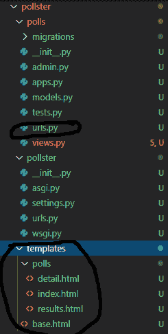

**步骤-2:** 默认情况下，Django 会在“投票”应用程序中搜索“模板”，但我们已经在投票应用程序之外创建了一个全局“模板”文件夹。因此，为了使它工作，我们需要在 settings.py 文件中定义“template”文件夹路径。打开**设置. py** 文件，将下面给出的代码添加到列表“TEMPLATES”中。

## 蟒蛇 3

```py
TEMPLATES = [
    {
        # make changes in DIRS[].
        'BACKEND': 'django.template.backends.django.DjangoTemplates',
        'DIRS': [os.path.join(BASE_DIR, 'templates')],
        'APP_DIRS': True,
        'OPTIONS': {
            'context_processors': [
                'django.template.context_processors.debug',
                'django.template.context_processors.request',
                'django.contrib.auth.context_processors.auth',
                'django.contrib.messages.context_processors.messages',
            ],
        },
    },
]
```

**步骤-3:** 打开**index.html**文件，写出下面给出的代码。该文件将显示存储在我们数据库中的**问题列表**。此外，将向用户显示两个按钮。一个用于**投票**(我们将创建一个 detail.html 文件用于投票)，另一个用于检查**结果**(我们将创建一个 results.html 文件用于结果)。

## 蟒蛇 3

```py


<h1 class ="text-center mb-3">Poll Questions</h1>


<div class ="card-mb-3">
    <div class ="card-body">
        <p class ="lead">{{ question.question_text }}</p>

        <a href ="" class ="btn btn-primary btn-sm">Vote Now</a>
        <a href ="" class ="btn btn-secondary btn-sm">Results</a>
    </div>
</div>



<p>No polls available</p>



```

**步骤-4:** 打开**detail.html**文件，写出下面给出的代码。该文件将负责特定问题的投票。无论用户将从问题列表(index.html 文件)中选择哪个问题进行投票，该特定问题和该问题的选项都将显示在此页面上。用户将被允许选择一个选项，并通过点击投票按钮进行投票。

## 蟒蛇 3

```py


<a class ="btn btn-secondary btn-sm mb-3" href ="">Back To Polls</a>
<h1 class ="text-center mb-3">{{ question.question_text }}</h1>


<p class ="alert alert-danger">
    <strong>{{ error_message }}</strong>
</p>



<form action ="" method ="post">
    
    
    <div class ="form-check">
        <input type ="radio" name ="choice" class ="form-check-input" id ="choice{{ forloop.counter }}"
            value ="{{ choice.id }}" />
        <label for ="choice{{ forloop.counter }}">{{ choice.choice_text }}</label>
    </div>
    
    <input type ="submit" value ="Vote" class ="btn btn-success btn-lg btn-block mt-4" />
</form>

```

**第 5 步:**打开**results.html**文件，写出下面给出的代码。该文件将显示特定问题的总投票结果，无论用户选择哪个问题(从 index.html 文件中)来检查结果。

## 蟒蛇 3

```py


<h1 class ="mb-5 text-center">{{ question.question_text }}</h1>

<ul class ="list-group mb-5">
    
    <li class ="list-group-item">
        {{ choice.choice_text }} <span class ="badge badge-success float-right">{{ choice.votes }}
            vote{{ choice.votes | pluralize }}</span>
    </li>
    
</ul>

<a class ="btn btn-secondary" href ="">Back To Polls</a>
<a class ="btn btn-dark" href ="">Vote again?</a>

```

**第 6 步:**让我们为我们的应用程序创建**导航**栏。在“模板”文件夹中创建一个文件夹“ **partials** ，然后在“partials”文件夹中创建一个文件“ **_navbar.html** ”。文件结构将是模板- > partials- > _navbar.html .将下面给出的代码写在这个文件中。

## 蟒蛇 3

```py
<nav class ="navbar navbar-dark bg-primary mb-4">
    <div class ="container">
        <a class ="navbar-brand" href ="/">Pollster</a>
    </div>
</nav>
```

**第 7 步:**到目前为止，我们还没有在创建的每个 HTML 文件中包含头部和身体标签。我们可以将这些代码写在一个单独的文件中**base.html**我们可以给我们的页面布局。我们还会在这个页面上带来我们的导航栏(_navbar.html 文件)。所以打开“模板”文件夹中的**base.html**文件，写下下面给出的代码。

## 蟒蛇 3

```py
<! DOCTYPE html>
<html lang ="en">
<head>
    <link rel ="stylesheet" href ="https://stackpath.bootstrapcdn.com / bootstrap / 4.4.1 / css / bootstrap.min.css"
        integrity ="sha384-Vkoo8x4CGsO3 + Hhxv8T / Q5PaXtkKtu6ug5TOeNV6gBiFeWPGFN9MuhOf23Q9Ifjh" crossorigin ="anonymous">
    <title>Pollster </title>
</head>

<body>
    <!--NavBar-->
    
    <div class ="container">
        <div class ="row">
            <div class =".col-md-6 m-auto">
                
            </div>
        </div>
    </div>
</body>

</html>
```

#### 创建登录页面

网址 **http://127.0.0.1:8000/** 应该显示我们的网络应用程序的登录页面。因此，为了创建一个登录页面，我们将遵循下面给出的步骤。

**步骤 1** 切换到顶级民意调查文件夹，运行下面给出的命令，创建一个应用程序“**页面**”。

```py
python manage.py startapp pages
```

下面是创建“pages”应用程序后的文件夹结构。

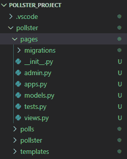

**步骤 2** 打开**视图. py** 在【pages】文件夹内，即 pages- >视图. py .写下下面给出的代码，在登陆页面上访问。

## 蟒蛇 3

```py
from django.shortcuts import render

# Create your views here.

def index(request):
    return render(request, 'pages / index.html')
```

**步骤 3** 在‘pages’文件夹内创建**URL . py**文件，即 pages->URL . py。编写下面给出的代码来定义 pages->index.html 文件的路由(检查步骤 1)。

## 蟒蛇 3

```py

from django.urls import path

from . import views

urlpatterns = [
    path('', views.index, name ='index'),
]
```

**步骤 4** 在“模板”文件夹中创建一个文件夹“**页面**”。现在在‘pages’文件夹内创建一个文件**index.html**。写下下面给出的代码，向用户显示登录页面。

## 蟒蛇 3

```py



<div class ="card text-center">
    <div class ="card-body">
        <h1>Welcome To Pollster</h1>

<p>This is an example Django polling app</p>

        <a class ="btn btn-dark" href ="">
            View Available Polls</a>
    </div>
</div>

```

### 在应用程序的主 urls.py 文件中创建路由

我们已经在我们的应用程序中创建了两个应用程序，分别是“投票”和“T2”页面。我们需要在主**URL . py**文件中定义这两个应用程序的路由，该文件是 poller->poller->URL . py 文件。因此，打开 poller 文件夹中的主**URL . py**文件，并写下下面给出的代码来定义这两个应用程序的路由(“轮询”和“页面”)。

## 蟒蛇 3

```py
from django.contrib import admin
from django.urls import include, path

urlpatterns = [
    path('', include('pages.urls')),
    path('polls/', include('polls.urls')),
    path('admin/', admin.site.urls),
]
```

### 应用程序的测试

#### 管理前端

**步骤-1** 使用命令**运行服务器 python manage.py runserver** 并浏览网址**http://127 . 0 . 0 . 1:8000/admin/**。现在输入用户名和密码登录系统。

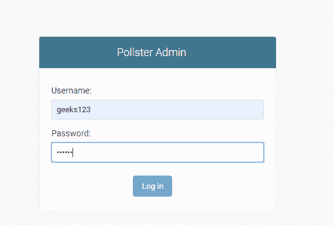

**步骤 2** 点击“问题”旁边的“添加”按钮。

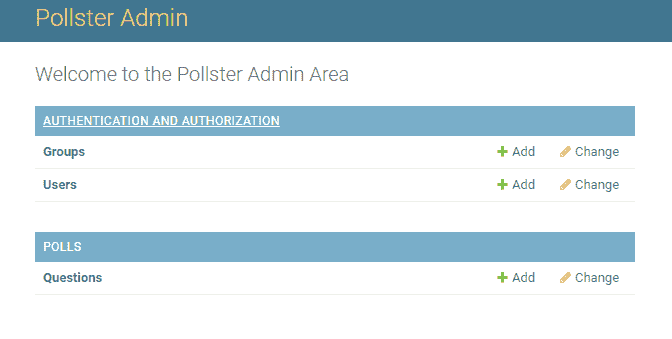

**第 2 步**现在为这些问题添加问题和选项。此外，提及日期和时间，然后点击“保存”按钮。你想加多少问题就加多少。您将看到数据库中添加的问题列表。

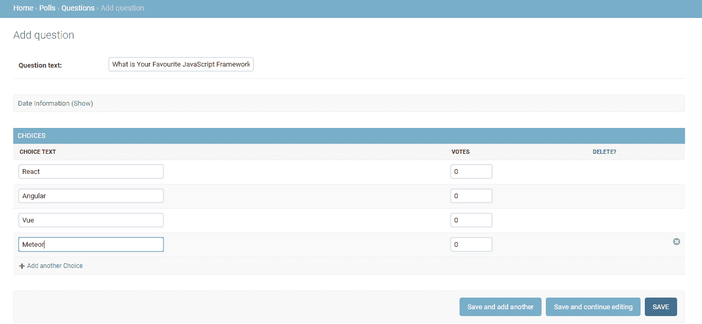

#### 用户前端

**第一步:**浏览网址 **http://127.0.0.1:8000/** 会看到应用的登陆页面。点击“查看可用投票”

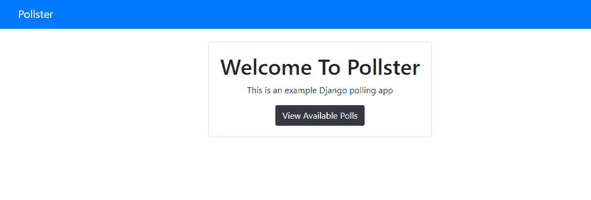

**第 2 步:**您将看到一个问题列表，其中有两个选项“立即投票”和“结果”。从这里你需要选择一个问题，并点击“立即投票”按钮。

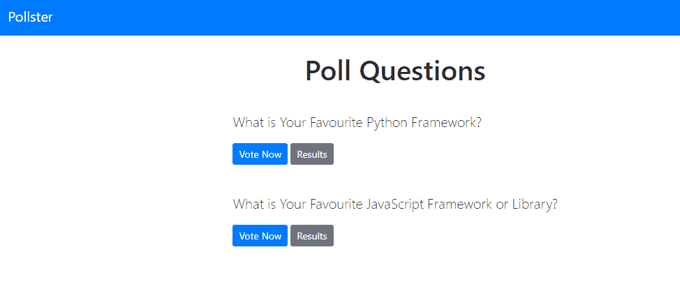

**步骤 3:** 完成后，选择任意一个选项并点击“投票”按钮。您也可以使用顶部的“返回投票”按钮进入上一菜单。

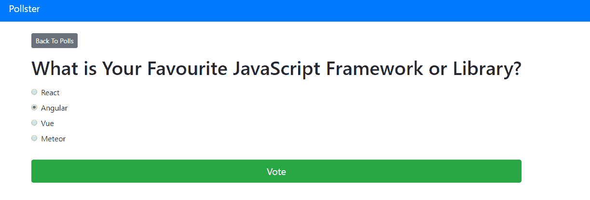

您将看到所选问题的总投票结果。

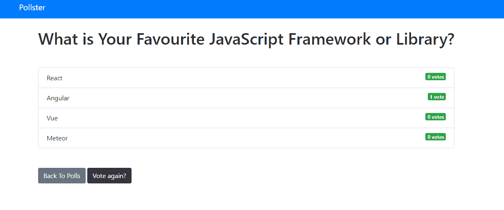

您也可以使用“投票问题”页面中的“结果”选项来检查任何问题的总投票数。

#### 未来范围

该项目可用于任何领域或行业的在线投票系统。该项目可以扩展，也可以根据需求包含其他几个特性。人们可以分享意见，也可以查看许多用户给出的总投票数。

#### 项目存储库链接

[https://github.com/anuupadhyay/pollster-django-crash](https://github.com/anuupadhyay/pollster-django-crash)T2】