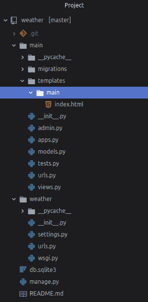
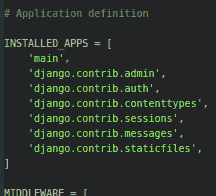
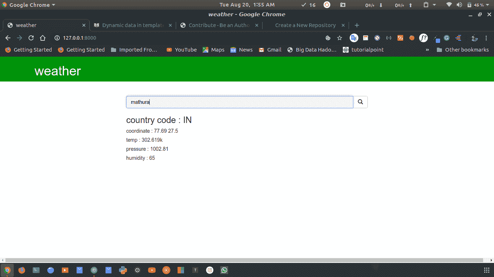

# 使用 Django | Python 的天气应用

> 原文:[https://www . geesforgeks . org/weather-app-use-django-python/](https://www.geeksforgeeks.org/weather-app-using-django-python/)

在本教程中，我们将学习如何创建一个使用 Django 作为后端的天气应用程序。Django 提供了一个基于 Python 网络框架的网络框架，允许快速开发和干净、实用的设计。

**基本设置–**
将目录更改为天气–

```py
cd weather
```

启动服务器–

```py
python manage.py runserver
```

要检查服务器是否正在运行，请转到网络浏览器并输入`http://127.0.0.1:8000/`作为网址。现在，您可以通过按

```py
ctrl-c
```

## 实施:

```py
 python manage.py startapp main
```

通过执行以下操作转到主/文件夹:

```py
cd main 
```

并用`index.html`文件创建一个文件夹: *`templates/main/index.html`*

使用文本编辑器打开项目文件夹。目录结构应该是这样的:


现在在`settings.py`
添加主 app

**编辑`urls.py`天气文件:**

```py
from django.contrib import admin
from django.urls import path, include

urlpatterns = [
    path('admin/', admin.site.urls),
    path('', include('main.urls')),
]
```

**在主界面编辑`urls.py`文件:**

```py
from django.urls import path
from . import views

urlpatterns = [
         path('', views.index),
]
```

**编辑主视图:**

```py
from django.shortcuts import render
# import json to load json data to python dictionary
import json
# urllib.request to make a request to api
import urllib.request

def index(request):
    if request.method == 'POST':
        city = request.POST['city']
        ''' api key might be expired use your own api_key
            place api_key in place of appid ="your_api_key_here "  '''

        # source contain JSON data from API

        source = urllib.request.urlopen(
            'http://api.openweathermap.org/data/2.5/weather?q =' 
                    + city + '&appid = your_api_key_here').read()

        # converting JSON data to a dictionary
        list_of_data = json.loads(source)

        # data for variable list_of_data
        data = {
            "country_code": str(list_of_data['sys']['country']),
            "coordinate": str(list_of_data['coord']['lon']) + ' '
                        + str(list_of_data['coord']['lat']),
            "temp": str(list_of_data['main']['temp']) + 'k',
            "pressure": str(list_of_data['main']['pressure']),
            "humidity": str(list_of_data['main']['humidity']),
        }
        print(data)
    else:
        data ={}
    return render(request, "main/index.html", data)
```

可以从[天气 API](https://openweathermap.org/api) 获取自己的 API 密钥

导航至`templates/main/index.html`并编辑:[链接至`index.html`文件](https://github.com/itsvinayak/weather-app/blob/master/weather-django/main/templates/main/index.html)

**进行迁移并迁移:**

```py
python manage.py makemigrations
python manage.py migrate

```

现在让我们运行服务器来查看您的天气应用程序。

```py
python manage.py runserver
```

