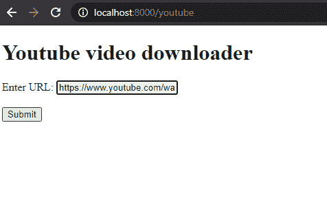
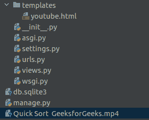

# 使用 Django 的 Youtube 视频下载器

> 原文:[https://www . geesforgeks . org/YouTube-video-downloader-using-django/](https://www.geeksforgeeks.org/youtube-video-downloader-using-django/)

在本文中，我们将看到如何在姜戈制作一个 YouTube 视频下载器工具。为此，我们将使用 **pytube** 模块。

**先决条件:**

*   **pytube:** It 是 python 的轻量级无依赖模块，用于下载 YouTube Videos。
*   [**【姜戈】**](https://www.geeksforgeeks.org/django-basics/) **:** 做网络应用是 python 的框架。

在这里，我们将使用 Django 作为后端以及 pytube 模块来创建这个工具。我们可以通过在终端中键入下面的命令来安装 pytube 模块。

```py
pip install pytube
```

所以，让我们开始制作我们的 YouTube 视频下载器工具。

首先，我们将创建一个 HTML 设计(表单)，用户可以在其中输入他/她想要下载的视频的网址。我们将使用 Django 的 **POST** 方法来获取该 URL(因为它是安全的)。如果使用 POST 方法，我们还需要使用 csrf 令牌。csrf 令牌的语法为:

```py

```

## 超文本标记语言

```py
<!DOCTYPE html>
<html>
<body>

<h1>Youtube video downloader</h1>

<form action="" method="post">
  

  <label for="link">Enter URL:</label>
  <input type="text" id="link" name="link"><br><br>
  <input type="submit" value="Submit">
</form>

</body>
</html>
```

现在，是时候创建一个接收视频链接并下载视频的功能了。您需要在 views.py 文件中从模块 pytube 导入函数 YouTube。现在我们可以定义下载视频的功能了。

**view . py**

## 蟒蛇 3

```py
# importing all the required modules
from django.shortcuts import render, redirect
from pytube import *

# defining function
def youtube(request):

    # checking whether request.method is post or not
    if request.method == 'POST':

        # getting link from frontend
        link = request.POST['link']
        video = YouTube(link)

        # setting video resolution
        stream = video.streams.get_lowest_resolution()

        # downloads video
        stream.download()

        # returning HTML page
        return render(request, 'youtube.html')
    return render(request, 'youtube.html')
```

现在，我们必须在 urls.py 中为这个函数定义 URL(路径)

## 蟒蛇 3

```py
from django.contrib import admin
from django.urls import path
from . import views

urlpatterns = [
    path('admin/', admin.site.urls),
    path('youtube', views.youtube, name='youtube'),
]
```

编码部分到此结束，现在可以通过 **python manage.py runserver** 运行项目，前往**http://localhost:8000/YouTube**查看输出。

**输出:**



当你点击提交时，一个视频将被下载到你的 Django 项目目录中。

