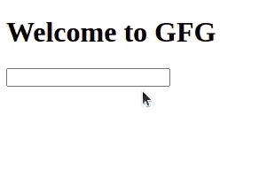

# 使用 Python 和 Flask 自动完成输入建议

> 原文:[https://www . geesforgeks . org/autocomplete-input-improvement-use-python-and-flask/](https://www.geeksforgeeks.org/autocomplete-input-suggestion-using-python-and-flask/)

在本文中，我们将学习如何为从 Flask 传递的数据提供自动完成等功能。自动完成基本上意味着当用户键入某些内容时，预测单词的其余部分。这样，随着每一个正确的预测，人与人之间的互动也会增加。让我们看看如何做同样的事情。

我们将使用 jquery 进行自动完成。

### **安装:**

要安装烧瓶，请在终端中键入以下命令。

```
pip install flask
```

首先，为项目创建一个新目录。在里面创建一个新文件并命名为 **app.py.**

**app.py**

## 蟒蛇 3

```
from flask import Flask, request, render_template

app = Flask(__name__)

@app.route("/", methods=["POST", "GET"])
def home():
    if request.method == "GET":
        languages = ["C++", "Python", "PHP", "Java", "C", "Ruby",
                     "R", "C#", "Dart", "Fortran", "Pascal", "Javascript"]

        return render_template("index.html", languages=languages)

if __name__ == '__main__':
    app.run(debug=True)
```

然后，在项目内部创建一个新的目录来保存所有的 HTML 文件，并将它们命名为**模板**。在这个文件中，我们有一个输入字段，用户将在其中键入一个字符串，jquery 函数将提供建议。

**index.html**

## 超文本标记语言

```
<!DOCTYPE html>
<html>
<head>
    <title>AutoComplete</title>
    <script src="https://ajax.googleapis.com/ajax/libs/jquery/1.7.1/jquery.js">  
    </script>  

    <script src="https://ajax.googleapis.com/ajax/libs/jqueryui/1.8.16/jquery-ui.js">  
    </script>  

    <link href="http://ajax.googleapis.com/ajax/libs/jqueryui/1.8.16/themes/ui-lightness/jquery-ui.css"
        rel="stylesheet" type="text/css" />  
</head>
<body>
    <h1>Welcome to GFG</h1>
    <input type="text" id="tags">

    <script>
  $( function() {
    var availableTags = [
        
            "{{language}}",
        
    ];
    $( "#tags" ).autocomplete({
      source: availableTags
    });
  } );
  </script>

</body>
</html>
```

要运行此应用程序，请打开 cmd 或终端并运行以下命令。

```
python app.py
```

**输出:**

