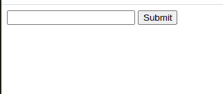
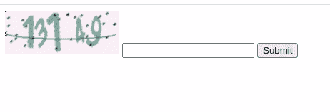

# 构建一个 Flask 应用程序来验证验证码

> 原文:[https://www . geesforgeks . org/build-a-flask-application-to-validate-captcha/](https://www.geeksforgeeks.org/build-a-flask-application-to-validate-captcha/)

在本文中，我们将构建一个可以使用验证码的网络应用程序。验证码是一个工具，你可以用来区分真实用户和自动用户。验证码通常出现在登录页面或支付页面。

## 什么是验证码？

验证码是用来确保网站免受垃圾邮件攻击的策略。目的是通过筛选自然生成的输入来防止直观网站被垃圾邮件攻击。缩写验证码的意思是“完全自动的公共图灵测试来区分计算机和人类”。当 web 应用程序需要客户端输入时，通常会使用验证码。想象一下，你正在经营一家在线商店，需要给你的客户一个在评论区撰写商品调查的机会。对于这种情况，你需要保证段落确实来自你的客户，或者如果没有其他来自人类网站的客人。你会定期查看自然产生的垃圾言论——在最悲观的情况下，这与你的反对意见有关。

**注:**更多信息参考[验证码是什么？](https://www.geeksforgeeks.org/what-is-captcha-code/)

## 要求

*   [**Flask 框架:**](https://www.geeksforgeeks.org/python-introduction-to-web-development-using-flask/) Flask 是 Python 的一个 API，允许我们构建网络应用程序。Flask 的框架比 Django 的框架更明确，也更容易学习，因为它实现一个简单的网络应用程序的基础代码更少。
*   **烧瓶-会话-验证码库:**使用烧瓶-会话存储和验证码包的烧瓶验证码实现。每个验证码挑战答案都保存在被挑战客户端的服务器端会话中。
*   [**MongoDB:**](https://www.geeksforgeeks.org/mongodb-an-introduction/) MongoDB，最受欢迎的 NoSQL 数据库，是一个开源的面向文档的数据库。术语“NoSQL”的意思是“非关系的”。这意味着 MongoDB 不是基于类似表的关系数据库结构，而是提供了一种完全不同的数据存储和检索机制。

**注意:**数据库取决于你的应用。Flask-session-captcha 库支持多个数据库，因此如果您使用任何其他数据库，请务必查看它们的文档。

## 构建应用程序

您可以使用以下命令安装所有必需的依赖项

> pip 安装-U 烧瓶-会话-验证码烧瓶-会话存储 pymongo

建议您在虚拟环境中安装所有依赖项。

## 逐步实施

### 第一步:创建用户界面

创建一个名为模板的文件夹，并在其中创建一个 HTML 文件。您可以将 HTML 文件保存为 form.html。

## 超文本标记语言

```py
<form method="post">

    <!-- The following line creates the captcha -->
    {{ captcha() }}
    <input type="text" name="captcha">
    <input type="submit" name="submit">
</form>
```

### 第二步:创建应用程序副本

让我们创建一个简单的应用程序，显示上面的形式没有验证码。

### 示例:初始化烧瓶应用程序

## 蟒蛇 3

```py
from flask import Flask,render_template

app = Flask(__name__)

@app.route('/')
def index():
    return render_template('form.html')

if __name__ == "__main__":
    app.run(debug=True)
```

使用以下命令运行服务器，以确保应用程序成功运行并显示 form.html 页面。

```py
python app.py
```

**输出:**



### 步骤 3:初始化 PyMongoClient

为了在 MongoDB 中使用 Python，我们将导入 PyMongo。由此，可以导入 MongoClient，用于创建数据库的客户端。

## 蟒蛇 3

```py
from flask import Flask, render_template
from pymongo import MongoClient

app = Flask(__name__)

# Database Config
# If your mongodb runs on a different port
# change 27017 to that port number
mongoClient = MongoClient('localhost', 27017)

@app.route('/')
def index():
    return render_template('form.html')

if __name__ == "__main__":
    app.run(debug=True)
```

### 步骤 4:配置验证码

在应用程序中使用验证码需要各种配置。这里我们将使用 flask_session_captcha 模块，该模块使用 flak-sessionstore 和 captcha 包实现 captcha。

## 蟒蛇 3

```py
import uuid
from flask import Flask, render_template
from flask_sessionstore import Session
from flask_session_captcha import FlaskSessionCaptcha
from pymongo import MongoClient

app = Flask(__name__)

# Database Config
# If your mongodb runs on a different port
# change 27017 to that port number
mongoClient = MongoClient('localhost', 27017)

# Captcha Configuration
app.config["SECRET_KEY"] = uuid.uuid4()
app.config['CAPTCHA_ENABLE'] = True

# Set 5 as character length in captcha
app.config['CAPTCHA_LENGTH'] = 5

# Set the captcha height and width
app.config['CAPTCHA_WIDTH'] = 160
app.config['CAPTCHA_HEIGHT'] = 60
app.config['SESSION_MONGODB'] = mongoClient
app.config['SESSION_TYPE'] = 'mongodb'

# Enables server session
Session(app)

# Initialize FlaskSessionCaptcha
captcha = FlaskSessionCaptcha(app)

@app.route('/')
def index():
    return render_template('form.html')

if __name__ == "__main__":
    app.run(debug=True)
```

### 步骤 5:配置日志记录

[](https://www.geeksforgeeks.org/logging-in-python/)**日志是一种跟踪某些软件运行时发生的事件的手段。这里我们使用了 logging.getLogger()方法，该方法返回具有指定名称的记录器，否则返回根记录器，**

## **蟒蛇 3**

```py
import uuid
import logging
from flask import Flask, render_template
from flask_sessionstore import Session
from flask_session_captcha import FlaskSessionCaptcha
from pymongo import MongoClient

app = Flask(__name__)

# Database Config
# If your mongodb runs on a different port
# change 27017 to that port number
mongoClient = MongoClient('localhost', 27017)

# Captcha Configuration
app.config["SECRET_KEY"] = uuid.uuid4()
app.config['CAPTCHA_ENABLE'] = True

# Set 5 as character length in captcha
app.config['CAPTCHA_LENGTH'] = 5

# Set the captcha height and width
app.config['CAPTCHA_WIDTH'] = 160
app.config['CAPTCHA_HEIGHT'] = 60
app.config['SESSION_MONGODB'] = mongoClient
app.config['SESSION_TYPE'] = 'mongodb'

# Enables server session
Session(app)

# Initialize FlaskSessionCaptcha
captcha = FlaskSessionCaptcha(app)

@app.route('/')
def index():
    return render_template('form.html')

if __name__ == "__main__":
    app.debug = True
    logging.getLogger().setLevel("DEBUG")
    app.run()
```

### **步骤 6:编码索引路径**

**在这里，我们使用了 POST 方法，它根据验证码返回检查输入。如果验证码匹配成功方法显示，否则失败方法显示。**

## **蟒蛇 3**

```py
import uuid
import logging
from flask import Flask, request, render_template
from flask_sessionstore import Session
from flask_session_captcha import FlaskSessionCaptcha
from pymongo import MongoClient

app = Flask(__name__)

# Database Config
# If your mongodb runs on a different port
# change 27017 to that port number
mongoClient = MongoClient('localhost', 27017)

# Captcha Configuration
app.config["SECRET_KEY"] = uuid.uuid4()
app.config['CAPTCHA_ENABLE'] = True

# Set 5 as character length in captcha
app.config['CAPTCHA_LENGTH'] = 5

# Set the captcha height and width
app.config['CAPTCHA_WIDTH'] = 160
app.config['CAPTCHA_HEIGHT'] = 60
app.config['SESSION_MONGODB'] = mongoClient
app.config['SESSION_TYPE'] = 'mongodb'

# Enables server session
Session(app)

# Initialize FlaskSessionCaptcha
captcha = FlaskSessionCaptcha(app)

@app.route('/', methods=['POST', 'GET'])
def index():
    if request.method == "POST":
        if captcha.validate():
            return "success"
        else:
            return "fail"

    return render_template("form.html")

if __name__ == "__main__":
    app.debug = True
    logging.getLogger().setLevel("DEBUG")
    app.run()
```

### **运行应用程序**

**启动服务器:**

```py
python app.py
```

**然后访问:**

```py
http://localhost:5000/
```

****输出:****

****