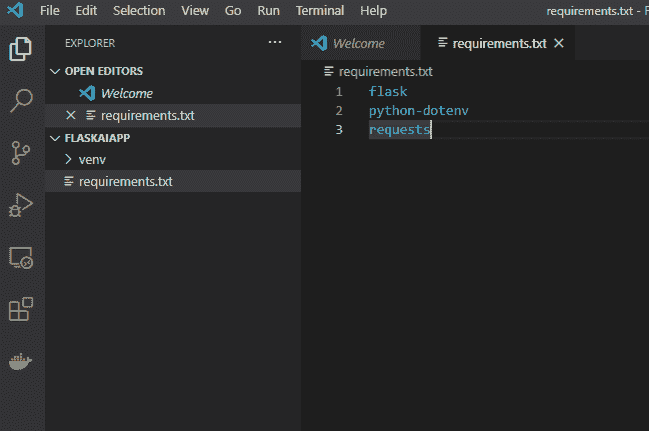
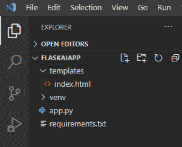
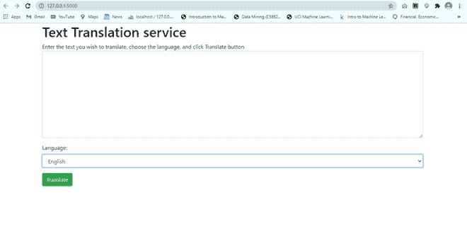
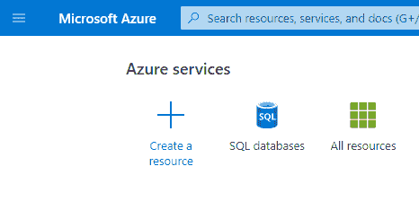
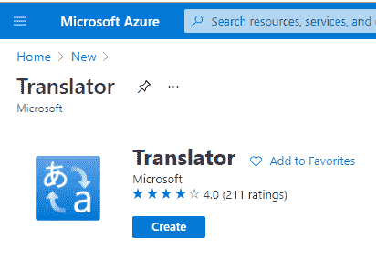
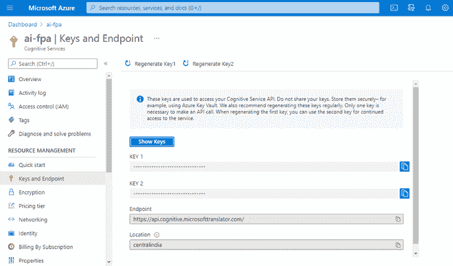
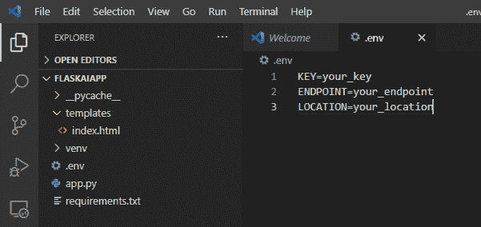

# 使用 Flask 和 Azure 认知服务构建一个文本翻译器网络应用

> 原文:[https://www . geesforgeks . org/build-a-text-translator-web-app-use-flask-and-azure-cognitive-services/](https://www.geeksforgeeks.org/build-a-text-translator-web-app-using-flask-and-azure-cognitive-services/)

我们将创建一个网站，使用人工智能将文本翻译成多种语言。我们将在前端使用 Flask 框架，在后端使用 Azure 认知服务(人工智能服务的集合)。

为了开始用 Python 编写我们的 Flask 应用程序，我们需要设置我们的开发环境，这将需要安装几个项目。

### 步骤 1:创建项目目录

我们可以使用以下命令之一从命令或终端窗口创建项目目录:

**对于窗户:**

```
md FlaskAiApp
cd FlaskAiApp
```

**对于 mac 或 linux :**

```
mkdir FlaskAiApp
cd FlaskAiApp
```

**注意:**保持整个模块的命令或终端窗口打开。

### **第二步:创建 Python 虚拟环境**

Python 的虚拟环境不一定像听起来那么复杂。不要创建虚拟机或容器，而是创建一个虚拟环境，它是一个包含我们运行应用程序所需的所有库的文件夹，包括 Python 运行时本身。通过使用虚拟环境，我们使我们的应用程序模块化，允许我们将它们彼此分开，并避免版本问题。使用 Python 时，您应该始终将虚拟环境作为最佳实践。在命令或终端窗口中编写以下命令。

**对于窗户:**

```
# Create the environment
python -m venv venv

# Activate the environment
.\\venv\\scripts\\activate
```

**对于 macOS 和 Linux :**

```
# Create the environment
python3 -m venv venv

# Activate the environment
source ./venv/bin/activate
```

### **第三步:安装烧瓶和其他库**

随着我们虚拟环境的创建和激活，我们网站所需的库 Flask 现在可以安装了。我们将按照一个通用的惯例来安装 Flask，以创建 **requirements.txt** 文件。**requirements . txt**文件本身并不特殊；这是一个文本文件，我们在其中列出了应用程序所需的库。但是开发人员通常使用该约定，这使得管理多个库依赖的应用程序变得更加容易。

在 **Visual Studio Code** 中打开项目目录，创建 **requirements.txt** 文件，并添加以下文本:



返回命令提示符或终端窗口，使用 pip 运行以下命令来执行安装

```
pip install -r requirements.txt
```

### **第四步:创建 app.py**

通常，名为 app.py 的文件是 Flask 应用程序的入口点。在项目目录中创建一个文件名 **app.py** 。


创建 **app.py** 文件后，添加以下代码:

## 蟒蛇 3

```
from flask import Flask, render_template

app = Flask(__name__)
```

导入声明包含对 Flask 的引用，Flask 是任何 Flask 程序的核心。一会儿，如果我们想返回我们的 HTML，我们可以使用渲染模板。

我们将使用一条路线–“/”。该路由通常被称为默认路由或索引路由，因为它是在用户除了域名或服务器之外没有其他东西时使用的。现在让我们使用下面的代码添加 route 方法。

## 蟒蛇 3

```
@app.route('/', methods=['GET'])
def index():
    return render_template('index.html')
```

通过使用@app.route，我们指出了我们想要创建的路由。路径为“/”，这是默认路由。我们表示这将用于**获取**。如果收到/的 GET 请求，Flask 将自动调用该函数。在索引主体中，我们指示将名为 index.html 的 HTML 模板返回给用户。

### **第五步:创建 HTML 模板**

让我们创建 Jinja(Flask 的模板引擎)。首先，创建文件夹名称**模板**，并在**模板**文件夹内创建**index.html**文件。添加以下代码:



## 超文本标记语言

```
<!DOCTYPE html>
<html lang="en">

<head>
    <meta charset="UTF-8">
    <meta name="viewport" content="width=device-width, initial-scale=1.0">
    <link rel="stylesheet" href="https://cdn.jsdelivr.net/npm/bootstrap@4.5.3/dist/css/bootstrap.min.css"
        integrity="sha384-TX8t27EcRE3e/ihU7zmQxVncDAy5uIKz4rEkgIXeMed4M0jlfIDPvg6uqKI2xXr2" crossorigin="anonymous">
    <title>Text Translator</title>
</head>

<body>
    <div class="container">
        <h1>Test Translation service</h1>
        <div>Enter the text you wish to translate, choose the language, and click Translate button</div>
        <div>
            <form method="POST">
                <div class="form-group">
                    <textarea name="text" cols="20" rows="10" 
                              class="form-control"></textarea>
                </div>
                <div class="form-group">
                    <label for="language">Language:</label>
                    <select name="language" class="form-control">
                        <option value="en">English</option>
                        <option value="it">Italian</option>
                        <option value="ja">Japanese</option>
                        <option value="ru">Russian</option>
                        <option value="de">German</option>
                    </select>
                </div>
                <div>
                    <button type="submit" class="btn btn-success">Translate</button>
                </div>
            </form>
        </div>
    </div>
</body>

</html>
```

### **步骤 6:测试应用程序**

在 Visual Studio 代码中打开终端，并运行以下命令:

**对于窗户:**

```
set FLASK_ENV=development
```

**对于 macOS/Linux:**

```
export FLASK_ENV=development
```

**运行应用程序:**

```
flask run
```

通过导航到 http://localhost:5000，在浏览器中打开应用程序。index.html 将被展示。



### **第七步:使用 Azure 认知服务创建后端**

Azure 提供认知服务，包括计算机视觉服务、语音到文本、文本到语音和文本翻译服务。您可以通过软件开发工具包(SDKs)访问这些服务中的任何一个，或者像调用任何其他 HTTP 端点一样调用它们。您需要一个 Azure 帐户来使用认知服务。我们需要一把钥匙来呼叫翻译服务(或任何其他认知服务)。只要我们能够访问该服务，就会使用该密钥。密钥与密码相同。

现在，让我们使用 Azure 门户创建翻译服务密钥，并将其存储到。我们应用程序中的 env 文件。

1.浏览 **Azure 门户。**

2.选择**创建资源**。



3.在搜索框中输入**翻译器**。

4.选择**创建**。



5.完成给定的表格:

*   **订阅:**您的订阅
*   **资源组:**
    *   选择新建
    *   **名称:**瓶
*   **资源组区域:**选择你附近的区域
*   **资源区域:**选择与上面相同的区域
*   **名称:**唯一的值，如 ai-yourname
*   **定价等级:**免费 F0

6.选择**查看+创建**。

7.选择**创建**。

8.选择**转到资源**。

9.选择**资源管理**下左侧的**键和端点**



10.创建**。env** 文件在我们的应用程序中存储密钥。



替换**中的占位符。env** 文件。

*   您的 _key 与上面复制的密钥
*   您的端点与来自 Azure 的端点
*   您的位置与 Azure 的位置

### **第 8 步:调用翻译服务**

在 **app.py** 文件的顶部插入以下代码:-

## 蟒蛇 3

```
# Importing the required libraries
import requests
import os
import uuid
import json
from dotenv import load_dotenv
load_dotenv()
```

现在在 **app.py** 的底部添加代码来创建翻译文本的路线和逻辑:-

## 蟒蛇 3

```
# code
@app.route('/', methods=['POST'])
def index_post():

    # Read the values from the form
    original_text = request.form['text']
    target_language = request.form['language']

    # Load the values from .env
    key = os.environ['KEY']
    endpoint = os.environ['ENDPOINT']
    location = os.environ['LOCATION']

    # Indicate that we want to translate and the API 
    # version (3.0) and the target language
    path = '/translate?api-version=3.0'

    # Add the target language parameter
    target_language_parameter = '&to=' + target_language

    # Create the full URL
    constructed_url = endpoint + path + target_language_parameter

    # Set up the header information, which includes our
    # subscription key
    headers = {
        'Ocp-Apim-Subscription-Key': key,
        'Ocp-Apim-Subscription-Region': location,
        'Content-type': 'application/json',
        'X-ClientTraceId': str(uuid.uuid4())
    }

    # Create the body of the request with the text to be
    # translated
    body = [{'text': original_text}]

    # Make the call using post
    translator_request = requests.post(
        constructed_url, headers=headers, json=body)

    # Retrieve the JSON response
    translator_response = translator_request.json()

    # Retrieve the translation
    translated_text = translator_response[0]['translations'][0]['text']

    # Call render template, passing the translated text,
    # original text, and target language to the template
    return render_template(
        'results.html',
        translated_text=translated_text,
        original_text=original_text,
        target_language=target_language
    )
```