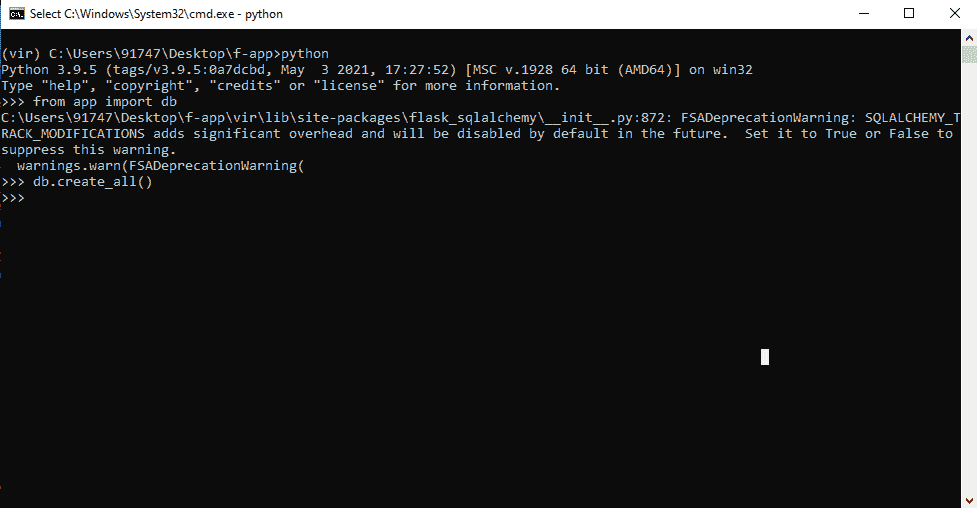
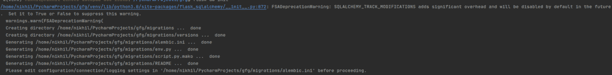
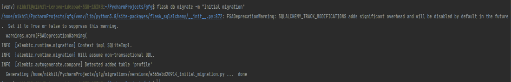
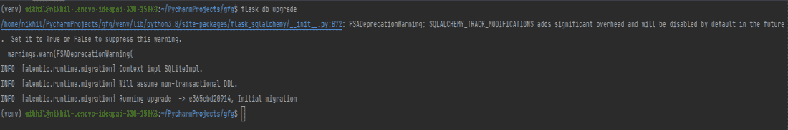
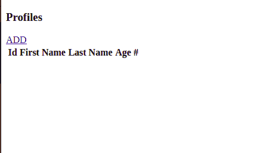
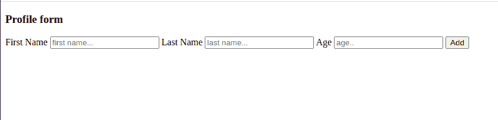

# 使用烧瓶-SQLAlchemy

将烧瓶连接到数据库

> 原文:[https://www . geesforgeks . org/connect-flask-to-a-database-with-flask-sqlalchemy/](https://www.geeksforgeeks.org/connect-flask-to-a-database-with-flask-sqlalchemy/)

Flask 是一个用 python 编写的微 web 框架。微框架通常是一个很少甚至不依赖外部库的框架。尽管作为一个微框架，几乎所有的东西都可以在需要的时候使用 python 库和其他依赖项来实现。

在本文中，我们将构建一个 Flask 应用程序，**从用户那里获取表单中的数据**，然后**将其显示在网站的另一个页面上。我们也可以**删除**数据。我们不会专注于前端部分，而只是为 web 应用程序编写后端代码。**

## **安装砂箱**

在您觉得合适的任何目录中创建一个文件夹，并在目录中打开命令行。使用以下命令创建一个 python 虚拟环境。

```py
python -m venv <name>
```

命令运行完成后，使用下面的命令激活虚拟环境。

```py
<name>\scripts\activate
```

现在，使用 pip(python 的包安装程序)安装 Flask。只需运行下面的命令。

```py
pip install Flask
```

## **创建 app.py**

安装完成后，创建一个文件名 app.py，并在您最喜欢的编辑器中打开它。要检查 Flask 是否已正确安装，您可以运行以下代码。

## 计算机编程语言

```py
from flask import Flask
app = Flask(__name__)

'''If everything works fine you will get a
message that Flask is working on the first
page of the application
'''

@app.route('/')
def check():
    return 'Flask is working'

if __name__ == '__main__':
    app.run()
```

**输出:**


## 设置 SQLAlchemy

现在，让我们继续为我们的应用程序创建一个**数据库。**为了本文的目的，我们将使用 SQLAlchemy(一个数据库工具包)和 ORM(对象关系映射器)。我们将再次使用 pip 来安装 SQLAlchemy。命令如下:

```py
pip install flask-sqlalchemy
```

在你的 app.py 文件中导入如下代码所示的 SQLAlchemy。我们还需要向我们的应用程序添加一个配置设置，这样我们就可以在我们的应用程序中使用 SQLite 数据库。我们还需要创建一个 SQLAlchemy 数据库实例，这就像创建一个对象一样简单。

## 计算机编程语言

```py
from flask import Flasky
from flask_sqlalchemy import SQLAlchemy

app = Flask(__name__)
app.debug = True

# adding configuration for using a sqlite database
app.config['SQLALCHEMY_DATABASE_URI'] = 'sqlite:///site.db'

# Creating an SQLAlchemy instance
db = SQLAlchemy(app)

if __name__ == '__main__':
    app.run()
```

## 创建模型

在 sqlalchemy 中，我们使用类来创建我们的数据库结构。在我们的应用程序中，我们将创建一个 Profile 表，负责保存用户的 id、名字、姓氏和年龄。

## 计算机编程语言

```py
from flask import Flask, request, redirect
from flask.templating import render_template
from flask_sqlalchemy import SQLAlchemy

app = Flask(__name__)
app.debug = True

# adding configuration for using a sqlite database
app.config['SQLALCHEMY_DATABASE_URI'] = 'sqlite:///site.db'

# Creating an SQLAlchemy instance
db = SQLAlchemy(app)

# Models
class Profile(db.Model):
    # Id : Field which stores unique id for every row in
    # database table.
    # first_name: Used to store the first name if the user
    # last_name: Used to store last name of the user
    # Age: Used to store the age of the user
    id = db.Column(db.Integer, primary_key=True)
    first_name = db.Column(db.String(20), unique=False, nullable=False)
    last_name = db.Column(db.String(20), unique=False, nullable=False)
    age = db.Column(db.Integer, nullable=False)

    # repr method represents how one object of this datatable
    # will look like
    def __repr__(self):
        return f"Name : {self.first_name}, Age: {self.age}"

if __name__ == '__main__':
    app.run()
```

下表解释了模型类中使用的一些关键词。

<figure class="table">

| **栏** | 用于在数据库表中创建新列 |
| **整数** | 整数数据字段 |
| **主键** | 如果为字段设置为真，则确保该字段可用于唯一标识数据表的对象。 |
| **弦** | 字符串数据字段。弦(<maximum length="">)</maximum> |
| **独特** | 如果设置为真，它将确保该字段中的每个数据都是唯一的。 |
| **可空** | 如果设置为假，它确保字段中的数据不能为空。 |
| **_ _ _ _ _ _ _** | 用于表示数据表对象的函数。 |

</figure>

## **创建数据库**

在导航到项目目录并运行虚拟环境的命令行中，我们需要运行以下命令。

```py
python
```

上面的命令将在您的命令行中启动一个 python bash，在这里您可以使用更多的代码行来根据数据库中的模型类创建您的数据表。

```py
from app import db
db.create_all()
```

在命令之后，响应看起来像图片中的一些东西，在您的项目目录中，您会注意到一个名为**“site . db”**的新文件。



## **在数据库中进行迁移**

安装烧瓶-使用 pip 迁移

```py
pip install Flask-Migrate
```

现在，在 app.py 中添加两行代码，如下所示:

## 计算机编程语言

```py
# Import for Migrations
from flask_migrate import Migrate, migrate

# Settings for migrations
migrate = Migrate(app, db)
```

现在，为了创建迁移，我们一个接一个地运行以下命令。

```py
flask db init
```



烧瓶数据库初始化

```py
flask db migrate -m "Initial migration"
```



烧瓶数据库迁移-m“初始迁移”

```py
flask db upgrade
```



flask db 升级

现在我们已经成功地在数据库中创建了数据表。

## 创建应用程序的索引页

在继续构建我们的表单之前，让我们为我们的网站创建一个索引页面。HTML 文件总是存储在名为**‘templates’**的应用程序父目录中的一个文件夹中。在模板文件夹中创建一个名为 index.html 的文件，并粘贴下面的代码。我们将继续向索引文件中添加更多的代码。

## 超文本标记语言

```py
<html>
   <head>
      <title>Index Page</title>
   </head>
   <body>
      <h3>Profiles</h3>
   </body>
</html>
```

在 app.py 中添加一个小函数，它将在 app.route 中指定的特定路线上呈现一个 HTML 页面。

## 计算机编程语言

```py
from flask import Flask, request, redirect
from flask.templating import render_template
from flask_sqlalchemy import SQLAlchemy

app = Flask(__name__)
app.debug = True

# adding configuration for using a sqlite database
app.config['SQLALCHEMY_DATABASE_URI'] = 'sqlite:///site.db'

# Creating an SQLAlchemy instance
db = SQLAlchemy(app)

# Models
class Profile(db.Model):

    id = db.Column(db.Integer, primary_key=True)
    first_name = db.Column(db.String(20), unique=False, nullable=False)
    last_name = db.Column(db.String(20), unique=False, nullable=False)
    age = db.Column(db.Integer, nullable=False)

    def __repr__(self):
        return f"Name : {self.first_name}, Age: {self.age}"

# function to render index page
@app.route('/')
def index():
    return render_template('index.html')

if __name__ == '__main__':
    app.run()
```

要测试是否一切正常，可以使用命令运行应用程序

```py
python app.py
```

该命令将在 http://localhost:5000 处设置一个本地服务器。

**输出:**



## 正在为表单创建网页

我们将创建一个网页，我们的表单将在其中呈现。在模板文件夹中创建一个名为 add_profile 的 HTML 文件。HTML 代码如下。当您在上阅读时，代码中的重要点将被**突出显示。**

## 超文本标记语言

```py
<!DOCTYPE html>
<html>
   <head>
      <title>Add Profile</title>
   </head>
   <body>
      <h3>Profile form</h3>
      <form action="/add" method="POST">
         <label>First Name</label>
         <input type="text" name="first_name" placeholder="first name...">
         <label>Last Name</label>
         <input type="text" name= "last_name" placeholder="last name...">
         <label>Age</label>
         <input type="number" name="age" placeholder="age..">
         <button type="submit">Add</button>
      </form>
   </body>
</html>
```

**在我们的应用程序中添加一个函数来渲染表单页面**

在我们的 app.py 文件中，我们将添加以下功能。在路由或站点路径“http://localhost:5000/add_data”处，将呈现该页面。

## 计算机编程语言

```py
@app.route('/add_data')
def add_data():
    return render_template('add_profile.html')
```

要检查代码是否正常工作，可以运行以下命令启动本地服务器。

```py
python app.py
```

现在，访问 http://localhost:5000/add_data，您将能够看到表单。

**输出:**



## 函数使用表单向数据库添加数据

要向数据库添加数据，我们将使用**“POST”**方法。开机自检用于向服务器发送数据以创建/更新资源。在 flask 中，我们指定我们的路由，也就是 app.route，我们也可以在那里指定 HTTP 方法。然后在函数内部，我们创建变量来存储数据，并使用**请求对象**从表单**获取数据。**

**注意:**在 HTML 文件的输入标签中使用的名称必须与该函数中使用的名称相同，

例如，

```py
<input type="number" name="age" placeholder="age..">
```

“age”也应该在 python 函数中使用，

```py
age = request.form.get("age")
```

然后，我们继续创建 Profile 类的对象，并使用数据库会话将其存储在我们的数据库中。

## 计算机编程语言

```py
# function to add profiles
@app.route('/add', methods=["POST"])
def profile():

    # In this function we will input data from the
    # form page and store it in our database.
    # Remember that inside the get the name should
    # exactly be the same as that in the html
    # input fields
    first_name = request.form.get("first_name")
    last_name = request.form.get("last_name")
    age = request.form.get("age")

    # create an object of the Profile class of models
    # and store data as a row in our datatable
    if first_name != '' and last_name != '' and age is not None:
        p = Profile(first_name=first_name, last_name=last_name, age=age)
        db.session.add(p)
        db.session.commit()
        return redirect('/')
    else:
        return redirect('/')
```

一旦函数被执行，它会将我们重定向回应用程序的索引页面。

## 在索引页上显示数据

现在在我们的索引页面上，我们将显示已经存储在数据表中的所有数据。我们将使用“ **Profile.query.all()** ”来查询 Profile 类的所有对象，然后使用 **Jinja 模板语言**在我们的索引 HTML 文件中动态显示它。

按如下方式更新您的索引文件。删除功能将在本文的后面进行描述。现在，我们将查询数据表中的所有数据，并将其显示在我们的主页上。

## 超文本标记语言

```py
<!DOCTYPE html>
<html>
   <head>
      <title>Index Page</title>
   </head>
   <body>
      <h3>Profiles</h3>
      <a href="/add_data">ADD</a>
      <br>
      <table>
         <thead>
            <th>Id</th>
            <th>First Name</th>
            <th>Last Name</th>
            <th>Age</th>
            <th>#</th>
         </thead>
         
         <tbody>
            <td>{{data.id}}</td>
            <td>{{data.first_name}}</td>
            <td>{{data.last_name}}</td>
            <td>{{data.age}}</td>
            <td><a href="/delete/{{data.id}}" type="button">Delete</a></td>
         </tbody>
         
      </table>
   </body>
</html>
```