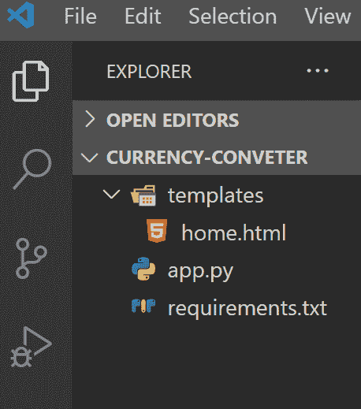
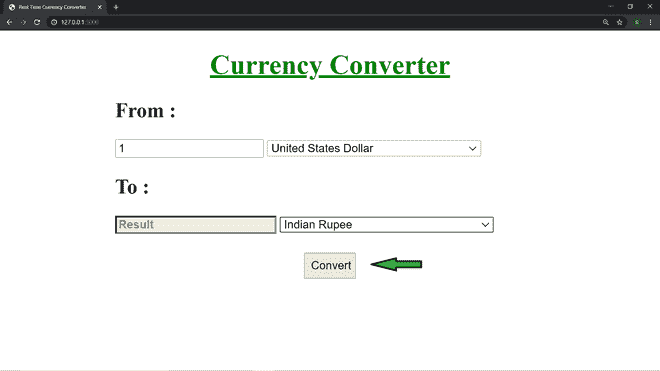
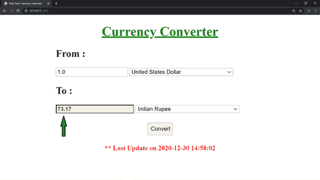

# 使用 Flask | Python 创建实时货币转换器应用程序

> 原文:[https://www . geesforgeks . org/create-a-real-time-currency-converter-app-use-flask-python/](https://www.geeksforgeeks.org/create-a-real-time-currency-converter-app-using-flask-python/)

#### 先决条件:[安装 Python](https://www.python.org/downloads/)

#### Python 中的 Flask 是什么？

Flask 是一个流行的轻量级 Python 网络框架，这意味着它是一个用于开发网络应用程序的第三方 Python 库。

#### 项目设置:

创建一个新目录，并将其命名为“**CURRENT-CONVERTER**”。

```
mkdir CURRENCY-CONVERTER && cd CURRENCY-CONVERTER
```

在里面创建两个文件 **app.py** 和 **requirements.txt** ，

```
touch app.py
touch requirements.txt
```

然后，创建一个新的文件夹名为**模板**，在里面创建一个 html 文件名为**home.html，**

```
mkdir templates && cd templates && touch home.html
cd ..
```

目录结构看起来像–



在开始编码之前，我们需要一个来自 [ALPHA VANTAGE](https://www.alphavantage.co/) 的 [API KEY](https://www.alphavantage.co/support/#api-key) 来获取实时货币汇率。

### 如何使用 Flask 创建货币转换器？

**1。**编辑**需求. txt**

```
Flask>=1.1.2
requests>=2.23.0
```

**2。**安装其他依赖项/python 包。这些是[烧瓶](https://pypi.org/project/Flask/)和[请求](https://pypi.org/project/requests/)。为此，打开终端并执行 Linux 命令

```
pip install -r requirements.txt
```

**3 .**编辑 **app.py**

## 计算机编程语言

```
from flask import Flask, render_template, request
import requests

app = Flask(__name__)
API_KEY = 'ENTER-YOUR-API-KEY'

@app.route('/', methods=['GET', 'POST'])
def home():
    if request.method == 'POST':
        try:
            amount = request.form['amount']
            amount = float(amount)
            from_c = request.form['from_c']
            to_c = request.form['to_c']
            url = 'https://www.alphavantage.co/query?function=CURRENCY_EXCHANGE_RATE&from_currency={}&to_currency={}&apikey={}'.format(
                from_c, to_c, API_KEY)
            response = requests.get(url=url).json()
            rate = response['Realtime Currency Exchange Rate']['5\. Exchange Rate']
            rate = float(rate)
            result = rate * amount
            from_c_code = response['Realtime Currency Exchange Rate']['1\. From_Currency Code']
            from_c_name = response['Realtime Currency Exchange Rate']['2\. From_Currency Name']
            to_c_code = response['Realtime Currency Exchange Rate']['3\. To_Currency Code']
            to_c_name = response['Realtime Currency Exchange Rate']['4\. To_Currency Name']
            time = response['Realtime Currency Exchange Rate']['6\. Last Refreshed']
            return render_template('home.html', result=round(result, 2), amount=amount,
                                   from_c_code=from_c_code, from_c_name=from_c_name,
                                   to_c_code=to_c_code, to_c_name=to_c_name, time=time)
        except Exception as e:
            return '<h1>Bad Request : {}</h1>'.format(e)

    else:
        return render_template('home.html')

if __name__ == "__main__":
    app.run(debug=True)
```

**4。**编辑**模板/首页. html**

## 超文本标记语言

```
<!DOCTYPE html>
<html lang="en">
<head>
    <meta charset="UTF-8">
    <meta name="viewport" content="width=device-width, initial-scale=1.0">
    <title>Real Time Currency Converter</title>
    <style>
        .container {
          max-width: 500px;
          margin: auto;
        }
    </style>
</head>
<body>
    <div class="container">
        <h1 style="text-align: center;color: green;"><u>Currency Converter</u></h1>
        <form action="/" method="POST" id="myform">
            <h2>From :</h2>
            <input type="number" placeholder="Enter Amount" name="amount" min="0" value="{{amount}}" required="required">
            <select required name="from_c" id="from_c">
                <option value="">Choose Currency</option>
                
                <option value="{{from_c_code}}" selected>{{from_c_name}}</option>
                
                <option value="AED">United Arab Emirates Dirham</option>
                <option value="AFN">Afghan Afghani</option>
                <option value="ALL">Albanian Lek</option>
                <option value="AMD">Armenian Dram</option>
                <option value="ANG">Netherlands Antillean Guilder</option>
                <option value="AOA">Angolan Kwanza</option>
                <option value="ARS">Argentine Peso</option>
                <option value="AUD">Australian Dollar</option>
                <option value="AWG">Aruban Florin</option>
                <option value="AZN">Azerbaijani Manat</option>
                <option value="BAM">Bosnia-Herzegovina Convertible Mark</option>
                <option value="BBD">Barbadian Dollar</option>
                <option value="BDT">Bangladeshi Taka</option>
                <option value="BGN">Bulgarian Lev</option>
                <option value="BHD">Bahraini Dinar</option>
                <option value="BIF">Burundian Franc</option>
                <option value="BMD">Bermudan Dollar</option>
                <option value="BND">Brunei Dollar</option>
                <option value="BOB">Bolivian Boliviano</option>
                <option value="BRL">Brazilian Real</option>
                <option value="BSD">Bahamian Dollar</option>
                <option value="BTN">Bhutanese Ngultrum</option>
                <option value="BWP">Botswanan Pula</option>
                <option value="BZD">Belize Dollar</option>
                <option value="CAD">Canadian Dollar</option>
                <option value="CDF">Congolese Franc</option>
                <option value="CHF">Swiss Franc</option>
                <option value="CLF">Chilean Unit of Account UF</option>
                <option value="CLP">Chilean Peso</option>
                <option value="CNH">Chinese Yuan Offshore</option>
                <option value="CNY">Chinese Yuan</option>
                <option value="COP">Colombian Peso</option>
                <option value="CUP">Cuban Peso</option>
                <option value="CVE">Cape Verdean Escudo</option>
                <option value="CZK">Czech Republic Koruna</option>
                <option value="DJF">Djiboutian Franc</option>
                <option value="DKK">Danish Krone</option>
                <option value="DOP">Dominican Peso</option>
                <option value="DZD">Algerian Dinar</option>
                <option value="EGP">Egyptian Pound</option>
                <option value="ERN">Eritrean Nakfa</option>
                <option value="ETB">Ethiopian Birr</option>
                <option value="EUR">Euro</option>
                <option value="FJD">Fijian Dollar</option>
                <option value="FKP">Falkland Islands Pound</option>
                <option value="GBP">British Pound Sterling</option>
                <option value="GEL">Georgian Lari</option>
                <option value="GHS">Ghanaian Cedi</option>
                <option value="GIP">Gibraltar Pound</option>
                <option value="GMD">Gambian Dalasi</option>
                <option value="GNF">Guinean Franc</option>
                <option value="GTQ">Guatemalan Quetzal</option>
                <option value="GYD">Guyanaese Dollar</option>
                <option value="HKD">Hong Kong Dollar</option>
                <option value="HNL">Honduran Lempira</option>
                <option value="HRK">Croatian Kuna</option>
                <option value="HTG">Haitian Gourde</option>
                <option value="HUF">Hungarian Forint</option>
                <option value="IDR">Indonesian Rupiah</option>
                <option value="ILS">Israeli New Sheqel</option>
                <option value="INR">Indian Rupee</option>
                <option value="IQD">Iraqi Dinar</option>
                <option value="IRR">Iranian Rial</option>
                <option value="ISK">Icelandic Krona</option>
                <option value="JEP">Jersey Pound</option>
                <option value="JMD">Jamaican Dollar</option>
                <option value="JOD">Jordanian Dinar</option>
                <option value="JPY">Japanese Yen</option>
                <option value="KES">Kenyan Shilling</option>
                <option value="KGS">Kyrgystani Som</option>
                <option value="KHR">Cambodian Riel</option>
                <option value="KMF">Comorian Franc</option>
                <option value="KPW">North Korean Won</option>
                <option value="KRW">South Korean Won</option>
                <option value="KWD">Kuwaiti Dinar</option>
                <option value="KYD">Cayman Islands Dollar</option>
                <option value="KZT">Kazakhstani Tenge</option>
                <option value="LAK">Laotian Kip</option>
                <option value="LBP">Lebanese Pound</option>
                <option value="LKR">Sri Lankan Rupee</option>
                <option value="LRD">Liberian Dollar</option>
                <option value="LSL">Lesotho Loti</option>
                <option value="LYD">Libyan Dinar</option>
                <option value="MAD">Moroccan Dirham</option>
                <option value="MDL">Moldovan Leu</option>
                <option value="MGA">Malagasy Ariary</option>
                <option value="MKD">Macedonian Denar</option>
                <option value="MMK">Myanma Kyat</option>
                <option value="MNT">Mongolian Tugrik</option>
                <option value="MOP">Macanese Pataca</option>
                <option value="MRO">Mauritanian Ouguiya (pre-2018)</option>
                <option value="MRU">Mauritanian Ouguiya</option>
                <option value="MUR">Mauritian Rupee</option>
                <option value="MVR">Maldivian Rufiyaa</option>
                <option value="MWK">Malawian Kwacha</option>
                <option value="MXN">Mexican Peso</option>
                <option value="MYR">Malaysian Ringgit</option>
                <option value="MZN">Mozambican Metical</option>
                <option value="NAD">Namibian Dollar</option>
                <option value="NGN">Nigerian Naira</option>
                <option value="NOK">Norwegian Krone</option>
                <option value="NPR">Nepalese Rupee</option>
                <option value="NZD">New Zealand Dollar</option>
                <option value="OMR">Omani Rial</option>
                <option value="PAB">Panamanian Balboa</option>
                <option value="PEN">Peruvian Nuevo Sol</option>
                <option value="PGK">Papua New Guinean Kina</option>
                <option value="PHP">Philippine Peso</option>
                <option value="PKR">Pakistani Rupee</option>
                <option value="PLN">Polish Zloty</option>
                <option value="PYG">Paraguayan Guarani</option>
                <option value="QAR">Qatari Rial</option>
                <option value="RON">Romanian Leu</option>
                <option value="RSD">Serbian Dinar</option>
                <option value="RUB">Russian Ruble</option>
                <option value="RUR">Old Russian Ruble</option>
                <option value="RWF">Rwandan Franc</option>
                <option value="SAR">Saudi Riyal</option>
                <option value="SBDf">Solomon Islands Dollar</option>
                <option value="SCR">Seychellois Rupee</option>
                <option value="SDG">Sudanese Pound</option>
                <option value="SDR">Special Drawing Rights</option>
                <option value="SEK">Swedish Krona</option>
                <option value="SGD">Singapore Dollar</option>
                <option value="SHP">Saint Helena Pound</option>
                <option value="SLL">Sierra Leonean Leone</option>
                <option value="SOS">Somali Shilling</option>
                <option value="SRD">Surinamese Dollar</option>
                <option value="SYP">Syrian Pound</option>
                <option value="SZL">Swazi Lilangeni</option>
                <option value="THB">Thai Baht</option>
                <option value="TJS">Tajikistani Somoni</option>
                <option value="TMT">Turkmenistani Manat</option>
                <option value="TND">Tunisian Dinar</option>
                <option value="TOP">Tongan Pa'anga</option>
                <option value="TRY">Turkish Lira</option>
                <option value="TTD">Trinidad and Tobago Dollar</option>
                <option value="TWD">New Taiwan Dollar</option>
                <option value="TZS">Tanzanian Shilling</option>
                <option value="UAH">Ukrainian Hryvnia</option>
                <option value="UGX">Ugandan Shilling</option>
                <option value="USD">United States Dollar</option>
                <option value="UYU">Uruguayan Peso</option>
                <option value="UZS">Uzbekistan Som</option>
                <option value="VND">Vietnamese Dong</option>
                <option value="VUV">Vanuatu Vatu</option>
                <option value="WST">Samoan Tala</option>
                <option value="XAF">CFA Franc BEAC</option>
                <option value="XCD">East Caribbean Dollar</option>
                <option value="XDR">Special Drawing Rights</option>
                <option value="XOF">CFA Franc BCEAO</option>
                <option value="XPF">CFP Franc</option>
                <option value="YER">Yemeni Rial</option>
                <option value="ZAR">South African Rand</option>
                <option value="ZMW">Zambian Kwacha</option>
                <option value="ZWL">Zimbabwean Dollar</option>
            </select>
            <h2>To :</h2>
            <input type="number" placeholder="Result" style="background-color:cornsilk;color:mediumblue;font-weight:bold" value="{{result}}" readonly>
            <select required name="to_c" id="to_c">
                <option value="">Choose Currency</option>
                
                <option value="{{to_c_code}}" selected>{{to_c_name}}</option>
                
                <option value="AED">United Arab Emirates Dirham</option>
                <option value="AFN">Afghan Afghani</option>
                <option value="ALL">Albanian Lek</option>
                <option value="AMD">Armenian Dram</option>
                <option value="ANG">Netherlands Antillean Guilder</option>
                <option value="AOA">Angolan Kwanza</option>
                <option value="ARS">Argentine Peso</option>
                <option value="AUD">Australian Dollar</option>
                <option value="AWG">Aruban Florin</option>
                <option value="AZN">Azerbaijani Manat</option>
                <option value="BAM">Bosnia-Herzegovina Convertible Mark</option>
                <option value="BBD">Barbadian Dollar</option>
                <option value="BDT">Bangladeshi Taka</option>
                <option value="BGN">Bulgarian Lev</option>
                <option value="BHD">Bahraini Dinar</option>
                <option value="BIF">Burundian Franc</option>
                <option value="BMD">Bermudan Dollar</option>
                <option value="BND">Brunei Dollar</option>
                <option value="BOB">Bolivian Boliviano</option>
                <option value="BRL">Brazilian Real</option>
                <option value="BSD">Bahamian Dollar</option>
                <option value="BTN">Bhutanese Ngultrum</option>
                <option value="BWP">Botswanan Pula</option>
                <option value="BZD">Belize Dollar</option>
                <option value="CAD">Canadian Dollar</option>
                <option value="CDF">Congolese Franc</option>
                <option value="CHF">Swiss Franc</option>
                <option value="CLF">Chilean Unit of Account UF</option>
                <option value="CLP">Chilean Peso</option>
                <option value="CNH">Chinese Yuan Offshore</option>
                <option value="CNY">Chinese Yuan</option>
                <option value="COP">Colombian Peso</option>
                <option value="CUP">Cuban Peso</option>
                <option value="CVE">Cape Verdean Escudo</option>
                <option value="CZK">Czech Republic Koruna</option>
                <option value="DJF">Djiboutian Franc</option>
                <option value="DKK">Danish Krone</option>
                <option value="DOP">Dominican Peso</option>
                <option value="DZD">Algerian Dinar</option>
                <option value="EGP">Egyptian Pound</option>
                <option value="ERN">Eritrean Nakfa</option>
                <option value="ETB">Ethiopian Birr</option>
                <option value="EUR">Euro</option>
                <option value="FJD">Fijian Dollar</option>
                <option value="FKP">Falkland Islands Pound</option>
                <option value="GBP">British Pound Sterling</option>
                <option value="GEL">Georgian Lari</option>
                <option value="GHS">Ghanaian Cedi</option>
                <option value="GIP">Gibraltar Pound</option>
                <option value="GMD">Gambian Dalasi</option>
                <option value="GNF">Guinean Franc</option>
                <option value="GTQ">Guatemalan Quetzal</option>
                <option value="GYD">Guyanaese Dollar</option>
                <option value="HKD">Hong Kong Dollar</option>
                <option value="HNL">Honduran Lempira</option>
                <option value="HRK">Croatian Kuna</option>
                <option value="HTG">Haitian Gourde</option>
                <option value="HUF">Hungarian Forint</option>
                <option value="IDR">Indonesian Rupiah</option>
                <option value="ILS">Israeli New Sheqel</option>
                <option value="INR">Indian Rupee</option>
                <option value="IQD">Iraqi Dinar</option>
                <option value="IRR">Iranian Rial</option>
                <option value="ISK">Icelandic Krona</option>
                <option value="JEP">Jersey Pound</option>
                <option value="JMD">Jamaican Dollar</option>
                <option value="JOD">Jordanian Dinar</option>
                <option value="JPY">Japanese Yen</option>
                <option value="KES">Kenyan Shilling</option>
                <option value="KGS">Kyrgystani Som</option>
                <option value="KHR">Cambodian Riel</option>
                <option value="KMF">Comorian Franc</option>
                <option value="KPW">North Korean Won</option>
                <option value="KRW">South Korean Won</option>
                <option value="KWD">Kuwaiti Dinar</option>
                <option value="KYD">Cayman Islands Dollar</option>
                <option value="KZT">Kazakhstani Tenge</option>
                <option value="LAK">Laotian Kip</option>
                <option value="LBP">Lebanese Pound</option>
                <option value="LKR">Sri Lankan Rupee</option>
                <option value="LRD">Liberian Dollar</option>
                <option value="LSL">Lesotho Loti</option>
                <option value="LYD">Libyan Dinar</option>
                <option value="MAD">Moroccan Dirham</option>
                <option value="MDL">Moldovan Leu</option>
                <option value="MGA">Malagasy Ariary</option>
                <option value="MKD">Macedonian Denar</option>
                <option value="MMK">Myanma Kyat</option>
                <option value="MNT">Mongolian Tugrik</option>
                <option value="MOP">Macanese Pataca</option>
                <option value="MRO">Mauritanian Ouguiya (pre-2018)</option>
                <option value="MRU">Mauritanian Ouguiya</option>
                <option value="MUR">Mauritian Rupee</option>
                <option value="MVR">Maldivian Rufiyaa</option>
                <option value="MWK">Malawian Kwacha</option>
                <option value="MXN">Mexican Peso</option>
                <option value="MYR">Malaysian Ringgit</option>
                <option value="MZN">Mozambican Metical</option>
                <option value="NAD">Namibian Dollar</option>
                <option value="NGN">Nigerian Naira</option>
                <option value="NOK">Norwegian Krone</option>
                <option value="NPR">Nepalese Rupee</option>
                <option value="NZD">New Zealand Dollar</option>
                <option value="OMR">Omani Rial</option>
                <option value="PAB">Panamanian Balboa</option>
                <option value="PEN">Peruvian Nuevo Sol</option>
                <option value="PGK">Papua New Guinean Kina</option>
                <option value="PHP">Philippine Peso</option>
                <option value="PKR">Pakistani Rupee</option>
                <option value="PLN">Polish Zloty</option>
                <option value="PYG">Paraguayan Guarani</option>
                <option value="QAR">Qatari Rial</option>
                <option value="RON">Romanian Leu</option>
                <option value="RSD">Serbian Dinar</option>
                <option value="RUB">Russian Ruble</option>
                <option value="RUR">Old Russian Ruble</option>
                <option value="RWF">Rwandan Franc</option>
                <option value="SAR">Saudi Riyal</option>
                <option value="SBDf">Solomon Islands Dollar</option>
                <option value="SCR">Seychellois Rupee</option>
                <option value="SDG">Sudanese Pound</option>
                <option value="SDR">Special Drawing Rights</option>
                <option value="SEK">Swedish Krona</option>
                <option value="SGD">Singapore Dollar</option>
                <option value="SHP">Saint Helena Pound</option>
                <option value="SLL">Sierra Leonean Leone</option>
                <option value="SOS">Somali Shilling</option>
                <option value="SRD">Surinamese Dollar</option>
                <option value="SYP">Syrian Pound</option>
                <option value="SZL">Swazi Lilangeni</option>
                <option value="THB">Thai Baht</option>
                <option value="TJS">Tajikistani Somoni</option>
                <option value="TMT">Turkmenistani Manat</option>
                <option value="TND">Tunisian Dinar</option>
                <option value="TOP">Tongan Pa'anga</option>
                <option value="TRY">Turkish Lira</option>
                <option value="TTD">Trinidad and Tobago Dollar</option>
                <option value="TWD">New Taiwan Dollar</option>
                <option value="TZS">Tanzanian Shilling</option>
                <option value="UAH">Ukrainian Hryvnia</option>
                <option value="UGX">Ugandan Shilling</option>
                <option value="USD">United States Dollar</option>
                <option value="UYU">Uruguayan Peso</option>
                <option value="UZS">Uzbekistan Som</option>
                <option value="VND">Vietnamese Dong</option>
                <option value="VUV">Vanuatu Vatu</option>
                <option value="WST">Samoan Tala</option>
                <option value="XAF">CFA Franc BEAC</option>
                <option value="XCD">East Caribbean Dollar</option>
                <option value="XDR">Special Drawing Rights</option>
                <option value="XOF">CFA Franc BCEAO</option>
                <option value="XPF">CFP Franc</option>
                <option value="YER">Yemeni Rial</option>
                <option value="ZAR">South African Rand</option>
                <option value="ZMW">Zambian Kwacha</option>
                <option value="ZWL">Zimbabwean Dollar</option>
            </select>
            <h2 style="text-align: center;"><input type="submit" style="width: 60px;height: 30px;" value="Convert"></h2>
        </form>
        
        <h4 style="color: red; text-align: center;">** Last Update on {{time}}</h4>
        
    </div>
</body>
</html>
```

**5。**之后可以运行网络服务器查看天气应用。为此，运行 **app.py** 文件。为此，在终端中编写以下 Linux 命令。

```
python app.py
```

**6。**然后打开任意网页浏览器，转到:http://127.0.0.1:5000/

### 最终应用程序看起来有点像:

 

#### 工作–

<video class="wp-video-shortcode" id="video-539246-1" width="640" height="360" preload="metadata" controls=""><source type="video/mp4" src="https://media.geeksforgeeks.org/wp-content/uploads/20201230201114/demo_video.mp4?_=1">[https://media.geeksforgeeks.org/wp-content/uploads/20201230201114/demo_video.mp4](https://media.geeksforgeeks.org/wp-content/uploads/20201230201114/demo_video.mp4)</video>

获取源代码[点击这里](https://github.com/sujoy-coder/Currency-Converter-App)。