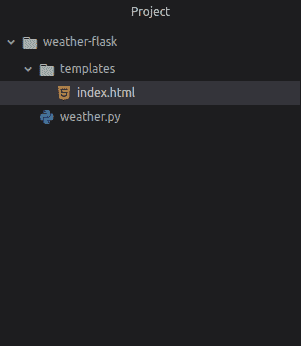

# 使用 Flask | Python 创建天气应用程序

> 原文:[https://www . geesforgeks . org/create-a-weather-app-use-flask-python/](https://www.geeksforgeeks.org/create-a-weather-app-using-flask-python/)

**先决条件:** [烧瓶安装](https://www.geeksforgeeks.org/flask-creating-first-simple-application/)

Flask 是一个用 Python 编写的轻量级框架。它是轻量级的，因为它不需要特定的工具或库，并且允许快速的 web 开发。今天我们将使用 flask 作为 web 框架创建一个天气应用程序。这个天气网络应用程序将提供搜索到的城市的最新天气信息。

**基本设置:**

创建一个文件，并将其命名为

**创建文件的 Linux 命令**

```
touch weather.py 
```

**现在，用文件名`index.html`创建一个文件夹*模板***

**Linux 命令创建一个文件夹和一个文件**

```
 mkdir templates && cd templates && touch index.html 
```

**项目文件夹看起来像:
**

****编辑文件:**
从[天气 API](https://openweathermap.org/api) 中使用自己的 API 密钥，并将其放入 API 变量中。现在编辑`weather.py`文件。**

```
from flask import Flask, render_template, request

# import json to load JSON data to a python dictionary
import json

# urllib.request to make a request to api
import urllib.request

app = Flask(__name__)

@app.route('/', methods =['POST', 'GET'])
def weather():
    if request.method == 'POST':
        city = request.form['city']
    else:
        # for default name mathura
        city = 'mathura'

    # your API key will come here
    api = api_key_here

    # source contain json data from api
    source = urllib.request.urlopen('http://api.openweathermap.org/data/2.5/weather?q =' + city + '&appid =' + api).read()

    # converting JSON data to a dictionary
    list_of_data = json.loads(source)

    # data for variable list_of_data
    data = {
        "country_code": str(list_of_data['sys']['country']),
        "coordinate": str(list_of_data['coord']['lon']) + ' ' 
                    + str(list_of_data['coord']['lat']),
        "temp": str(list_of_data['main']['temp']) + 'k',
        "pressure": str(list_of_data['main']['pressure']),
        "humidity": str(list_of_data['main']['humidity']),
    }
    print(data)
    return render_template('index.html', data = data)

if __name__ == '__main__':
    app.run(debug = True)
```

**导航至模板/index.html 并编辑:[链接至索引文件](https://github.com/itsvinayak/weather-app/blob/master/weather-flask/templates/index.html)。**

**现在，您可以运行服务器来查看天气应用程序–**

```
 python weather.py 
```