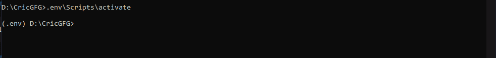
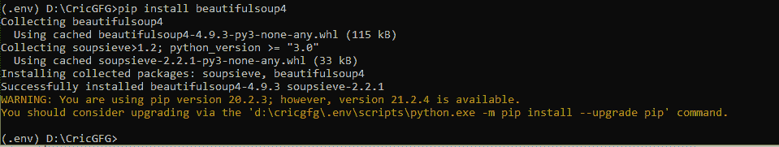
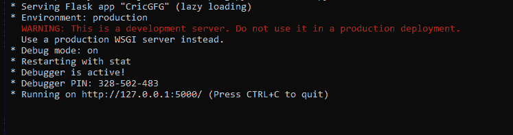
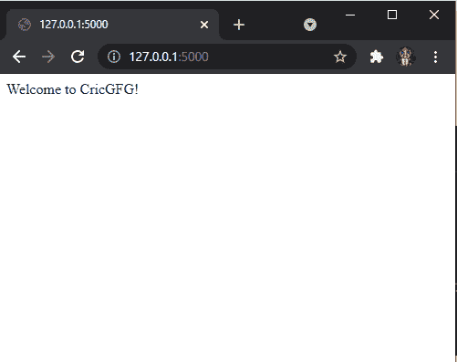
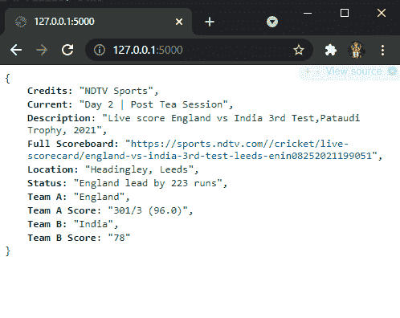
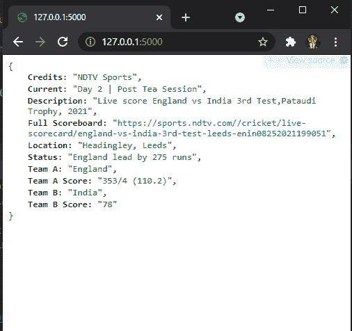
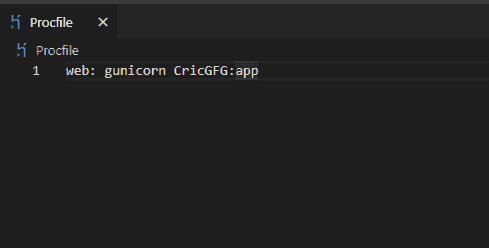
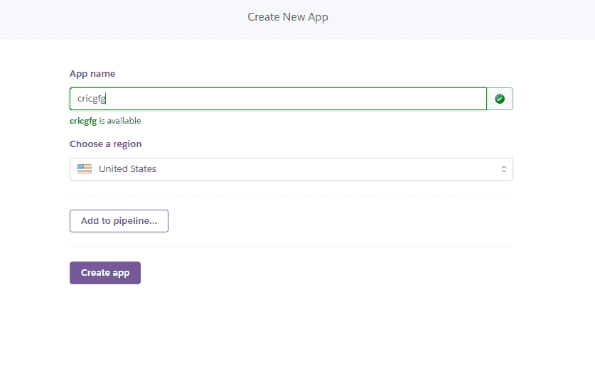
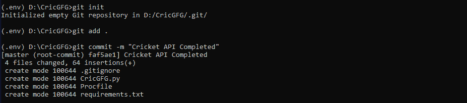
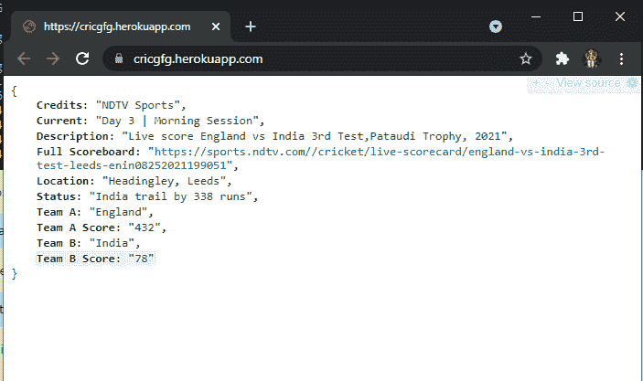

# 使用烧瓶中的刮网创建板球得分 API

> 原文:[https://www . geesforgeks . org/create-cricket-score-API-use-web-scratch-in-flask/](https://www.geeksforgeeks.org/create-cricket-score-api-using-web-scraping-in-flask/)

板球是全世界著名的户外运动之一。提供实时记分牌的 API 非常少，而且没有一个是免费使用的。使用任何可用的记分牌，我们都可以为自己创建 API。这种方法不仅适用于板球记分牌，也适用于任何在线信息。以下是本博客将指导创建和部署应用编程接口的流程。

*   设置应用程序目录
*   网络刮刮乐数据来自 NDTV 体育。
    *   将使用 Python 中的“美丽的汤”。
*   创建一个应用编程接口。
    *   将使用烧瓶。
*   Heroku 将用于部署，

## **设置应用目录**

**第 1 步:**创建一个文件夹(如 CricGFG)。

**第二步:**设置虚拟环境。这里我们创造一个环境**。env**

```
python -m venv .env
```

**第三步:**激活环境。

```
.env\Scripts\activate
```



## **获取数据**

**第一步:**在 Python 中，我们有美人汤，这是一个从 HTML 文件中拉出数据的库。要安装美丽的汤，运行一个简单的命令；

```
pip install beautifulsoup4
```



同样，安装 Python 的请求模块。

```
pip install requests
```

我们将使用 [NDTV 体育板球](https://sports.ndtv.com/cricket/live-scores)记分卡来获取数据。

**步骤 3:** 以下是从网页中抓取数据的步骤。从网页中获取 HTML 文本；

> html _ text = requests . get(' https://sports . ndtv . com/cricket/live-scores ')。文本

为了将解析后的对象作为一个整体来表示，我们使用了美丽的输出对象，

```
soup = BeautifulSoup(html_text, "html.parser")
```

**注意:**建议每走一步后运行检查代码，了解区别，彻底理解概念。

**示例:**

## 计算机编程语言

```
from bs4 import BeautifulSoup
import requests

html_text = requests.get('https://sports.ndtv.com/cricket/live-scores').text
soup = BeautifulSoup(html_text, "html.parser")
print(soup)
```

我们将进一步找到所有必需的 div 和其他标签以及它们各自的类。

## 计算机编程语言

```
from bs4 import BeautifulSoup
import requests

html_text = requests.get('https://sports.ndtv.com/cricket/live-scores').text
soup = BeautifulSoup(html_text, "html.parser")
sect = soup.find_all('div', class_='sp-scr_wrp')
section = sect[0]
description = section.find('span', class_='description').text
location = section.find('span', class_='location').text
current = section.find('div', class_='scr_dt-red').text
link = "https://sports.ndtv.com/" + \
    section.find('a', class_='scr_ful-sbr-txt').get('href')
```

代码的下一部分有我们的数据，也就是我们的结果。如果由于任何原因，代码没有出现在 HTML 文件中，这将导致错误，因此将该部分包含在 try and except 块中。

**完整代码:**

## 蟒蛇 3

```
from bs4 import BeautifulSoup
import requests

html_text = requests.get('https://sports.ndtv.com/cricket/live-scores').text
soup = BeautifulSoup(html_text, "html.parser")
sect = soup.find_all('div', class_='sp-scr_wrp ind-hig_crd vevent')

section = sect[0]
description = section.find('span', class_='description').text
location = section.find('span', class_='location').text
current = section.find('div', class_='scr_dt-red').text
link = "https://sports.ndtv.com/" + section.find(
    'a', class_='scr_ful-sbr-txt').get('href')

try:
    status = section.find_all('div', class_="scr_dt-red")[1].text
    block = section.find_all('div', class_='scr_tm-wrp')
    team1_block = block[0]
    team1_name = team1_block.find('div', class_='scr_tm-nm').text
    team1_score = team1_block.find('span', class_='scr_tm-run').text
    team2_block = block[1]
    team2_name = team2_block.find('div', class_='scr_tm-nm').text
    team2_score = team2_block.find('span', class_='scr_tm-run').text
    print(description)
    print(location)
    print(status)
    print(current)
    print(team1_name.strip())
    print(team1_score.strip())
    print(team2_name.strip())
    print(team2_score.strip())
    print(link)
except:
    print("Data not available")
```

**输出:**

> 现场评分英格兰 vs 印度第三次测试，帕特奥迪奖杯，2021
> 
> 利兹海德利
> 
> 英格兰队领先 223 分
> 
> 第 2 天|茶后会议
> 
> 英格兰
> 
> 301/3 (96.0)
> 
> 印度
> 
> seventy-eight
> 
> https://sports.ndtv.com//cricket/live-scorecard/england-vs-india-3rd-test-leeds-enin08252021199051

## **创建应用编程接口**

我们将使用 [Flask](https://www.geeksforgeeks.org/flask-creating-first-simple-application/) ，这是一个用 Python 编写的微 web 框架。

```
pip install Flask
```

以下是我们烧瓶应用的起始代码。

## 蟒蛇 3

```
# We import the Flask Class, an instance of 
# this class will be our WSGI application.
from flask import Flask

# We create an instance of this class. The first
# argument is the name of the application’s module 
# or package. __name__ is a convenient shortcut for
# this that is appropriate for most cases.This is
# needed so that Flask knows where to look for resources
# such as templates and static files.
app = Flask(__name__)

# We use the route() decorator to tell Flask what URL 
# should trigger our function.
@app.route('/')
def cricgfg():
    return "Welcome to CricGFG!"

# main driver function
if __name__ == "__main__":

    # run() method of Flask class runs the 
    # application on the local development server.
    app.run(debug=True)
```

输出:



在浏览器上打开 localhost:



我们现在将把我们的网页抓取代码添加到这个中，并添加一些由 Flask 提供的帮助方法来正确返回 JSON 数据。

### 理解 Jsonify

jsonify 是 Flask 中的一个函数。它将数据序列化为 JavaScript 对象符号(JSON)格式。考虑以下代码:

## 蟒蛇 3

```
from flask import Flask, jsonify

app = Flask(__name__)

@app.route('/')
def cricgfg():

    # Creating a dictionary with data to test jsonfiy.
    result = {
        "Description": "Live score England vs India 3rd Test,Pataudi \
        Trophy, 2021",
        "Location": "Headingley, Leeds",
        "Status": "England lead by 223 runs",
        "Current": "Day 2 | Post Tea Session",
        "Team A": "England",
        "Team A Score": "301/3 (96.0)",
        "Team B": "India",
        "Team B Score": "78",
        "Full Scoreboard": "https://sports.ndtv.com//cricket/live-scorecard\
        /england-vs-india-3rd-test-leeds-enin08252021199051",
        "Credits": "NDTV Sports"
    }
    return jsonify(result)

if __name__ == "__main__":
    app.run(debug=True)
```

**输出:**



现在是时候合并我们所有的代码了。让我们开始吧！

## 蟒蛇 3

```
import requests
from bs4 import BeautifulSoup
from flask import Flask, jsonify

app = Flask(__name__)

@app.route('/')
def cricgfg():
    html_text = requests.get('https://sports.ndtv.com/cricket/live-scores').text
    soup = BeautifulSoup(html_text, "html.parser")
    sect = soup.find_all('div', class_='sp-scr_wrp ind-hig_crd vevent')

    section = sect[0]
    description = section.find('span', class_='description').text
    location = section.find('span', class_='location').text
    current = section.find('div', class_='scr_dt-red').text
    link = "https://sports.ndtv.com/" + section.find(
    'a', class_='scr_ful-sbr-txt').get('href')

    try:
        status = section.find_all('div', class_="scr_dt-red")[1].text
        block = section.find_all('div', class_='scr_tm-wrp')
        team1_block = block[0]
        team1_name = team1_block.find('div', class_='scr_tm-nm').text
        team1_score = team1_block.find('span', class_='scr_tm-run').text
        team2_block = block[1]
        team2_name = team2_block.find('div', class_='scr_tm-nm').text
        team2_score = team2_block.find('span', class_='scr_tm-run').text
        result = {
            "Description": description,
            "Location": location,
            "Status": status,
            "Current": current,
            "Team A": team1_name,
            "Team A Score": team1_score,
            "Team B": team2_name,
            "Team B Score": team2_score,
            "Full Scoreboard": link,
            "Credits": "NDTV Sports"
        }
    except:
        pass
    return jsonify(result)

if __name__ == "__main__":
    app.run(debug=True)
```

浏览器中的输出:



在这里，我们创建了自己的板球应用编程接口。

## **在 Heroku 上部署 API**

**第一步:**你需要在[英雄库](https://signup.heroku.com/login)上创建一个账户。

**第二步:** [在你的机器上安装 Git](https://www.geeksforgeeks.org/introduction-and-installation-of-git/) 。

**步骤 3:** 在机器上安装 Heroku。

**第 4 步:**登录你的 Heroku 账户

```
heroku login
```

**第五步:**安装 gunicorn，这是一个用于 WSGI 应用的纯 Python HTTP 服务器。它允许您通过运行多个 Python 进程来同时运行任何 Python 应用程序。

```
pip install gunicorn
```

**第 6 步:**我们需要创建一个概要文件，它是我们应用程序根目录中的一个文本文件，以明确声明应该执行什么命令来启动我们的应用程序。

```
web: gunicorn CricGFG:app
```



**第 7 步:**我们进一步创建一个 requirements.txt 文件，其中包含 Heroku 运行我们的 flask 应用程序所需的所有必要模块。

```
pip freeze >> requirements.txt
```

**第八步:**在 Heroku 上创建一个应用，[点击这里](https://dashboard.heroku.com/new-app)。



**步骤 9:** 我们现在初始化一个 git 存储库，并将我们的文件添加到其中。

```
git init
git add .
git commit -m "Cricket API Completed"
```



**第 10 步:**我们现在将引导 Heroku 前往我们的 git 存储库。

```
heroku git:remote -a cricgfg
```

**第 11 步:**我们现在将在 Heroku 上推送我们的文件。

```
git push heroku master
```

最后，我们的应用编程接口现已在 https://cricgfg.herokuapp.com/发布

