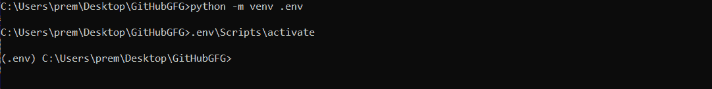
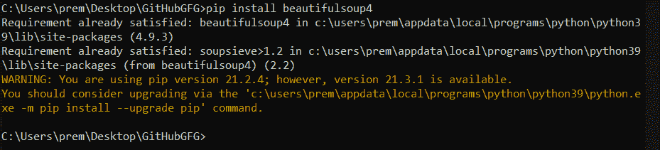
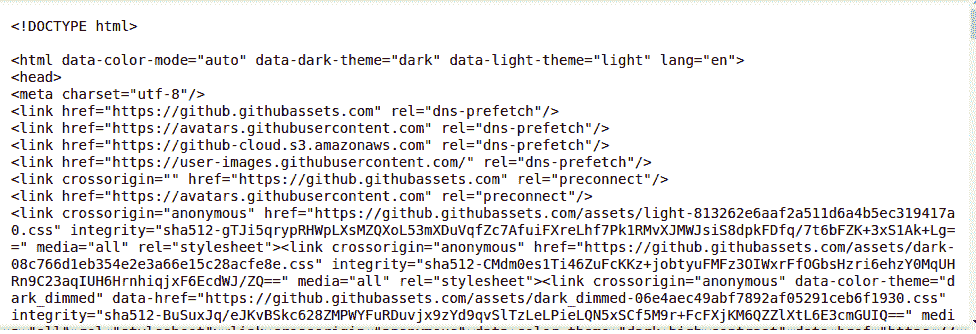
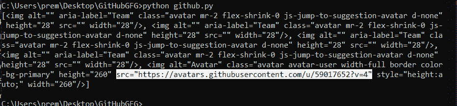
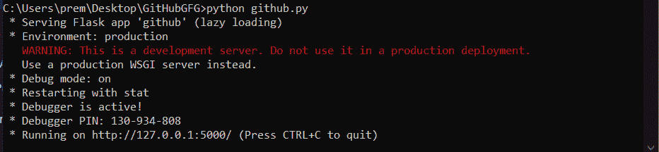
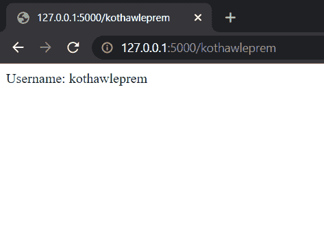

# 使用 Python 和 Flask 创建 GitHub API 来获取用户配置文件图像和存储库数量

> 原文:[https://www . geesforgeks . org/create-github-API-to-fetch-user-profile-image-and-number-repository-use-python-and-flask/](https://www.geeksforgeeks.org/create-github-api-to-fetch-user-profile-image-and-number-of-repositories-using-python-and-flask/)

GitHub 是开发者塑造软件未来的地方，一起，为开源社区做贡献，管理 Git 存储库等。它是开发人员最常用的工具之一，它的简介被共享以展示或让其他人为它的项目做贡献。使用 python 进行网页抓取也是获取数据的最佳方法之一。

在本文中，我们将创建一个应用编程接口来获取用户的配置文件图像及其追随者。以下是本博客创建应用编程接口的流程:

*   设置应用程序目录
*   从 GitHub 抓取数据。
    *   将使用 Python 中的“美丽的汤”。
*   创建一个应用编程接口。
    *   将使用烧瓶。

## **设置应用目录**

**步骤 1:** 创建一个文件夹(如 GitHubGFG)。

**第二步:**设置虚拟环境。这里我们创造了一个环境。包封/包围（动词 envelop 的简写）

```py
python -m venv .env
```

**第三步:**激活环境。

```py
.env\Scripts\activate
```



## **抓取数据**

**第一步:**在 Python 中，我们有美人汤，这是一个从 HTML 文件中拉出数据的库。要安装美丽的汤，运行一个简单的命令；

```py
pip install beautifulsoup4
```



**第二步:**安装 Python 的 Requests 模块。[请求](https://www.geeksforgeeks.org/python-requests-tutorial/)允许极其轻松地发送 HTTP/1.1 请求。

```py
pip install requests
```

创建一个 python 文件。(例如:github.py)

**步骤 3:** 以下是从网页中抓取数据的步骤。从网页中获取 HTML 文本；

```py
github_html = requests.get(f'https://github.com/{username}').text
```

{username}将具有所需用户的 GitHub 用户名。为了将解析后的对象作为一个整体来表示，我们使用了美丽的输出对象，

```py
soup = BeautifulSoup(github_html, "html.parser")
```

**示例:**

## 蟒蛇 3

```py
from bs4 import BeautifulSoup
import requests

username = "kothawleprem"

github_html = requests.get(f'https://github.com/{username}').text
soup = BeautifulSoup(github_html, "html.parser")
print(soup)
```

**输出:**



现在在 HTML 文档中找到头像类，因为它有配置文件图像所需的网址。

**find _ all():**find _ all()方法查看标记的后代，并检索所有与过滤器匹配的后代。这里我们的过滤器是一个 img 标签，类是头像。

## 蟒蛇 3

```py
avatar_block = soup.find_all('img',class_='avatar')
print(avatar_block)
```

以下是 avatar_block 的输出:



图像网址在 src 属性中，获取网址文本使用。get():

## 蟒蛇 3

```py
img_url = avatar_block[4].get('src')
print(img_url)
```

以下是 img_url 的输出:


在 HTML 文档中找到第一个计数器类，因为它包含了存储库数量所需的数据。

**find():**find()方法查看标签的后代，并检索与过滤器匹配的单个后代。这里我们的过滤器是一个 span 标签，类是 Counter。

```py
repos = soup.find('span',class_="Counter").text
```

整个代码如下:

## 蟒蛇 3

```py
from bs4 import BeautifulSoup
import requests

username = "kothawleprem"

github_html = requests.get(f'https://github.com/{username}').text
soup = BeautifulSoup(github_html, "html.parser")
avatar_block = soup.find_all('img',class_='avatar')
img_url = avatar_block[4].get('src')
repos = soup.find('span',class_="Counter").text

print(img_url)
print(repos)
```

**输出:**

```py
https://avatars.githubusercontent.com/u/59017652?v=4
33
```

## 创建应用编程接口

我们将使用 Flask，这是一个用 Python 编写的微型网络框架。

```py
pip install Flask
```

以下是我们烧瓶应用的起始代码。

## 蟒蛇 3

```py
# We import the Flask Class, an instance of
# this class will be our WSGI application.
from flask import Flask

# We create an instance of this class. The first
# argument is the name of the application’s module
# or package.
# __name__ is a convenient shortcut for
# this that is appropriate for most cases.This is
# needed so that Flask knows where to look for resources
# such as templates and static files.
app = Flask(__name__)

# We use the route() decorator to tell Flask what URL
# should trigger our function.
@app.route('/')
def github():
    return "Welcome to GitHubGFG!"

# main driver function
if __name__ == "__main__":

    # run() method of Flask class runs the
    # application on the local development server.
    app.run(debug=True)
```



在浏览器上打开 localhost:


从网址获取 GitHub 用户名:

## 蟒蛇 3

```py
from flask import Flask

app = Flask(__name__)

@app.route('/<username>')
def github(username):
    return f"Username: {username}"

if __name__ == "__main__":
    app.run(debug=True)
```

**输出:**



我们现在将添加我们的网络废弃代码和一些由 Flask 提供的帮助方法来正确返回 JSON 数据。jsonify 是 Flask 中的一个函数。它将数据序列化为 JavaScript 对象符号(JSON)格式。考虑以下代码:

## 蟒蛇 3

```py
import requests
from bs4 import BeautifulSoup
from flask import Flask

app = Flask(__name__)

@app.route('/<username>')
def github(username):
    github_html = requests.get(f'https://github.com/{username}').text
    soup = BeautifulSoup(github_html, "html.parser")
    avatar_block = soup.find_all('img',class_='avatar')
    img_url = avatar_block[4].get('src')
    repos = soup.find('span',class_="Counter").text

    # Creating a dictionary for our data
    result = {
        'imgUrl' : img_url,
        'numRepos' : repos,
    }
    return result

if __name__ == "__main__":
    app.run(debug=True)
```

**输出:**


如果用户名不正确或出于任何其他原因，我们需要在 try 和 except 块中添加代码来处理异常。最终代码如下:

## 蟒蛇 3

```py
import requests
from bs4 import BeautifulSoup
from flask import Flask

app = Flask(__name__)

@app.route('/<username>')
def github(username):
    try:
        github_html = requests.get(f'https://github.com/{username}').text
        soup = BeautifulSoup(github_html, "html.parser")
        avatar_block = soup.find_all('img',class_='avatar')
        img_url = avatar_block[4].get('src')
        repos = soup.find('span',class_="Counter").text
        # Creating a dictionary for our data
        result = {
            'imgUrl' : img_url,
            'numRepos' : repos,
        }
    except:
        result = {
            "message": "Invalid Username!"
        }, 400
    return result

if __name__ == "__main__":
    app.run(debug=True)
```