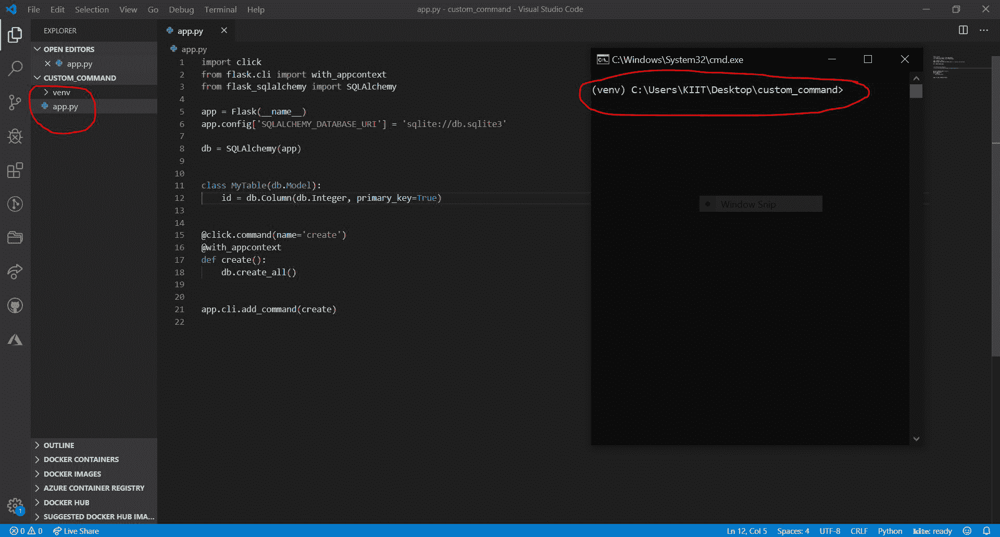
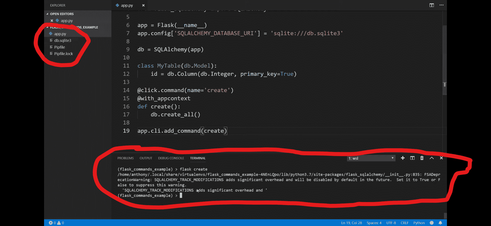
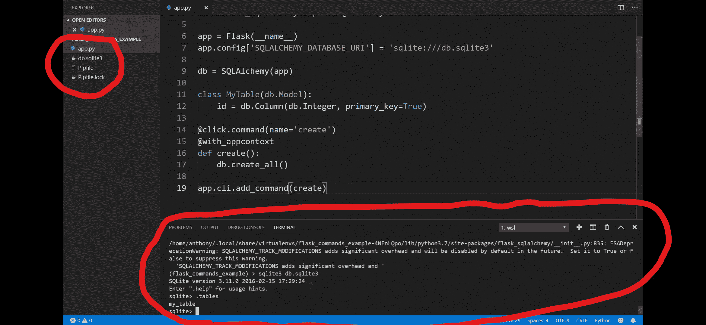

# 在烧瓶中创建自定义命令

> 原文:[https://www . geesforgeks . org/creating-custom-commands-in-flask/](https://www.geeksforgeeks.org/creating-custom-commands-in-flask/)

本文围绕如何在 flask 中创建自定义命令展开。每次使用**烧瓶运行**运行烧瓶时，运行实际上是一个命令，在烧瓶配置文件中启动一个名为运行的函数。同样，如果您曾经使用过类似 **flask migrate** 的东西，那么您可能对 flask DB migrate 或升级很熟悉。要创建这样一个在后端执行一些操作的手动命令，我们将遵循一些步骤–

### 如何在 Flask 中创建自定义命令？

**第 1 步:**使用两个主库创建命令–单击并使用烧瓶的 _appcontext 库。现在让我们创建一个名为“**烧瓶创建**”的命令，该命令将启动一个数据库，并在该数据库中创建一个简单的表

```py
import click
from flask.cli import with_appcontext
```

**点击**是 flask 用来在命令行创建这些命令的库。

**步骤 2:** 添加数据库配置–

```py
from flask_sqlalchemy import SQLAlchemy
app.config['SQLALCHEMY_DATABASE_URI']="sqlite://db.sqlite3"
```

**第三步:**然后我们创建一个简单的表格，如图所示:

```py
class MyTable(db.Model):
    id = db.Column(db.Integer, primary_key=True)
```

所以这个表显然不会做任何事情，它只有一列，因为本文的目的是演示如何创建一个命令，所以无论何时您想首先创建一个命令，您都可以使用装饰器**@ click . command(name = ' create ')**(这里参数*的值*告诉您想要创建的自定义命令的名称)。

**@ with _ app context()–**with _ app context 将所有的 app 信息都放在这个函数中，所以这个函数被称为包含在 app 中。

**步骤 4–**让我们创建所需的文件

## 蟒蛇 3

```py
# import required libraries
from flask import Flask
import click
from flask.cli import with_appcontext
from flask_sqlalchemy import SQLAlchemy

# initialize flask app
app = Flask(__name__)

# initialize Database configuration
app.config['SQLALCHEMY_DATABASE_URI'] = 'sqlite://db.sqlite3'

# create Database
db = SQLAlchemy(app)

# add table to Database
class MyTable(db.Model):
    id = db.Column(db.Integer, primary_key=True)

# create command function
@click.command(name='create')
@with_appcontext
def create():
    db.create_all()

# add command function to cli commands
app.cli.add_command(create)
```

**运行烧瓶前创建–**



**运行烧瓶创建后–**



**数据库中的表格–**

