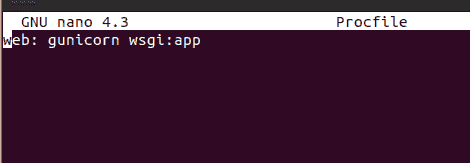
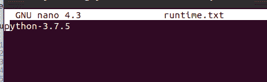
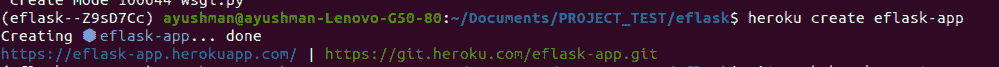
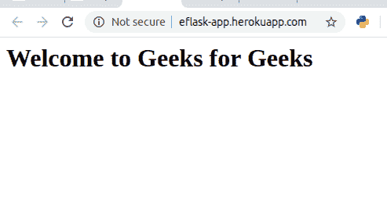

# 在 Heroku 上部署 Python 烧瓶应用

> 原文:[https://www . geesforgeks . org/deploy-python-flask-app-on-heroku/](https://www.geeksforgeeks.org/deploy-python-flask-app-on-heroku/)

Flask 是一个用 Python 编写的网络应用框架。Flask 基于 Werkzeug WSGI 工具包和 Jinja2 模板引擎。两者都是 Pocco 项目。本文围绕**如何在 Heroku** 上部署 flask app 展开。为了演示这一点，我们首先要创建一个示例应用程序，以便更好地理解这个过程。

#### 先决条件

*   计算机编程语言
*   点
*   Heroku CLI
*   饭桶

#### 在 Heroku 上部署烧瓶应用程序

让我们先创建一个简单的 flask 应用程序，然后可以将其部署到 heroku。创建一个名为**“eflask”**的文件夹，打开**“eflask”**目录中的命令行和 cd。按照以下步骤创建本教程的示例应用程序。
**STEP 1 :** 用 pipenv 创建虚拟环境，安装**烧瓶**和 **Gunicorn** 。

```py
$ pipenv install flask gunicorn 
```

**第二步:**创建一个**【进程文件】**并编写以下代码。

```py
$ touch Procfile 
```



**步骤 3 :** 创建**“runtime . txt”**并编写以下代码。

```py
$ touch runtime.txt 
```



**第四步:**创建一个名为**【app】**的文件夹，进入文件夹。

```py
$ mkdir app
$ cd app

```

**STEP 5 :** 创建 python 文件，**【main . py】**并输入样例代码。

```py
 touch main.py 
```

## 蟒蛇 3

```py
from flask import Flask

app = Flask(__name__)

@app.route("/")
def home_view():
        return "<h1>Welcome to Geeks for Geeks</h1>"
```

**STEP 6 :** 回到上一个目录“eflask”。创建一个文件**“wsgi . py”**并插入以下代码。

```py
$ cd ../
$ touch wsgi.py
```

## 蟒蛇 3

```py
from app.main import app

if __name__ == "__main__":
        app.run()
```

**步骤 7 :** 运行虚拟环境。

```py
$ pipenv shell 
```

**步骤 8 :** 初始化一个空的回购，在回购中添加文件，并提交所有更改。

```py
$ git init 
$ git add .
$ git commit -m "Initial Commit"
```

**步骤 9 :** 使用
登录英雄库命令行界面

```py
heroku login
```

现在，为您的网络应用程序创建一个唯一的名称。

```py
$ heroku create eflask-app
```



**STEP 10 :** 将代码从本地推送到 heroku 远程。

```py
$ git push heroku master
```


最后，网络应用将部署在[http://eflask-app.herokuapp.com](http://eflask-app.herokuapp.com)上。

