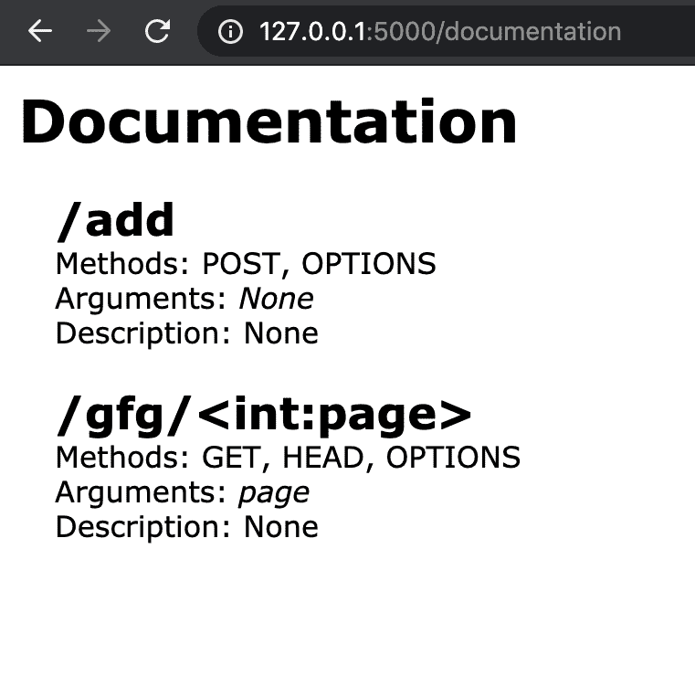
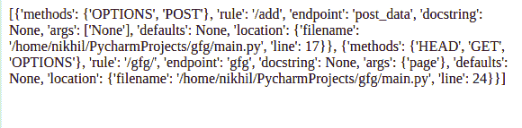
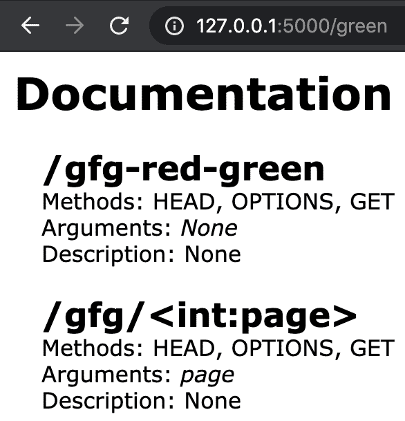
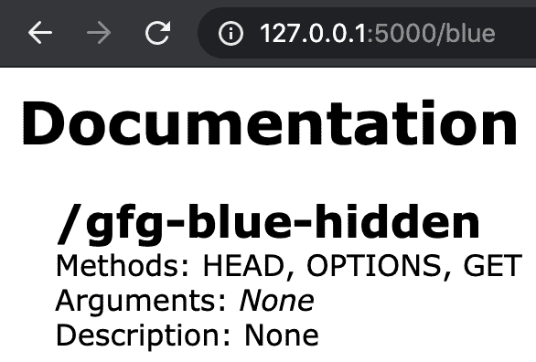
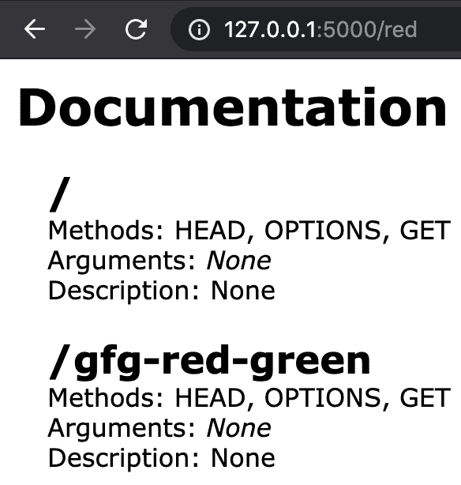

# 使用烧瓶-自动文档记录烧瓶终点

> 原文:[https://www . geesforgeks . org/docking-flask-endpoint-use-flask-autodoc/](https://www.geeksforgeeks.org/documenting-flask-endpoint-using-flask-autodoc/)

端点的文档化是 web 开发中的一项基本任务，能够在不同的框架中应用它总是一种实用工具。本文讨论如何使用 Flask-Autodoc 模块修饰 Flask 中的端点，以生成它们的良好文档。本模块提供以下功能–

*   帮助记录基于路由、函数参数和文档字符串的应用程序端点。
*   在终端和 HTML 模板上呈现。
*   提供了自定义分组和模板。

### 装置

要安装此模块，请在终端中键入以下命令。

```py
pip install flask-autodoc
```

安装后，需要导入 Autodoc 类并使用应用程序上下文进行初始化。路线需要被定义。

### **使用的功能**

*   **doc() :** 将记录仅带有此包装的所有路线。
*   **html() :** 生成 html 格式的文档。
*   **生成()**:生成非 HTML 格式的文档。

**注:**

使用 flask-autodoc 时可能出现的错误是–

```py
ModuleNotFoundError: No module named 'flask.ext'
```

要消除此错误，请打开 __init__。flask_autodoc 模块的 py 文件并更改

```py
from flask.ext.autodoc.autodoc import Autodoc
to
from flask_autodoc.autodoc import Autodoc
```

**生成 HTML 格式的文档**

## 蟒蛇 3

```py
from flask import Flask, render_template

app = Flask(__name__)
from flask_autodoc.autodoc import Autodoc

auto = Autodoc(app)

# GET API
@app.route('/')
def index():
    return render_template('index.html')

# POST API
@auto.doc()
@app.route('/add', methods = ['POST'])
def post_data():
    return render_template('form.html')

# GET API with path param
@app.route('/gfg/<int:page>')
@auto.doc()
def gfg(page):
    return render_template('gfg.html', page=page)

# This route generates HTML of documentation
@app.route('/documentation')
def documentation():
    return auto.html()

if __name__ == '__main__':
    app.run()
```

运行服务器后，路由到/documentation，用包装器精确记录路由。将显示文档()。
**输出:**



**示例 2:在标准输出上打印文档。**

这可以通过使用 generate()来实现

## 蟒蛇 3

```py
from flask import Flask, render_template

app = Flask(__name__)
from flask_autodoc.autodoc import Autodoc

auto = Autodoc(app)

# GET API
@app.route('/')
def index():
    return render_template('index.html')

# POST API
@auto.doc()
@app.route('/add', methods = ['POST'])
def post_data():
    return render_template('form.html')

# GET API with path param
@app.route('/gfg/<int:page>')
@auto.doc()
def gfg(page):
    return render_template('gfg.html', page=page)

# This route generates documentation in list 
# of rules
@app.route('/documentation')
def documentation():
    return str(auto.generate())
```

**输出:**



**说明:**规则列表，带一定参数。

*   **方法**:允许的方法(即['GET '，' POST'])
*   **规则**:相对网址结构(即'/gfg/int:page ')
*   **端点**:函数名(即‘gfg’)
*   **文档**:功能的文档字符串(如果提供)
*   **参数**:函数参数(如页面)
*   **默认值**:参数的默认值。

**示例 3:使用自定义模板**

除了通用模板之外，带有自定义模板和其他 jinja 兼容标记的自定义模板可以传递到 HTML 上，以便通过传递 auto.html()函数更好地记录。

## 蟒蛇 3

```py
from flask import Flask, render_template

app = Flask(__name__)
from flask_autodoc.autodoc import Autodoc

auto = Autodoc(app)

# GET API
@app.route('/')
@auto.doc()
def index():
    return render_template('index.html')

# GET API with path param
@app.route('/gfg/<int:page>')
@auto.doc()
def gfg(page):
    return render_template('gfg.html', page=page)

# This route generates documentation in list of rules
# in custom html
@app.route('/documentation')
def documentation():
    return auto.html(template='custom_autodoc.html', 
                     title='Custom Gfg Flask AutoDoc',
                     author='Manjeet Singh',)

if __name__ == '__main__':
    app.run()
```

**输出:**


**示例 4:小组合作**

可以构建独立的文档集，以根据用例或分组的产品需求，保持从特定集合中抽象出的逻辑/端点。通过将“组”作为列表传递，每个路由可以是一个或多个组的一部分。

## 蟒蛇 3

```py
from flask import Flask, render_template

app = Flask(__name__)
from flask_autodoc.autodoc import Autodoc

auto = Autodoc(app)

@app.route('/')
@auto.doc(groups=['red'])
def index():
    return render_template('index.html')

@app.route('/gfg/<int:page>')
@auto.doc(groups=['green'])
def gfg(page):
    return render_template('gfg.html', page=page)

@app.route('/gfg-red-green')
@auto.doc(groups=['green', 'red'])
def gfg_all(page):
    return render_template('gfg-all.html', page=page)

@app.route('/gfg-blue-hidden')
@auto.doc(groups=['blue'])
def gfg_blue(page):
    return render_template('gfg-blue.html', page=page)

# generating red grouped urls
@app.route('/red')
def red():
    return auto.html(groups='red')

# generating blue grouped urls
@app.route('/blue')
def blue():
    return auto.html(groups='blue')

# generating green grouped urls
@app.route('/green')
def green():
    return auto.html(groups='green')

if __name__ == '__main__':
    app.run()
```

**输出:**

  