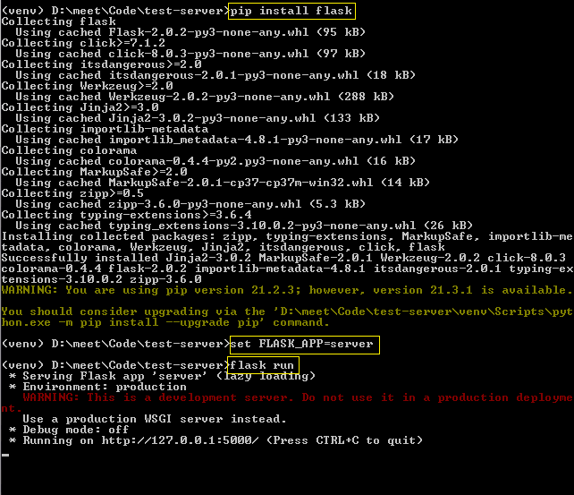
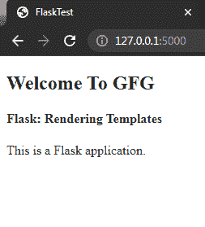
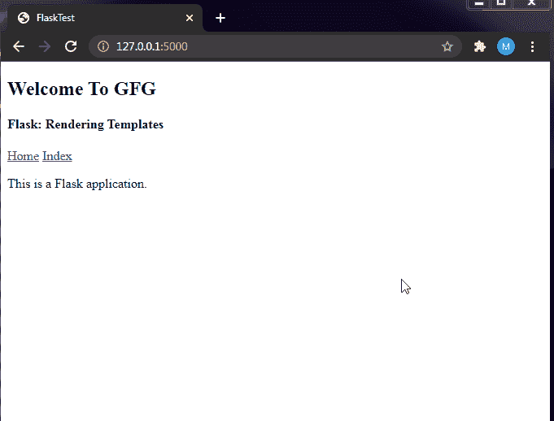
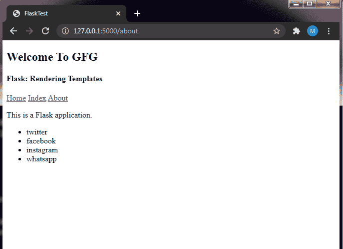
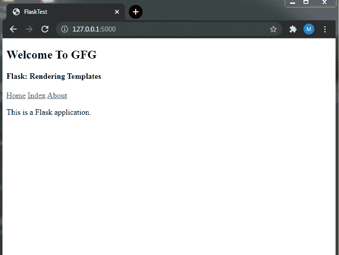

# 烧瓶渲染模板

> 原文:[https://www.geeksforgeeks.org/flask-rendering-templates/](https://www.geeksforgeeks.org/flask-rendering-templates/)

Flask 是一个基于 Python 编程语言的后端网络框架。它基本上允许用 Pythonic 语法和概念创建网络应用程序。有了 Flask，我们可以在网络应用程序中使用 Python 库和工具。使用 Flask，我们可以设置一个网络服务器来加载一些基本的 HTML 模板以及 Jinga2 模板语法。在本文中，我们将看到如何在 Flask 中呈现 HTML 模板。

**设置烧瓶:**设置烧瓶相当容易。我们可以使用虚拟环境为我们的项目创建一个隔离的环境，然后在该环境中安装 Python 包。之后，我们为在本地机器上运行 Flask 设置环境变量。本教程假设您已经配置了 Python 环境，如果没有，请继续在您的系统上设置 Python 和 [pip](https://www.geeksforgeeks.org/download-and-install-pip-latest-version/) 。完成后，您就可以开发 Flask 应用程序了。

**设置虚拟环境:**要设置虚拟环境，可以利用 Python Package manager“pip”安装“virtualenv”包。

```
pip install virtualenv
```

这将在您的机器上安装软件包“virtualenv”。pip 命令可以根据您安装的 Python 版本而有所不同，因此请务必查看您的版本的 pip 的不同语法。

**创建虚拟环境:**软件包安装完成后，我们需要在项目文件夹中创建一个虚拟环境。因此，您可以在想要创建 Flask 应用程序的位置找到一个空文件夹，或者在您想要的路径中创建一个空文件夹。要创建环境，我们只需使用以下命令。

```
virtualenv venv
```

这里，venv 是环境的名称，执行完这个命令后，您会在当前文件夹中看到一个名为“venv”的文件夹。“venv”这个名称可以是您喜欢的任何名称(“env”)，但是在生产级别引用虚拟环境是标准的。

**激活虚拟环境:**现在虚拟环境已经设置并创建完成，我们可以使用 CMD\Powershell 或 Terminal 中的命令进行激活:

**注意:你需要和“venv”文件夹在同一个文件夹中。**

**对于窗户:**

```
venv\Scripts\activate
```

**对于 Linux/macOS:**

```
source venv/bin/activate
```

这应该在命令提示符前用“(venv)”激活 virtualenv。


整个 virtualenv 设置的截图

正如我们所看到的，我们已经成功地在 Windows 操作系统中创建了 virtualenv，在 Linux/macOS 中，这个过程非常相似。(venv)表示终端/CMD 的当前实例处于虚拟环境中，使用 pip 安装在终端当前实例中的任何内容都将存储在 venv 文件夹中，而不会影响整个系统。

**安装 Flask:** 虚拟环境设置好之后，我们只需要用下面的命令就可以安装 Flask 了:

```
pip install flask
```

这应该会在虚拟环境中安装实际的 Flask python 包。

**将 Flask 添加到环境变量中:**我们需要为 Flask 创建一个应用程序，将其设置为我们应用程序的起点。我们可以通过创建一个名为“ **server.py** ”的文件来实现这一点，你可以将它称为任何你喜欢的东西，但是要与你创建的其他 flask 项目保持一致。请粘贴以下代码:

## 计算机编程语言

```
from flask import Flask

app = Flask(__name__)

if __name__ == "__main__":
    app.run()
```

这是实际运行创建 Flask 应用程序的代码。这就是所谓的 Flask 网络服务器的入口点。如您所见，我们正在导入 Flask 模块，并用“Flask(__name__)中的当前文件名进行实例化。因此，在检查之后，我们运行一个名为 run()的函数。

之后，我们需要将 Flask 应用程序的文件设置为环境变量。

**对于窗户:**

```
set FLASK_APP=server
```

**对于 Linux/macOS:**

```
export FLASK_APP=server
```

现在，这将为我们创建的文件设置 Flask 起始点，因此一旦我们启动服务器，Flask 服务器将找到文件“server.py”的路径

**要运行服务器，输入命令:**

```
flask run
```

这将运行服务器，以及它如何巧妙地将 server.py 文件检测为我们实际的 flask 应用程序。如果您访问网址“http://localhost:5000”，您会看到一条“找不到”的消息，这是因为我们还没有配置我们的网络服务器来提供任何服务。可以按 **CTRL + C** 停止服务器



为网络服务器设置的烧瓶

**创建模板:**现在，我们可以进入本文的目标，即渲染模板。为此，我们需要首先创建模板，您可以使用任何 HTML 模板，但是为了简单起见，我将使用一个基本的 HTML 模板。在此之前，**在当前文件夹中创建一个名为“模板”的文件夹。**在这个“**模板**文件夹中，所有的模板都将驻留。现在让我们创建一个基本的 HTML 模板:

**模板\index.html**

## 超文本标记语言

```
<!DOCTYPE html>
<html>

<head>
    <title>FlaskTest</title>
</head>

<body>
    <h2>Welcome To GFG</h2>
    <h4>Flask: Rendering Templates</h4>

<p>This is a Flask application.</p>

</body>

</html>
```

**添加路线和渲染模板:**现在，我们需要一种方法来将模板与特定的路线或网址实际链接起来。这意味着每当用户访问一个特定的网址时，就应该呈现或生成一个特定的模板。现在，我们需要用以下内容来更改“server.py ”:

## 计算机编程语言

```
from flask import Flask, render_template

app = Flask(__name__)

if __name__ == "__main__":
    app.run()

@app.route("/")
def index():
    return render_template("index.html")
```

我们已经从 Flask 模块导入了 render_template 函数，并添加了一条路线。

#### 什么是路线？

路由是 URL 与要在网络服务器上呈现的函数或任何其他代码片段的映射。在烧瓶中，我们使用函数修饰@app.route 来表示函数与 route 函数的参数中提供的 URL 绑定。

**创建基本路由:**在这种情况下，我们将服务器的基础 URL**URL“/**与**函数“index”**绑定在一起，你爱怎么叫就怎么叫，不过这里叫它 index 更有意义。这个函数只是在这里返回一些它调用的函数 render_template。默认情况下，render_template 会在 templates 文件夹中找到该应用程序。因此，我们只需要提供模板的名称，而不是模板的整个路径。索引函数呈现一个模板 index.html，因此我们可以在浏览器中看到结果。



渲染基本模板

#### 添加 Jinja 模板语法

现在，我们将创建一个新的路线来演示神牙模板的用法。我们需要添加路由，所以只需在“server.py 文件”中再添加一大块代码

## 计算机编程语言

```
@app.route("/<name>")
def welcome(name):
    return render_template("welcome.html", name=name)
```

现在，这看起来很容易理解，我们只是创建了一个路由“/ <name>”，它将绑定到欢迎函数。“<name>”代表“/”后面的任何东西。因此，我们将它作为函数的参数，并将其作为名称传递给 render_template 函数。因此，在 render_template 函数中传递变量名后，我们可以在模板中访问它来呈现该变量。您甚至可以对变量执行操作，然后解析它。</name></name>

不，我们需要在模板文件夹中创建另一个名为“welcome.html”的模板。该文件应该可以包含以下标记

## 超文本标记语言

```
<!DOCTYPE html>
<html>

<head>
    <title>FlaskTest</title>
</head>

<body>
    <h2>Welcome To GFG</h2>
    <h3>Welcome, {{name}}</h3>
</body>

</html>
```


使用神牙模板

### 创建和扩展模板

现在，我们需要一种方法来实际继承一些模板，而不是重用它们，我们可以通过在神牙创建块来做到这一点。它们允许我们创建一个模板块，我们可以在其他模板中使用它们，并为该块命名。

因此，让我们重新使用我们的“index.html”并在其中创建一个块..不要这样做，我们使用“”来启动该块，这将获取它上面的所有内容并存储在模板的虚拟块中，要结束该块，您只需使用“”这将复制它下面的所有内容。

模板/索引. html

## 超文本标记语言

```
<!DOCTYPE html>
<html>
<head>
<title>FlaskTest</title>
</head>
<body>
<h2>Welcome To GFG</h2>
<h4>Flask: Rendering Templates</h4>
<a href="{{ url_for('home') }}">Home</a>
<a href="{{ url_for('index') }}">Index</a>


<p>This is a Flask application.</p>


</body>
</html>
```

因此，这里我们不包括

标签，因为以下的所有内容和以上的所有内容都被复制了。我们也在使用绝对 URL。URL 是动态的，非常容易理解。我们将它们包含在“{{ }}”中，作为 Jinga2 语法的一部分。函数的 url_for 为我们颠倒了整个 url，我们只需要将函数的名称作为字符串作为参数传递给函数。

现在，我们将创建另一个模板来重用这个创建的块“body”，让我们创建具有以下内容的模板“home.html”:

模板/主页. html

## 超文本标记语言

```


<p> This is a home page</p>
```

这看起来像一个双班轮，但也将包括 index.html。这是通过使用标记，他们将块解析成所提到的模板。之后我们可以添加我们想要的东西。

最后，这里剩下的部分是去 home.html 的路线，所以让我们也创建它。让我们向“server.py 文件”添加另一个路由

## 计算机编程语言

```
@app.route("/home")
def home():
    return render_template("home.html")
```

因此，这是一个绑定到带有 home 函数的“/home”URL 的路由，该函数呈现我们刚才创建的模板“home.html”。



演示块和 URL

正如，我们可以看到生成的 url 是动态的，否则我们将不得不硬编码这两个模板页面路径。此外，该块正在工作并继承基础模板中提供的模板。

**模板中的归纳逻辑:**如果模板中有条件，我们可以用于循环。这是一个非常好的特性。我们可以创建一些伟大的动态模板，而没有太多的麻烦。让我们用 python 创建一个列表，并尝试在一个 HTML 模板上呈现它。

**在模板中使用 for 循环:**为此，我们将创建另一个路由，这次在“/about”处，该路由将绑定到呈现模板“about.html”的 about 函数，但是我们将在从该函数返回之前添加一些更多的东西。我们将创建一些伪字符串的列表，然后将它们解析为 render_template 函数。

## 计算机编程语言

```
@app.route("/about")
def about():
    sites=['twitter', 'facebook', 'instagram', 'whatsapp']
    return render_template("about.html", sites=sites)
```

因此，我们在“/about”处创建了绑定到 about 函数的路由。在该函数中，我们首先用一些伪字符串创建列表“站点”，最后在返回时，我们将该列表解析为 render_template 函数作为站点，您可以随意调用任何东西，但是请记住在模板中使用该名称。现在，为了创建模板，我们将创建包含以下内容的模板“about.html”:

**模板/约. html**

## 超文本标记语言

```


<ul>
    
    <li>{{ social }}</li>
    
</ul>
```

我们可以使用“”中包含的模板中的循环，我们可以将其称为普通的 pythonic 方式。sites 是我们在 route 函数中解析的变量(列表)。我们可以再次使用迭代器作为包含在“{{ }}”中的变量。这就像连接拼图块一样，变量值用“{{ }}”访问，任何其他结构或块都用“”括起来。

现在，为了使它更容易访问，您可以像这样将其网址添加到 index.html:

## 超文本标记语言

```
<!DOCTYPE html>
<html>

<head>
    <title>FlaskTest</title>
</head>

<body>
    <h2>Welcome To GFG</h2>
    <h4>Flask: Rendering Templates</h4>
    <a href="{{ url_for('home') }}">Home</a>
    <a href="{{ url_for('index') }}">Index</a>
    <a href="{{ url_for('about') }}">About</a>
    

<p>This is a Flask application.</p>

    
</body>

</html>
```

这不是强制性的，但它创建了一个易于访问的链接。



演示模板中的循环

正如我们所看到的，它已经动态地创建了模板中的所有列表。如果应用程序准备就绪，这可以用于从数据库中获取数据。此外，它还可以用来创建某些很难手动完成的重复性任务或数据。

**在模板中使用 if else:**我们甚至可以在烧瓶模板中使用 if-else 条件。类似于 for 循环的语法，我们可以利用它来创建动态模板。让我们看一个网站角色的例子。

让我们为部门联系人建立路线。这个网址是“contact/ <role>”，绑定到呈现一个名为“contacts.html”的模板的函数 contact。这在争论中起了作用。现在我们可以在这里看到一些变化，这只是语义上的变化没有什么新的，我们可以在模板中使用变量 person 作为不同的名称，该名称被指定为 role 的值。</role>

## 计算机编程语言

```
@app.route("/contact/<role>")
def contact(role):
    return render_template("contact.html", person=role)
```

因此，这将根据需要创建路线，并将可变角色解析为模板中的一个人。现在让我们创建模板。

**模板/联系人. html**

## 超文本标记语言

```




<p> Admin Section </p>



<p> App Source Page for Maintainer</p>



<p> Hope you are enjoying our services</p>



<p> Hello, {{ person }}</p>


```

因此，在模板中，我们正在检查变量 person 的值，该值是从 URL 获得的，并从 render_template 函数解析而来。if else 语法类似于 python，只有“{ % % }”ien closed。代码非常容易解释，因为我们创建了 if-elif 和 else 梯形，检查值并根据需求创建 HTML 元素。



因此，我们可以看到模板正在按照 URL 中传递的角色变量呈现内容。不要试图为此创建一个网址链接，因为它不会工作，因为我们需要手动输入角色变量。使用它需要一些变通方法。

这就是关于在 Flask 中使用和渲染模板。我们利用 Python 中的 Jinja 模板语法创建了一些动态模板。