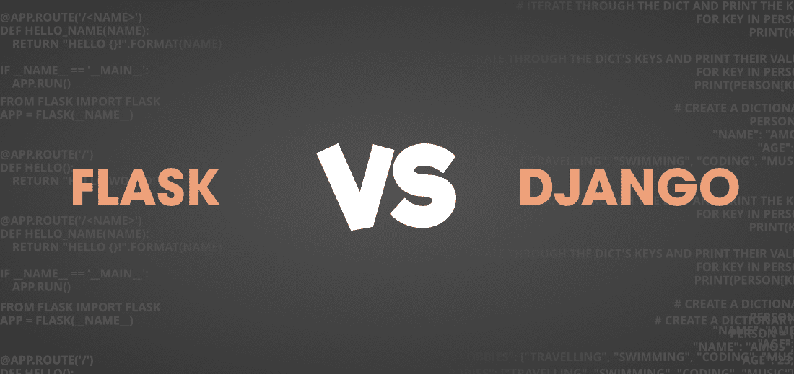

# Flask vs Django–您应该选择哪个框架？

> 原文:[https://www . geesforgeks . org/flask-vs-django-你应该选择哪个框架/](https://www.geeksforgeeks.org/flask-vs-django-which-framework-should-you-choose/)

Python 是一种强大的语言，它拥有一套令人惊叹的工具，让 python 开发人员的生活变得不那么简单。但是说到网络框架，Flask 和 Django 是最受欢迎的。Web 框架是包和模块的集合，使得编写 web 应用程序变得更加容易，而无需关注较低层次的细节。这些网络框架提供了许多功能，并帮助快速构建优雅而强大的应用程序。让我们先简单看一下这两个框架，即 Flask 和 Django，以便更好地理解，然后再进行比较。

### [烧瓶](https://www.geeksforgeeks.org/flask-creating-first-simple-application/)

Flask 是一个自由开源的**微 web 框架**，用 Python 编程语言编写，可以轻松制作可扩展的 web 应用。这里的“微”并不意味着框架缺乏功能，而是意味着核心是不复杂和可扩展的。Flask 不包含一些东西，如上传处理、表单(对象关系映射器)、数据库抽象层、身份验证、表单验证等。但是这些功能可以使用预先存在的外部库来集成。微框架基于 WSGI 的工具包 Werkzeug，即 Web 服务器网关接口和 Python 的模板引擎 Jinja。一些使用 Flask 的知名机构有 Reddit、网飞、Lyft、Airbnb、优步等。

### [姜戈](https://www.geeksforgeeks.org/django-introduction-and-installation/)

Django 是一个开源的全栈**网络框架**，与 Flask 相对，遵循模型模板视图(MVC)的架构风格。Django 有助于用更少的时间和更少的代码构建具有可重用特性的更好的 web 应用程序。它遵循“不要重复自己”的原则，主要关注尽可能地自动化事情。它有几十种功能，比如用于测试的轻量级 web 服务器、表单序列化、验证、缓存框架、内部调度程序等等。使用 Django 的公司有 Udemy、Instagram、Quora、YouTube 等。

### Django 号烧瓶

现在让我们看看它们的具体特点，看看哪一个更好！

**数据库**

Flask 不支持 ORM 框架，因此开发人员可以自由选择适合他们应用的 ORM。然而，Django 提供了一个强大的 ORM 和迁移管理工具，这使得它更容易上手。Django 支持许多关系数据库，如 Oracle、MySQL、SQLite、MariaDB 和 PostgreSQL。Flask 不仅支持关系数据库，还支持非关系数据库，如 MongoDB。Django 中的 ORM 使得创建模板、视图、表单等变得容易。这是在数据模型上制作的，但是 flask 不支持数据模型。

**项目规模**

如果你想要一个更小的网络应用程序，那么 Flask 将是一个最佳选择，因为它非常适合高负载的小而不复杂的网络应用程序。另一方面，Django 是大型项目的绝佳选择，因为它是为处理高流量的大型复杂应用程序而设计的。由于 Flask 是模块化的，高度灵活，并且您可以控制其中的所有内容，因此将其放大可能会变成容易出错的复杂代码。在 Django 中，由于它提供了功能齐全的功能，所以相对容易扩展。

**性能**

Flask 在性能上肯定会优于 Django，并且明显快于 Django，因为它的功能更少，层数更少，并且是一个轻量级框架。Django 提供了 Flask 中没有的许多功能，以实现快速开发，因此与对应的 Flask 相比，性能有所下降。

**安全**

Flask 和 Django 提供了类似的机制来防止网络应用程序攻击和其他威胁。Django 有一个内置的系统来防止常见的攻击，如跨站点请求伪造(CSRF)，跨站点脚本(XSS)，SQL 注入等。这反过来有助于防止或减轻攻击者在浏览器中执行脚本、使用其他用户的凭据登录以及在数据库中执行任意 SQL 代码的攻击。由于 Flask 应用程序小得多，它们更容易保护，因为可供攻击的区域更少。但是由于 Flask 依赖于外部安全扩展，这可能意味着如果扩展本身被破坏，这将导致 Flask 网络应用程序被破坏。

**路由系统和视图**

路由是任何 web 应用程序的重要部分，这两个框架都支持路由和基于类的视图。它创建通用资源定位器(URL)，然后将它们映射到各自的功能，这些功能又决定了加载 URL 时要做什么。在 Django 中，URL 和视图是在 urls.py 和 views.py 中定义的。要访问 Django 中的请求对象，您必须显式传递它，而在 Flask 中，请求对象是全局的，因此可以轻松访问。

#### 其他人

与 Flask 相比，Django 在其 GitHub 个人资料中的明星数量稍多一些，在人气方面领先一点。但是 Flask 有一个特殊的粉丝群，因为它是在 Django 发布 5 年后发布的，并被选为 2018 年最著名的 Python 网络框架。

Flask 的文档非常广泛，非常欢迎想要接触 Flask 的初学者。它包括详细的解释，涵盖了从安装到部署的所有内容，并且比 Django 的学习曲线更低。同时，Django 的文档要比 Flask 广泛得多，因为它是一个全栈框架，而不是一个极简框架。另外，Flask 中没有现成的管理系统。Django 中有一些文件在启动项目时会自动出现，对于初学者来说很难理解。另一方面，Flask 项目中的每一行都是由您编写的，您从一开始就完全控制了它。

### 那么你应该选择什么呢？

在不同因素上比较两个框架，可以看出 Flask 和 Django 都不能在单个特性上被标记为最佳。当 Django 被认为更适合快速开发的大型项目并提供更多功能时，Flask 似乎更容易启动。这两个框架对于开发 web 应用程序都非常有用，应该根据当前的需求和需求以及项目的规模来选择。