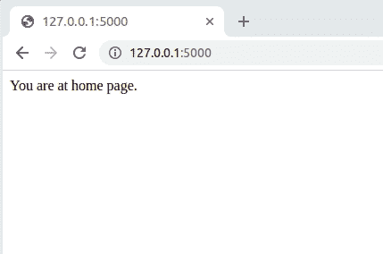

# 在烧瓶中生成动态网址

> 原文:[https://www . geesforgeks . org/generating-dynamic-URL-in-flask/](https://www.geeksforgeeks.org/generating-dynamic-urls-in-flask/)

**先决条件:** [烧瓶基础](https://www.geeksforgeeks.org/flask-creating-first-simple-application/)

创建应用程序时，对每个网址进行硬编码非常麻烦。解决这个问题的一个更好的方法是通过构建动态网址。让我们先简单了解几个常用术语的含义。

*   **动态路由:**是获取 URL 中的动态数据(变量名)然后使用的过程。
*   **可变规则:**通过用<变量名>标记节，可以将可变节添加到网址中。

让我们首先创建一个基本的烧瓶应用程序:

## 蟒蛇 3

```
#importing the flask Module
from flask import Flask

# Flask constructor takes the name of
# current module (__name__) as argument
app = Flask(__name__)

@app.route('/')
# ‘/’ URL is bound with hello_world() function.
def home():
    return 'You are at home page.'

@app.route('/allow')
def allow():
    return 'You have been allowed to enter.'

@app.route('/disallow')
def disallow():
    return 'You have not been allowed to enter.'

# main driver function
if __name__ == '__main__':
    # run() method of Flask class runs the application
    # on the local development server.
    app.run()
```

**输出:**


现在考虑这样一种情况，您有许多用户，您希望将用户路由到一个特定的页面，在 URL 和模板中包含他或她的名字或 ID。如果您尝试手动这样做，那么您必须为每个用户手动键入完整的网址。这样做可能非常繁琐，几乎不可能。然而，这可以通过使用带有所谓的**动态路由**的烧瓶来解决。

### 动态路由

我们现在来看看使用可变规则的更好的方法。我们将为每条路线添加一个<variable name="">。或者，我们也可以用每个变量名<converter: variable="" name="">定义转换器。默认情况下，转换器为*弦*。</converter:></variable>

**示例:**

```
@app.route('allow/<variable name>')

OR

@app.route('allow/<converter: variable name>')
```

**部分转换器为:**

<figure class="table">

| 线 | (默认)接受任何不带斜杠的文本 |
| （同 Internationalorganizations）国际组织 | 接受正整数 |
| 漂浮物 | 接受正浮点值 |
| 小路 | 喜欢字符串，但也接受斜线 |
| uuid | 接受 UUID 字符串 |

</figure>

让我们允许 ID 小于 25 的用户访问该页面。下面给出了动态网址绑定的修改代码。该函数使用 route()装饰器中传递的<variable name="">作为参数。</variable>

```
@app.route('/allow/<int:Number>')
def allow(Number):
    if Number < 25:
        return f'You have been allowed to enter because\
         your number is {str(Number)}'
    else:
       return f'You are not allowed'
```

## 蟒蛇 3

```
#importing the flask Module
from flask import Flask

# Flask constructor takes the name of
# current module (__name__) as argument
app = Flask(__name__)

@app.route('/')
# ‘/’ URL is bound with hello_world() function.
def home():
    return 'You are at home page.'

# Use of <converter: variable name> in the
# route() decorator.
@app.route('/allow/<int:Number>')
def allow(Number):
    if Number < 25:
        return f'You have been allowed to enter because your number is {str(Number)}'
    else:
       return f'You are not allowed'

# main driver function
if __name__ == '__main__':
    # run() method of Flask class runs the application
    # on the local development server.
    app.run()
```

**输出:**

