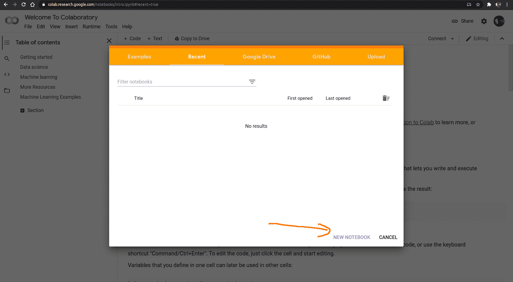
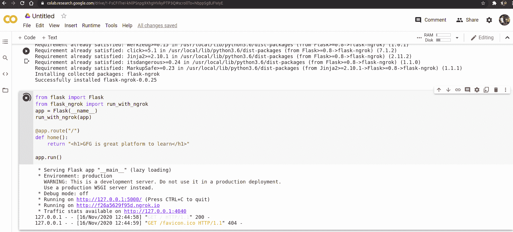
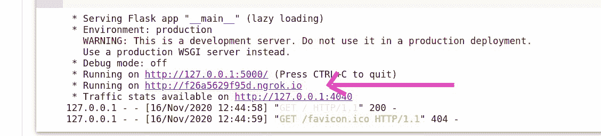
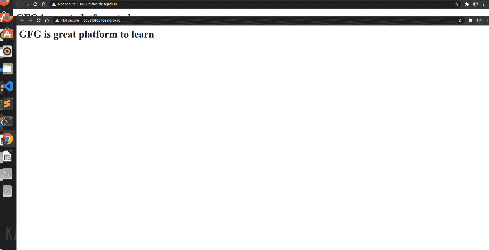

# 如何在谷歌 Colab 上运行 Flask App？

> 原文:[https://www . geesforgeks . org/how-run-flask-app-on-Google-colab/](https://www.geeksforgeeks.org/how-to-run-flask-app-on-google-colab/)

Flask 是 python 语言的 web 框架。这意味着 flask 为您提供了工具、库和技术，允许您构建 web 应用程序。这个 web 应用程序可以是一些网页、博客、wiki，或者像基于 web 的日历应用程序或机器学习 webapp 一样大。

Google Colab 提供了一个 VM(虚拟机)，所以我们不能像在本地机器上运行本地 web 服务器时那样访问本地主机(它所做的只是将它路由到我们本地机器的本地主机)。我们可以做的是使用 ngrok 将其公开到一个公共 URL。Python 库烧瓶来了。

### 如何在谷歌 Colab 上使用 Flask？

要创建 google colab 文件，请访问以下链接:

[https://colab . research . Google . com/notebooks/intro . ipynb # recent = true](https://colab.research.google.com/notebooks/intro.ipynb#recent=true)



1)在谷歌 colab 中创建新笔记本

2)在 google colab 中安装库

```py
!pip install flask-ngrok
```

Flask 已经安装在谷歌 colab 上，所以你不需要再次安装它。

3)之后，让我们创建一个简单的烧瓶应用程序

## 蟒蛇 3

```py
from flask import Flask
from flask_ngrok import run_with_ngrok
app = Flask(__name__)
run_with_ngrok(app)   

@app.route("/")
def home():
    return "<h1>GFG is great platform to learn</h1>"

app.run()
```

4)要在谷歌 colab 上运行代码，请按 shift+enter。

**输出:**



点击此链接获取输出:

 