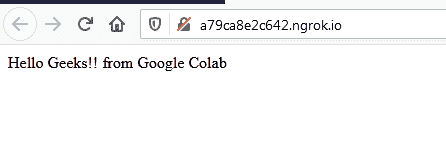

# 如何使用 Ngrok 在线运行 Python Flask App？

> 原文:[https://www . geesforgeks . org/how-run-python-flask-app-online-using-ngrok/](https://www.geeksforgeeks.org/how-to-run-python-flask-app-online-using-ngrok/)

Python Flask 是一个流行的网络框架，用于开发网络应用程序、应用编程接口等。在本地机器上运行 flask 应用程序非常简单，但是当涉及到与其他用户共享应用程序链接时，您需要在另一台笔记本电脑上设置整个应用程序。这篇文章提供了一个有趣的方法来设置你的网络应用在线。然后，您可以在部署之前将链接发送给您的同行。通常，在本地机器上运行 flask 应用程序时，我们需要使用 local-host，但是像 google colab 这样的服务提供了 VM(虚拟机)，因此我们不能访问 LOCAL-HOST。我们将使用 **ngrok** 将其用于公共网址。Python 库**烧瓶-ngrok** 。

**安装**–

从您的终端运行–

```
pip install flask-ngrok
```

**创建烧瓶应用程序–**

现在创建一个简单的 Flask 应用程序**app . py**–

## 蟒蛇 3

```
from flask import Flask
from flask_ngrok import run_with_ngrok

app = Flask(__name__)
run_with_ngrok(app)

@app.route("/")
def hello():
    return "Hello Geeks!! from Google Colab"

if __name__ == "__main__":
  app.run()
```

**运行应用–**

使用运行应用程序–

```
python run.py
```

点击 **终端**中 ngrok 提供的**安全网址后，您可以访问您的应用程序–**



给你！！

现在你可以在谷歌上或任何地方使用这个网址来访问你正在运行的应用程序。