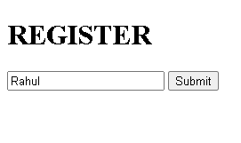
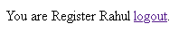
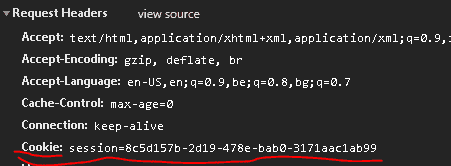
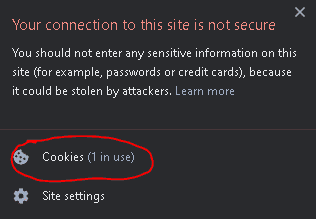

# 如何在 Python 烧瓶中使用烧瓶会话？

> 原文:[https://www . geeksforgeeks . org/使用方法-烧瓶-python 中的会话-烧瓶/](https://www.geeksforgeeks.org/how-to-use-flask-session-in-python-flask/)

### 烧瓶会议–

*   Flask-Session 是 Flask 的扩展，支持应用程序的**服务器端会话**。
*   会话是**客户端登录到服务器**和**退出服务器**之间的**时间。**
*   会话中需要保存的数据存储在服务器上的**临时目录中。**
*   会话中的数据存储在 cookies 的顶部，并由服务器的 T2 加密签名。
*   **每个客户端**将有他们自己的**会话**，他们自己的数据将存储在他们的会话中。

#### 会话的用途

*   当用户登录时记住他们
*   存储用户特定的网站设置(主题)
*   将电子商务网站用户项目存储在购物车中

> 本文假设您熟悉烧瓶基础知识。check–[Flask–(创建第一个简单的应用程序)](https://www.geeksforgeeks.org/flask-creating-first-simple-application/)了解如何在 Flask 中制作一个简单的 web 应用程序。

### 装置

使用以下命令安装扩展

```py
$ easy_install Flask-Session
```

**或者**，如果你安装了 pip

```py
$ pip install Flask-Session
```

### 在烧瓶中配置会话

*   会话实例不用于直接访问，您应该始终使用 flask_session。
*   烧瓶的第一行(会话)是这样的，即我们每个用户都可以获得自己版本的会话。

## 蟒蛇 3

```py
from flask import Flask, render_template, redirect, request, session
from flask_session import Session
```

这仅适用于 flask_session 库

*   **SESSION _ PERMANENT = False–**因此，此会话的默认时间限制为几分钟、几小时或几天，超过此时间后，它将过期。
*   **SESSION_TYPE =“文件系统”–**它将存储在硬盘中(这些文件存储在您的配置目录中的/flask_session 文件夹下。)或任何在线 ide 帐户，它是使用数据库或类似工具的替代方案。

## 蟒蛇 3

```py
app = Flask(__name__)
app.config["SESSION_PERMANENT"] = False
app.config["SESSION_TYPE"] = "filesystem"
Session(app)
```

### 登录后记住用户

所以我们将开始制作两个基本页面，它们的路线分别叫做**index.html**和**login.html**

*   **login.html**包含一个表单，用户可以在其中填写姓名并提交
*   **index.html**是主页面

## 蟒蛇 3

```py
@app.route("/")
def index():
    return render_template('index.html')

@app.route("/login", methods=["POST", "GET"])
def login():
    return render_template("login.html")
```

*   当他们提交表单时，我们需要在会话中记录用户名
*   我们使用 python 中的字典，其中“name”是键= request . form . get(“name”)是值

## 蟒蛇 3

```py
@app.route("/login", methods=["POST", "GET"])
def login():
  # if form is submited
    if request.method == "POST":
        # record the user name
        session["name"] = request.form.get("name")
        # redirect to the main page
        return redirect("/")
    return render_template("login.html")
```

*   存储用户名后，我们需要在用户登陆索引页面时检查是否存在使用该用户名的会话。
*   如果用户名不存在，则重定向到登录页面。

## 蟒蛇 3

```py
@app.route("/")
def index():
  # check if the users exist or not
    if not session.get("name"):
        # if not there in the session then redirect to the login page
        return redirect("/login")
    return render_template('index.html')
```

*   在成功记住**用户之后，我们还需要一个注销用户的方法。**
*   因此，每当用户**点击注销**时，将用户**的值更改为无**，并将它们重定向到**索引页面。**

## 蟒蛇 3

```py
@app.route("/logout")
def logout():
    session["name"] = None
    return redirect("/")
```

### 完成项目–

## 蟒蛇 3

```py
from flask import Flask, render_template, redirect, request, session
# The Session instance is not used for direct access, you should always use flask.session
from flask_session import Session

app = Flask(__name__)
app.config["SESSION_PERMANENT"] = False
app.config["SESSION_TYPE"] = "filesystem"
Session(app)

@app.route("/")
def index():
    if not session.get("name"):
        return redirect("/login")
    return render_template('index.html')

@app.route("/login", methods=["POST", "GET"])
def login():
    if request.method == "POST":
        session["name"] = request.form.get("name")
        return redirect("/")
    return render_template("login.html")

@app.route("/logout")
def logout():
    session["name"] = None
    return redirect("/")

if __name__ == "__main__":
    app.run(debug=True)
```

#### index.html

*   我们也可以使用**会话名称**来超出**会话**的值。

## 超文本标记语言

```py




   
      You are Register {{ session.name }} <a href="/logout">logout</a>.
   
      You are not Register. <a href="/login">login</a>.
   


```

#### login.html

## 超文本标记语言

```py




   <h1> REGISTER </h1>

   <form action="/login" method="POST">
      <input placeholder="Name" autocomplete="off" type="text" name="name">
      <input type="submit" name="Register">
   </form>


```

#### layout.html

## 超文本标记语言

```py
<!DOCTYPE html>

<html lang="en">
    <head>
        <meta name="viewport" content="initial-scale=1, width=device-width">
        <title> flask </title>
    </head>
    <body>
        
    </body>
</html>
```

### 输出–

#### login.html



#### index.html



### 您还可以看到生成的会话

 