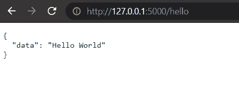

# 如何为 hello world 编写一个简单的 Flask API？

> 原文:[https://www . geesforgeks . org/如何编写简单的烧瓶-api-for-hello-world/](https://www.geeksforgeeks.org/how-to-write-a-simple-flask-api-for-hello-world/)

**先决条件:**[REST API 简介](https://www.geeksforgeeks.org/rest-api-introduction/)

[**【REST】**](https://www.geeksforgeeks.org/rest-api-introduction/)代表具象状态转移，是现代 web 开发中使用的一种建筑风格。它为 web 应用程序定义了一组发送和接收数据的规则/约束。在本文中，我们将学习如何在烧瓶的帮助下创建一个返回“Hello World”的简单 REST API。

在本文中，我们将使用两种方法为 hello world 编写一个简单的 flask API:

*   使用 Flask jsonify 对象。
*   将 flask_restful 库与 flask 一起使用。

## 装置

1.使用以下命令安装 python Flask 库。

```
pip install Flask
```

2.使用以下命令安装烧瓶-restful 库。

```
pip install Flask-RESTful
```

## **方法一:使用烧瓶‘jsonify’对象**

*   创建一个名为“main.py”的新 python 文件。
*   从烧瓶框架中导入烧瓶、jsonify 和请求。
*   使用以下语法将 web 应用注册到应用变量中。

## 蟒蛇 3

```
app =   Flask(__name__)
```

*   创建一个名为“helloworld”的新函数。这个函数将返回 JSON 格式的“你好，世界”文本。
*   使用以下语法将“helloworld”函数路由到所需的 URL。

## 蟒蛇 3

```
@app.route('/path_of_the_response', methods=['GET'])
def helloworld():
    pass
```

*   在“helloworld”函数中，如果请求方法是“GET”，那么创建一个包含“Hello World”消息的 python 字典。
*   jsonify python 字典并返回它。
*   使用以下命令构建烧瓶应用程序。

## 蟒蛇 3

```
if __name__ == '__main__':
    app.run(debug=True)
```

*   在终端或 IDE 中运行“main.py”文件，并在浏览器中键入以下网址。

```
http://127.0.0.1:5000/hello
```

**代码:**

## 蟒蛇 3

```
from flask import Flask, jsonify, request

app = Flask(__name__)

@app.route('/hello', methods=['GET'])
def helloworld():
    if(request.method == 'GET'):
        data = {"data": "Hello World"}
        return jsonify(data)

if __name__ == '__main__':
    app.run(debug=True)
```

**输出:**



## **方法 2:使用烧瓶 _restful 库**

*   创建一个名为“main.py”的新 python 文件。
*   从烧瓶框架导入烧瓶。
*   从“烧瓶 _restful”库中导入应用编程接口和资源。
*   使用以下语法将 web 应用注册到应用变量中。

## 蟒蛇 3

```
app =   Flask(__name__)
```

*   使用“flask_restful”库的 API 方法将 app 变量注册为 Api 对象。

## 蟒蛇 3

```
api =   Api(app)
```

*   创建一个名为“HelloWorld”的资源类。
*   在资源类中，创建一个“get”方法。
*   从“get”方法返回带有“Hello World”消息的字典。
*   使用 add_resource 方法将资源类添加到 API 中。
*   使用以下命令构建烧瓶应用程序。

## 蟒蛇 3

```
if __name__ == '__main__':
    app.run(debug=True)
```

*   在终端或 IDE 中运行“main.py”文件，并在浏览器中键入以下网址。

```
http://127.0.0.1:5000/hello
```

**代码:**

## 蟒蛇 3

```
from flask import Flask
from flask_restful import Api, Resource

app =   Flask(__name__)

api =   Api(app)

class HelloWorld(Resource):
    def get(self):
        data={"data":"Hello World"}
        return data

api.add_resource(HelloWorld,'/hello')

if __name__=='__main__':
    app.run(debug=True)
```

**输出:**

