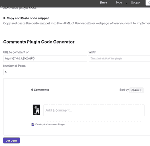
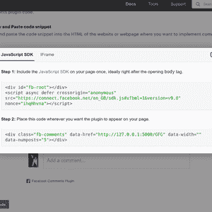
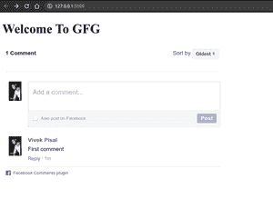
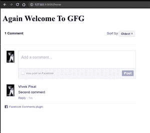
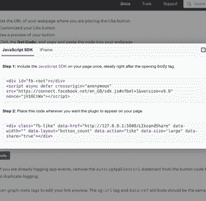
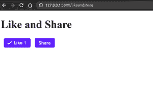

# 在 Flask 项目中集成脸书喜欢、评论和分享插件

> 原文:[https://www . geesforgeks . org/integrating-Facebook-like-comments-share-plugin-in-flask-project/](https://www.geeksforgeeks.org/integrating-facebook-like-comments-and-share-plugin-in-flask-project/)

Flask 是一个 Python 框架，它允许我们构建网络应用程序。它是由阿明·罗纳奇开发的。Flask 的框架比 Django 的框架更明确，也更容易学习，因为它实现一个简单的网络应用程序的基础代码更少。本文围绕如何在 flask 应用程序中集成脸书评论插件展开

**安装**

```
pip install flask
```

**如何在 Flask 中整合 facebook 评论？**

创建新文件 **app.py**

## 蟒蛇 3

```
from flask import Flask,render_template

app = Flask(__name__)

@app.route("/")
def home():
    return render_template("index.html")

if __name__ == '__main__':
    app.run(debug=True)
```

转到[https://developers.facebook.com/docs/plugins/comments/](https://developers.facebook.com/docs/plugins/comments/)，添加你想添加评论插件的帖子链接，



点击获取代码



创建新目录**模板**在里面创建新的 html 文件**index.html**

## 超文本标记语言

```
<!DOCTYPE html>
<html>
<head>
    <title></title>
    <div id="fb-root"></div>
<script async defer crossorigin="anonymous" 
        src="https://connect.facebook.net/en_GB/sdk.js#xfbml=1&version=v9.0" 
        nonce="ihqHhvna"></script>
</head>
<body>
<h1>Welcome To GFG</h1>
<div class="fb-comments" data-href="http://127.0.0.1:5000/GFG" 
     data-width="" data-numposts="5"></div>
</body>
</html>
```

如果我们改变网址，评论也会改变。

要看到这一点，让我们创建新文件**index1.html**

**index1.html**

## 超文本标记语言

```
<!DOCTYPE html>
<html>
<head>
    <title></title>
    <div id="fb-root"></div>
<script async defer crossorigin="anonymous"
        src="https://connect.facebook.net/en_GB/sdk.js#xfbml=1&version=v9.0"
        nonce="ihqHhvna"></script>
</head>
<body>
<h1>Again Welcome To GFG</h1>
<div class="fb-comments" data-href="http://127.0.0.1:5000/GFG1" 
     data-width="" 
     data-numposts="5"></div>
</body>
</html>
```

**app.py**

## 蟒蛇 3

```
from flask import Flask,render_template

app = Flask(__name__)

@app.route("/")
def index():
    return render_template("index.html")

@app.route("/home")
def home():
    return render_template("index1.html")

if __name__ == '__main__':
    app.run(debug=True)
```

要运行此应用程序，请打开终端或 cmd

```
python app.py
```

**输出:-**

 

要添加喜欢和共享字段，请转到[https://developers.facebook.com/docs/plugins/like-button](https://developers.facebook.com/docs/plugins/like-button)，执行相同的过程



点击获取代码

在模板目录中创建新的 html 文件

## 超文本标记语言

```
<!DOCTYPE html>
<html>
<head>
    <title>GFG</title>
    <div id="fb-root"></div>
    <script async defer crossorigin="anonymous"
            src="https://connect.facebook.net/en_GB/sdk.js#xfbml=1&version=v9.0" 
            nonce="4HOL61En"></script>
</head>
<body>
<h1>Like and Share</h1>
<div class="fb-like" data-href="http://127.0.0.1:5000/LIkeandShare" 
     data-width="" data-layout="button_count" data-action="like"
     data-size="large" data-share="true"></div>
</body>
</html>
```

在你的 **app.py** 中添加新功能

## 蟒蛇 3

```
@app.route("/likeandshare")
def likeandshare():
    return render_template("Likeandshare.html")
```

然后再次使用命令运行应用程序

```
python3 app.py
```

**输出:-**

