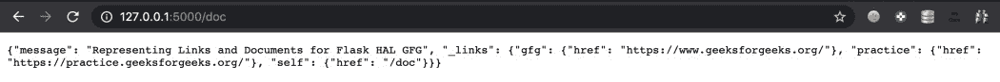
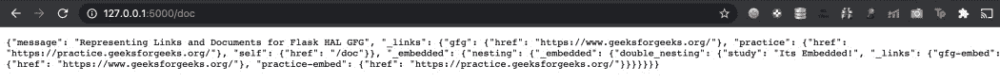

# 在烧瓶中整合哈尔

> 原文:[https://www.geeksforgeeks.org/integrating-hal-in-flask/](https://www.geeksforgeeks.org/integrating-hal-in-flask/)

**超文本应用语言(HAL)** 是一种标准，用于建立用 JSON 表达超媒体控件(如链接)的约定。它被认为是一种通用媒体类型，通过它可以开发网络应用编程接口，并作为一系列链接公开。

在本文中，我们将使用**烧瓶-HAL** 模块，该模块可用于将 HAL 规格与烧瓶集成。本模块的主要特点是–

*   易于集成到 HAL 的结构化格式。
*   提供 HAL 提供的大部分功能，包括嵌入文档、链接和文档。

### 装置

要安装此模块，请在终端中键入以下命令。

```
pip install Flask-HAL
```

### 使用的功能

*   **文档(数据、链接、嵌入):**这是嵌入的文档、链接和相关数据的集合。
*   **嵌入(数据、链接、嵌入):**提供关于嵌套资源及其链接的信息。
*   **链接(资源，超链接):**包括资源及其关联的超链接和元数据。链接类的类型为 Collection()。

**示例 1:链接和文档**

安装库后，需要导入 HAL、链接和文档类。文档用数据及其链接初始化，链接由资源及其超链接组成。自我链接是哈尔文件的一部分。

## 蟒蛇 3

```
from flask import Flask
from flask_hal import HAL, document, link

# initializing HAL with app context
app = Flask(__name__)
HAL(app)

# Links with data in document.

@app.route('/doc')
def doc():
    return document.Document(data={
        'message': 'Representing Links and Documents for Flask HAL GFG'
    }, links=link.Collection(
        link.Link('gfg', 'https://www.geeksforgeeks.org/'),
        link.Link('practice', 'https://practice.geeksforgeeks.org/')
    ))

if __name__ == "__main__":
    app.run(debug=True)
```

**输出:**转到网址 http://127.0.0.1:5000/doc



哈尔文件

**示例 2:** 使用嵌入式

嵌入式文档与文档属于类似的类别，只是另一个键用于定义嵌入式文档的键值。需要导入嵌入式类。

## 蟒蛇 3

```
from flask import Flask
from flask_hal import HAL, document, link
from flask_hal.document import Embedded

# initializing HAL with app context
app = Flask(__name__)
HAL(app)

# Links with data in document.
# including embedded.
@app.route('/doc')
def doc():
    return document.Document(data={
        'message': 'Representing Links and Documents for Flask HAL GFG'
    }, links=link.Collection(
        link.Link('gfg', 'https://www.geeksforgeeks.org/'),
        link.Link('practice', 'https://practice.geeksforgeeks.org/')
    ), embedded={
        'nesting': Embedded(
            embedded={'double_nesting': Embedded(
                data={'study': "Its Embedded!"}, links=link.Collection(
                    link.Link(
                        'gfg-embed', 'https://www.geeksforgeeks.org/'),
                    link.Link('practice-embed',
                              'https://practice.geeksforgeeks.org/')
                )
            )})})

if __name__ == "__main__":
    app.run(debug=True)
```

**输出:**



嵌入示例