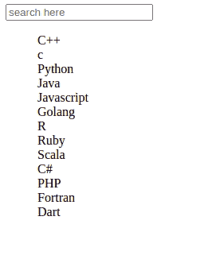

# 使用烧瓶和 jQuery 进行实时搜索

> 原文:[https://www . geesforgeks . org/live-search-use-flask-and-jquery/](https://www.geeksforgeeks.org/live-search-using-flask-and-jquery/)

在本文中，我们将使用 Jquery 在 Flask 中进行实时搜索。实时搜索意味着每当用户在输入框中键入任何字母时，包含该字母的所有单词都会显示出来。

### 装置

这个模块没有内置 Python。要安装它，请在终端中键入以下命令。

```py
pip install flask
```

安装烧瓶后，为项目创建一个新目录。在里面创建一个新文件并命名为 **app.py.**

## 蟒蛇 3

```py
from flask import Flask,render_template

app = Flask(__name__)

@app.route("/")
def home():
    return render_template("index.html")

if __name__ == "__main__":
    app.run(debug=True)
```

在项目内部创建新目录**模板**并在其中创建新文件**index.html。**该文件包含用户输入的 HTML 代码，用户将在其中输入所需的文本，并显示输出。Jquery 将搜索包含用户键入的匹配字符的所有字符串。

**Index.HTML**

## 超文本标记语言

```py
<!DOCTYPE html>
<html>
<head>
    <title>GFG</title>
</head>
<body>

<input type="text" class="live-search-box" placeholder="search here" />

<ul class="live-search-list" type="None">
<li>C++</li>
<li>c</li>
<li>Python</li>
<li>Java</li>
<li>Javascript</li>
<li>Golang</li>
<li>R</li>
<li>Ruby</li>
<li>Scala</li>
<li>C#</li>
<li>PHP</li>
<li>Fortran</li>
<li>Dart</li>
</ul>

<script src="https://code.jquery.com/jquery-3.5.1.js" integrity="sha256-QWo7LDvxbWT2tbbQ97B53yJnYU3WhH/C8ycbRAkjPDc=" crossorigin="anonymous"></script>

<script type="text/javascript">
    jQuery(document).ready(function($){

$('.live-search-list li').each(function(){
$(this).attr('data-search-term', $(this).text().toLowerCase());
});

$('.live-search-box').on('keyup', function(){

var searchTerm = $(this).val().toLowerCase();

    $('.live-search-list li').each(function(){

        if ($(this).filter('[data-search-term *= ' + searchTerm + ']').length > 0 || searchTerm.length < 1) {
            $(this).show();
        } else {
            $(this).hide();
        }

    });

});

});
</script>

</body>
</html>
```

要运行此应用程序，请在同一目录中打开 cmd 或终端，并键入以下命令。

```py
python app.py
```

**输出:**

