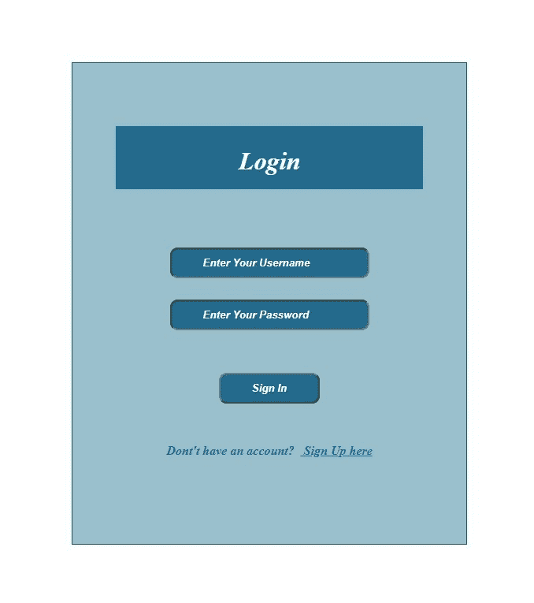
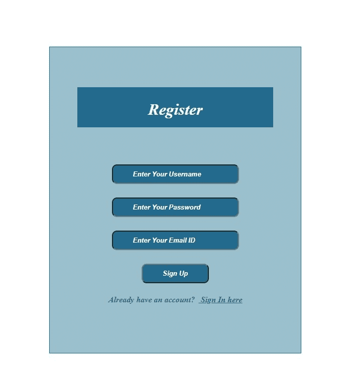
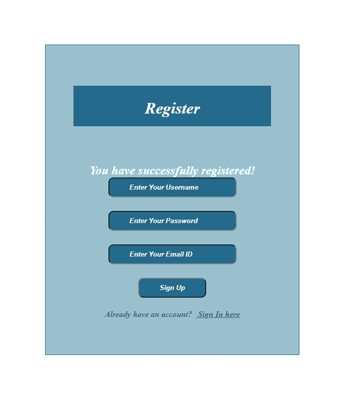
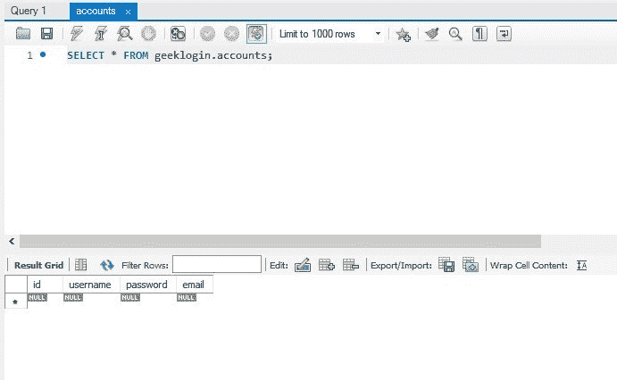
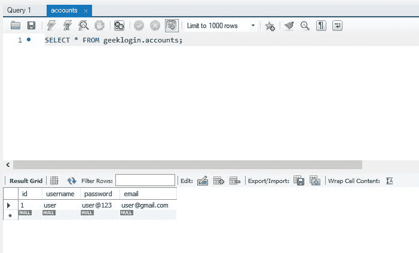
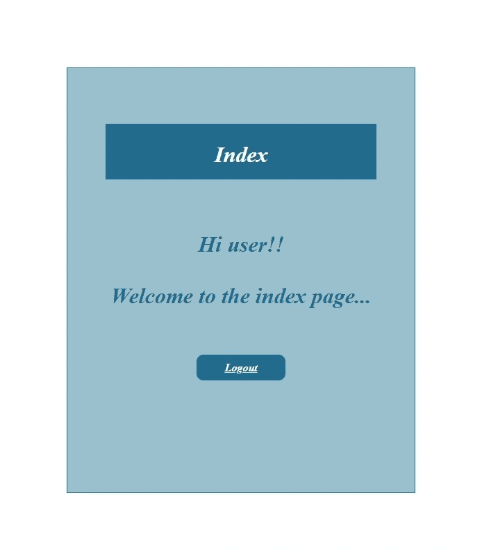
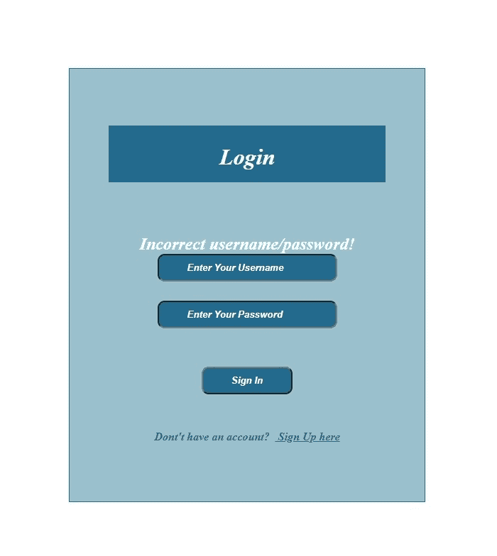

# 使用 Flask 和 MySQL 登录注册项目

> 原文:[https://www . geesforgeks . org/log in-and-registration-project-use-flask-and-MySQL/](https://www.geeksforgeeks.org/login-and-registration-project-using-flask-and-mysql/)

**项目名称:**使用 Flask 框架和 MySQL 工作台登录注册项目。

**应用类型(类别):** Web 应用。

**简介:**框架是一个代码库，它通过为常见操作提供可重用的代码，使开发人员在构建 web 应用程序时的生活变得更加轻松。Python 有许多框架，包括 Flask、Tornado、金字塔和 Django。Flask 是一个轻量级的 web 应用程序框架。它被归类为微框架，因为它不需要特定的工具或库。

**先决条件:**Python 知识、MySQL 工作台和 Flask 框架基础。系统中应该安装 Python 和 MySQL Workbench。Visual studio 代码或 Spyder 或任何代码编辑器来处理应用程序。

**项目使用的技术:** Flask 框架，MySQL Workbench。

**项目实施:**

**(1)创造环境**

**第一步:**创造环境。在中创建项目文件夹和 venv 文件夹。

> **py -3 -m venv venv**

**步骤 2:** 激活环境。

> **venv \ Scripts \激活**

**步骤 3:** 安装烧瓶。

> **pip 安装烧瓶**

**(2) MySQL 工作台**

**步骤-1:** 安装 MySQL 工作台。
链接安装:[https://dev.mysql.com/downloads/workbench/](https://dev.mysql.com/downloads/workbench/)T5】了解详情:[https://www.mysql.com/products/workbench/](https://www.mysql.com/products/workbench/)

**步骤 2:** 在你的 venv 中安装“mysqlbd”模块。

> **pip 安装烧瓶-mysqldb**

**步骤-3:** 打开 MySQL 工作台。

**步骤-4:** 编写以下代码。上面的 SQL 语句将创建我们的数据库**极客登录**和表**账户**。

**第 5 步:**执行查询。
T3】

**(3)创建项目**

**步骤-1:** 创建一个空文件夹**【登录】**。

**步骤 2:** 现在打开你的代码编辑器，打开这个‘登录’文件夹。

**第三步:**创建**【app . py】**文件夹，并写出下面给出的代码。

```
# Store this code in 'app.py' file

from flask import Flask, render_template, request, redirect, url_for, session
from flask_mysqldb import MySQL
import MySQLdb.cursors
import re

app = Flask(__name__)

app.secret_key = 'your secret key'

app.config['MYSQL_HOST'] = 'localhost'
app.config['MYSQL_USER'] = 'root'
app.config['MYSQL_PASSWORD'] = 'your password'
app.config['MYSQL_DB'] = 'geeklogin'

mysql = MySQL(app)

@app.route('/')
@app.route('/login', methods =['GET', 'POST'])
def login():
    msg = ''
    if request.method == 'POST' and 'username' in request.form and 'password' in request.form:
        username = request.form['username']
        password = request.form['password']
        cursor = mysql.connection.cursor(MySQLdb.cursors.DictCursor)
        cursor.execute('SELECT * FROM accounts WHERE username = % s AND password = % s', (username, password, ))
        account = cursor.fetchone()
        if account:
            session['loggedin'] = True
            session['id'] = account['id']
            session['username'] = account['username']
            msg = 'Logged in successfully !'
            return render_template('index.html', msg = msg)
        else:
            msg = 'Incorrect username / password !'
    return render_template('login.html', msg = msg)

@app.route('/logout')
def logout():
    session.pop('loggedin', None)
    session.pop('id', None)
    session.pop('username', None)
    return redirect(url_for('login'))

@app.route('/register', methods =['GET', 'POST'])
def register():
    msg = ''
    if request.method == 'POST' and 'username' in request.form and 'password' in request.form and 'email' in request.form :
        username = request.form['username']
        password = request.form['password']
        email = request.form['email']
        cursor = mysql.connection.cursor(MySQLdb.cursors.DictCursor)
        cursor.execute('SELECT * FROM accounts WHERE username = % s', (username, ))
        account = cursor.fetchone()
        if account:
            msg = 'Account already exists !'
        elif not re.match(r'[^@]+@[^@]+\.[^@]+', email):
            msg = 'Invalid email address !'
        elif not re.match(r'[A-Za-z0-9]+', username):
            msg = 'Username must contain only characters and numbers !'
        elif not username or not password or not email:
            msg = 'Please fill out the form !'
        else:
            cursor.execute('INSERT INTO accounts VALUES (NULL, % s, % s, % s)', (username, password, email, ))
            mysql.connection.commit()
            msg = 'You have successfully registered !'
    elif request.method == 'POST':
        msg = 'Please fill out the form !'
    return render_template('register.html', msg = msg)
```

**第 4 步:**创建文件夹**“模板”**。在“模板”文件夹中创建文件“login.html”、“register.html”、“index.html”。

**步骤-5:** 打开**【log in . html】**文件，写出下面给出的代码。在“login.html”中，我们有两个字段，即用户名和密码。当用户输入正确的用户名和密码时，它会将您路由到索引页面，否则会显示“用户名/密码不正确”。

```
<!-- Store this code in 'login.html' file inside the 'templates' folder -->

<html>
    <head>
        <meta charset="UTF-8">
        <title> Login </title>
        <link rel="stylesheet" href="{{ url_for('static', filename='style.css') }}">           
    </head>
    <body></br></br></br></br></br>
        <div align="center">
          <div align="center" class="border">
             <div class="header">
                <h1 class="word">Login</h1>
             </div></br></br></br>
            <h2 class="word">
                <form action="{{ url_for('login') }}" method="post">
                  <div class="msg">{{ msg }}</div>
                    <input id="username" name="username" type="text" placeholder="Enter Your Username" class="textbox"/></br></br>
                    <input id="password" name="password" type="password" placeholder="Enter Your Password" class="textbox"/></br></br></br>
                    <input type="submit" class="btn" value="Sign In"></br></br>
                </form>
            </h2>
            <p class="bottom">Dont't have an account?  <a class="bottom" href="{{url_for('register')}}"> Sign Up here</a></p>
          </div>
        </div>
    </body>
</html>
```

**第 6 步:**打开**【register . html】**文件，写出下面给出的代码。在“register.html”中，我们有三个字段，即用户名、密码和电子邮件。当用户输入所有信息时，它将数据存储在数据库中，并显示“注册成功”。

```
<!-- Store this code in 'register.html' file inside the 'templates' folder -->

<html>
    <head>
        <meta charset="UTF-8">
        <title> Register </title>
        <link rel="stylesheet" href="{{ url_for('static', filename='style.css') }}">              
    </head>
    <body></br></br></br></br></br>
        <div align="center">
          <div align="center" class="border">
             <div class="header">
                <h1 class="word">Register</h1>
             </div></br></br></br>
            <h2 class="word">
                <form action="{{ url_for('register') }}" method="post">
                  <div class="msg">{{ msg }}</div>
                    <input id="username" name="username" type="text" placeholder="Enter Your Username" class="textbox"/></br></br>
                    <input id="password" name="password" type="password" placeholder="Enter Your Password" class="textbox"/></br></br>
                    <input id="email" name="email" type="text" placeholder="Enter Your Email ID" class="textbox"/></br></br>
                    <input type="submit" class="btn" value="Sign Up"></br>
                </form>
            </h2>
            <p class="bottom">Already have an account?  <a class="bottom" href="{{url_for('login')}}"> Sign In here</a></p>
          </div>
        </div>
    </body>
</html>
```

**第 7 步:**打开**【index . html】**文件，写出下面给出的代码。登录成功时会显示此页面，并且还会显示用户名。该页面还包括注销功能。当用户注销时，它会再次移动到新的登录页面。

```
<!-- Store this code in 'index.html' file inside the 'templates' folder-->

<html>
    <head>
        <meta charset="UTF-8">
        <title> Index </title>
        <link rel="stylesheet" href="{{ url_for('static', filename='style.css') }}">                     
    </head>
    <body></br></br></br></br></br>
        <div align="center">
          <div align="center" class="border">
             <div class="header">
                <h1 class="word">Index</h1>
             </div></br></br></br>
                <h1 class="bottom">
                     Hi {{session.username}}!!</br></br> Welcome to the index page...                 
                </h1></br></br></br>
                <a href="{{ url_for('logout') }}" class="btn">Logout</a>
          </div>
        </div>
    </body>
</html>
```

**第 8 步:**创建文件夹**【静态】**。在“静态”文件夹中创建文件**“style . css”**，并粘贴给定的 CSS 代码。

```
/* Store this code in 'style.css' file inside the 'static' folder*/

            .header{
                padding: 5px 120px;
                width: 150px;
                height: 70px;
                background-color: #236B8E; 
            }

            .border{
                padding: 80px 50px;
                width: 400px;
                height: 450px;
                border: 1px solid #236B8E;
                border-radius: 0px;
                background-color: #9AC0CD;
            }

            .btn {
                padding: 10px 40px;
                background-color: #236B8E; 
                color: #FFFFFF;
                font-style: oblique;
                font-weight: bold;
                border-radius: 10px;
            }

            .textbox{
                padding: 10px 40px;
                background-color: #236B8E; 
                text-color: #FFFFFF;
                border-radius: 10px;
            }

            ::placeholder {
                color: #FFFFFF;
                opacity: 1;
                font-style: oblique;
                font-weight: bold;
            }

            .word{
                color: #FFFFFF;
                font-style: oblique;
                font-weight: bold;
            }

            .bottom{
                color: #236B8E;
                font-style: oblique;
                font-weight: bold;
            }
```

**步骤-9:** 项目结构会是这样的。
T3】

**(4)运行项目**
**步骤-1:** 运行服务器。

**第 2 步:**浏览网址‘localhost:5000’。

**步骤-3:** 将显示输出网页。

**(5)应用测试**

**第一步:**如果你是新用户，去报名页面填写详细信息。

**第 2 步:**注册后，进入登录页面。输入您的用户名和密码并登录。

**步骤-3:** 如果登录成功，将移至索引页面，并显示您的姓名。

**输出:**
**登录页面:**


**注册页面:**


**如果注册成功:**


**注册前，数据库表:**


**注册后，数据库表:**


**如果登录成功，显示**
索引页面

**如果登录失败:**
