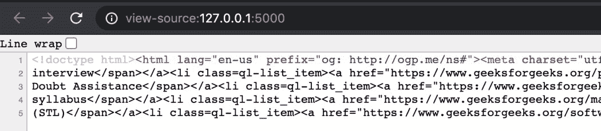
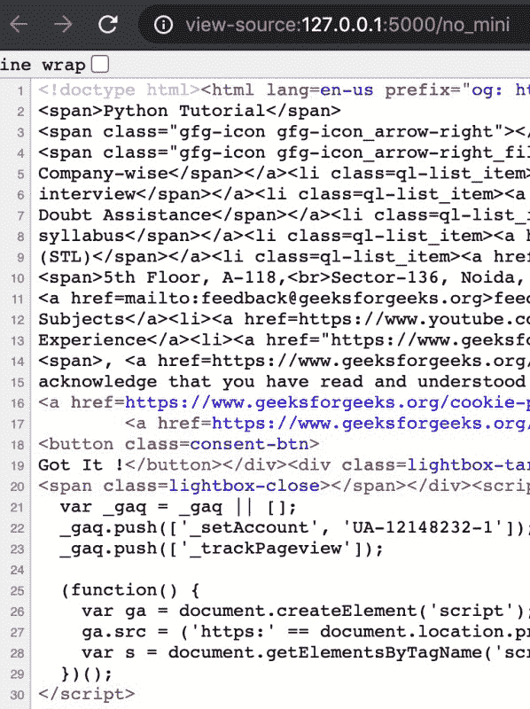

# 使用烧瓶-Minify

缩小烧瓶中的 HTML

> 原文:[https://www . geesforgeks . org/minify-html-in-flask-use-flask-minify/](https://www.geeksforgeeks.org/minify-html-in-flask-using-flask-minify/)

Flask 提供 HTML 渲染作为输出，通常希望输出的 HTML 应该简洁，并且它也服务于目的。在本文中，我们将使用库-Flask-Minify 显示 Flask 响应的输出路径的缩小。

### **缩小的优势**

*   网站加载速度更快，因为上传和下载的行数更少。
*   随着通过网络传输的数据越来越少，带宽成本也随之降低。
*   使用前不需要解压。
*   随着网站加载速度的加快，UX 和搜索引擎优化也在改进。

### 装置

要安装此模块，请在终端中键入以下命令。

```
pip install Flask-Minify
```

**使用的函数:** minify(self，app=None，html=True，js=True，无 CSS = True，fail_safe=True，bypass=[]，passive=False，static=True，script _ type =[])

**参数:**

*   **应用程序:**将启动 Flask 应用程序实例。
*   **js:** Minify js 与否。
*   **无 CSS:**是否 Minify css。
*   **故障安全:**避免缩小时出现错误。
*   **绕过:**要绕过缩小的端点列表。
*   **被动:**选择性缩小路线
*   **静态:**启用缩小静态文件 css、less 和 js。
*   **脚本类型:**限制 js 缩小的脚本类型列表。

### 逐步实施

**第一步:导入库，用 app 上下文初始化 Minify。**

## 蟒蛇 3

```
from flask import Flask
from flask_minify import minify

app = Flask(__name__)

# initializing minify for html, js and cssless
minify(app=app, html=True, js=True, cssless=True)
```

**第二步:添加路由，输出带有精简代码的 HTML。**

## 蟒蛇 3

```
@app.route('/')
def sample_minify():
    return """<!doctype html>
<html lang=en-us prefix="og: http://ogp.me/ns#">
<meta charset=utf-8>
<meta name=viewport content="width=device-width,initial-scale=1,maximum-scale=1">
<meta name=description content="A Computer Science portal for geeks. It contains well written, well thought and well explained computer science and programming articles, quizzes and practice/competitive programming/company interview Questions.">
<link rel="shortcut icon" href=https://media.geeksforgeeks.org/wp-content/cdn-uploads/gfg_favicon.png type=image/x-icon>
<meta name=theme-color content="#308D46">
<meta property="og:image" content="https://media.geeksforgeeks.org/wp-content/cdn-uploads/gfg_200x200-min.png">
<meta property="og:image:type" content="image/png">
<meta property="og:image:width" content="200">
<meta property="og:image:height" content="200">
<script defer src=https://apis.google.com/js/platform.js></script>
<script async src=//cdnjs.cloudflare.com/ajax/libs/require.js/2.1.14/require.min.js></script>
<script async src="//translate.google.com/translate_a/element.js?cb=googleTranslateElementInit"></script>
<link rel=stylesheet href=https://use.typekit.net/mrg0hpc.css>
<title>GeeksforGeeks | A computer science portal for geeks</title>
<link rel=profile href=http://gmpg.org/xfn/11>
<link rel=pingback href>
<script type=application/ld+json>
    <span>Python Tutorial</span>
    <span class="gfg-icon gfg-icon_arrow-right"></span></a></ul></div></div></div></div><div class="side--container mb-30"><div class=card-layout><div class=heading><div class=def-title_wrap><div class=title>Featured Articles</div><a href=https://www.geeksforgeeks.org/featured-articles class=vall><span>View All</span>
    <span class="gfg-icon gfg-icon_arrow-right_filled"></span></a></div></div><div class=rightbar--articles_container><div class=content-wrapper><ul class="content-wrapper content-wrapper_links"><li><a href="https://www.geeksforgeeks.org/must-do-coding-questions-for-product-based-companies/?ref=grb" title="Permalink to Must Do Coding Questions for Product Based Companies" rel=bookmark>Must Do Coding Questions for Product Based Companies</a>
<p>May 16, 2021<li><a href="https://www.geeksforgeeks.org/must-do-coding-questions-for-companies-like-amazon-microsoft-adobe/?ref=grb" title="Permalink to Must Do Coding Questions for Companies like Amazon, Microsoft, Adobe, …" rel=bookmark>Must Do Coding Questions for Companies like Amazon, Microsoft, Adobe, …</a>
<p>May 16, 2021<li><a href="https://www.geeksforgeeks.org/progeek-cup-2021-a-project-competition-by-geeksforgeeks/?ref=grb" title="Permalink to ProGeek Cup 2021 – A Project Competition By GeeksforGeeks" rel=bookmark>ProGeek Cup 2021 – A Project Competition By GeeksforGeeks</a>
<p>May 11, 2021<li><a href="https://www.geeksforgeeks.org/recently-asked-interview-questions-in-product-based-companies/?ref=grb" title="Permalink to Recently Asked Interview Questions in Product Based Companies" rel=bookmark>Recently Asked Interview Questions in Product Based Companies</a>
<p>May 11, 2021<li><a href="https://www.geeksforgeeks.org/bridge-the-gap-between-engineering-and-your-dream-job-complete-interview-preparation/?ref=grb" title="Permalink to Bridge the Gap Between Engineering and Your Dream Job – Complete Interview Preparation" rel=bookmark>Bridge the Gap Between Engineering and Your Dream Job – Complete Interview Preparation</a>
<p>May 1, 2021</ul></div></div></div></div><div class="side--container mb-30"><div id=secondary class=widget-area role=complementary><aside id=text-15 class="widget widget_text"><div class=textwidget></div></aside><aside id=text-19 class="widget widget_text"><div class=textwidget><div class=heading><div class=def-title_wrap><div class=title>What’s New</div></div></div></div></aside><div class=card-layout><div class=content-wrapper><div class=side--container_wscard><a href="https://practice.geeksforgeeks.org/courses/dsa-self-paced?utm_source=geeksforgeeks&utm_medium=article&utm_campaign=gfg_article_dsa_content_bottom"><div class=card-content><div class=thumbnail></div><div class=content><div class=head>DSA Self Paced Course</div><div class=ref>View Details</div></div></div></a></div></div></div><div class=card-layout><div class=content-wrapper><div class=side--container_wscard style=margin-top:-20px><a href="https://premium.geeksforgeeks.org/premium-plans/?utm_source=geeksforgeeks&utm_medium=article&utm_campaign=gfg_article_premium_content_bottom"><div class=card-content><div class=thumbnail></div><div class=content><div class=head>Ad free experience with GeeksforGeeks Premium</div><div class=ref>View Details</div></div></div></a></div></div></div><aside id=text-16 class="widget widget_text"><div class=textwidget></div></aside><aside id=text-17 class="widget widget_text"><div class=textwidget></div></aside><aside id=text-18 class="widget widget_text"><div class=textwidget></div></aside></div></div><div class="side--container mb-30"><div class=card-layout><div class=heading><div class=def-title_wrap><div class=title>Recommended</div></div></div><div class=content-wrapper><div class=item-container><ul class="ql-list recommended"><li class=ql-list_item><a href="https://www.geeksforgeeks.org/category/guestblogs/?ref=grb" class=no-hover><span data-icon=one></span><span class="gfg-icon gfg-icon_arrow-right">Guest Blogs</span></a><li class=ql-list_item><a href="https://www.geeksforgeeks.org/must-coding-questions-company-wise/?ref=grb" class=no-hover><span data-icon=two></span><span class="gfg-icon gfg-icon_arrow-right">Must Do Coding Questions
    Company-wise</span></a><li class=ql-list_item><a href="https://www.geeksforgeeks.org/practice-for-cracking-any-coding-interview/?ref=grb" class=no-hover><span data-icon=three></span><span class="gfg-icon gfg-icon_arrow-right">Practice for cracking any coding
    interview</span></a><li class=ql-list_item><a href="https://www.geeksforgeeks.org/placements-gq/?ref=grb" class=no-hover><span data-icon=four></span><span class="gfg-icon gfg-icon_arrow-right">Placements</span></a><li class=ql-list_item><a href="https://practice.geeksforgeeks.org/courses/cip-da/?ref=grb" class=no-hover><span data-icon=five></span><span class="gfg-icon gfg-icon_arrow-right">Complete Interview Preparation With
    Doubt Assistance</span></a><li class=ql-list_item><a href="https://www.geeksforgeeks.org/gate-cs-notes-gq/?ref=grb" class=no-hover><span data-icon=six></span><span class="gfg-icon gfg-icon_arrow-right">GATE CS Notes according to GATE 2021
    syllabus</span></a><li class=ql-list_item><a href="https://www.geeksforgeeks.org/machine-learning/?ref=grb" class=no-hover><span data-icon=seven></span><span class="gfg-icon gfg-icon_arrow-right">Machine Learning</span></a><li class=ql-list_item><a href="https://www.geeksforgeeks.org/django-tutorial/?ref=grb" class=no-hover><span data-icon=eight></span><span class="gfg-icon gfg-icon_arrow-right">Django Tutorial</span></a><li class=ql-list_item><a href="https://www.geeksforgeeks.org/computer-science-projects/?ref=grb" class=no-hover><span data-icon=nine></span><span class="gfg-icon gfg-icon_arrow-right">Computer Science Projects</span></a><li class=ql-list_item><a href="https://practice.geeksforgeeks.org/courses/Amazon-Test-Series/?ref=grb" class=no-hover><span data-icon=ten></span><span class="gfg-icon gfg-icon_arrow-right">Amazon SDE Test Series</span></a><li class=ql-list_item><a href="https://www.geeksforgeeks.org/company-interview-corner/?ref=grb" class=no-hover><span data-icon=eleven></span><span class="gfg-icon gfg-icon_arrow-right">Company Interview Corner</span></a><li class=ql-list_item><a href="https://www.geeksforgeeks.org/the-c-standard-template-library-stl/?ref=grb" class=no-hover><span data-icon=twelve></span><span class="gfg-icon gfg-icon_arrow-right">The C++ Standard Template Library
    (STL)</span></a><li class=ql-list_item><a href="https://www.geeksforgeeks.org/software-design-patterns/?ref=grb" class=no-hover><span data-icon=thirteen></span><span class="gfg-icon gfg-icon_arrow-right">Software Design Patterns</span></a><li class=ql-list_item><a href="https://www.geeksforgeeks.org/sql-tutorial/?ref=grb" class=no-hover><span data-icon=fourteen></span><span class="gfg-icon gfg-icon_arrow-right">SQL Tutorial</span></a><li class=ql-list_item><a href="https://www.geeksforgeeks.org/advanced-data-structures/?ref=grb" class=no-hover><span data-icon=fifteen></span><span class="gfg-icon gfg-icon_arrow-right">Advanced Data Structures</span></a></ul></div></div></div></div></div></div></div></div><footer class=gfg-footer id=gfg-footer><div class=footer-wrapper><div class=footer-wrapper_branding><a class=footer-wrapper_branding-anchor href=https://www.geeksforgeeks.org/></a><div class=footer-wrapper_branding-address><i class="gfg-icon gfg-icon_pin"></i>
    <span>5th Floor, A-118,<br>Sector-136, Noida, Uttar Pradesh - 201305</span></div><div class=footer-wrapper_branding-email><i class="gfg-icon gfg-icon_mail"></i>
    <a href=mailto:feedback@geeksforgeeks.org>feedback@geeksforgeeks.org</a></div><div class=footer-wrapper_branding-social><a href=https://www.facebook.com/geeksforgeeks.org/ rel="noopener noreferrer" aria-label="GeeksforGeeks Facebook" target=_blank><div class=facebook></div></a><a href=https://www.instagram.com/geeks_for_geeks/ rel="noopener noreferrer" aria-label="GeeksforGeeks Instagram" target=_blank><div class=instagram></div></a><a href=https://in.linkedin.com/company/geeksforgeeks rel="noopener noreferrer" aria-label="GeeksforGeeks LinkedIn" target=_blank><div class=linkedin></div></a><a href=https://twitter.com/geeksforgeeks rel="noopener noreferrer" aria-label="GeeksforGeeks Twitter" target=_blank><div class=twitter></div></a><a href=https://www.youtube.com/geeksforgeeksvideos rel="noopener noreferrer" aria-label="GeeksforGeeks YouTube" target=_blank><div class=youtube></div></a></div></div><div class=footer-wrapper_links><ul class=footer-wrapper_links-list><li>Company<li><a href=https://www.geeksforgeeks.org/about/>About Us</a><li><a href=https://www.geeksforgeeks.org/careers/>Careers</a><li><a href=https://www.geeksforgeeks.org/privacy-policy/>Privacy Policy</a><li><a href=https://www.geeksforgeeks.org/about/contact-us/>Contact Us</a><li><a href=https://www.geeksforgeeks.org/copyright-information/>Copyright Policy</a></ul><ul class=footer-wrapper_links-list><li>Learn<li><a href=https://www.geeksforgeeks.org/fundamentals-of-algorithms/>Algorithms</a><li><a href=https://www.geeksforgeeks.org/data-structures/>Data Structures</a><li><a href=https://www.geeksforgeeks.org/category/program-output/>Languages</a><li><a href=https://www.geeksforgeeks.org/articles-on-computer-science-subjects-gq/>CS
    Subjects</a><li><a href=https://www.youtube.com/geeksforgeeksvideos/>Video Tutorials</a></ul><ul class=footer-wrapper_links-list><li>Practice<li><a href=https://practice.geeksforgeeks.org/courses/>Courses</a><li><a href=https://practice.geeksforgeeks.org/company-tags/>Company-wise</a><li><a href=https://practice.geeksforgeeks.org/topic-tags/>Topic-wise</a><li><a href=https://practice.geeksforgeeks.org/faq.php>How to begin?</a></ul><ul class=footer-wrapper_links-list><li>Contribute<li><a href=https://www.geeksforgeeks.org/contribute/>Write an Article</a><li><a href=https://www.geeksforgeeks.org/write-interview-experience/>Write Interview
    Experience</a><li><a href="https://www.geeksforgeeks.org/careers/?job_type=1">Internships</a><li><a href=https://www.geeksforgeeks.org/how-to-contribute-videos-to-geeksforgeeks/>Videos</a></ul></div></div><div class=footer-strip><div class=copyright><a href=https://www.geeksforgeeks.org/ rel="noopener noreferrer" target=_blank>@geeksforgeeks</a>
    <span>, <a href=https://www.geeksforgeeks.org/copyright-information/>Some rights reserved</a></span></div><div class=social-links></div></div></footer></div><script src="https://www.geeksforgeeks.org/wp-includes/js/wp-embed.min.js?ver=4.9.8">
</script>
<script>
    jQuery(document).ready(function($) { RESPONSIVEUI.responsiveTabs(); })
</script>
<div class="cookie-consent hide-consent"><span class=cookie-text>We use cookies to ensure you have the best browsing experience on our website. By using our site, you
acknowledge that you have read and understood our
<a href=https://www.geeksforgeeks.org/cookie-policy/ target=_blank><u>Cookie Policy</u></a> &
        <a href=https://www.geeksforgeeks.org/privacy-policy/ target=_blank><u>Privacy Policy</u></a></span>
    <button class=consent-btn>Got It !</button>
</div>
<div class=lightbox-target>
    
<span class=lightbox-close></span>
</div>
<script>
    var _gaq = _gaq || [];
      _gaq.push(['_setAccount', 'UA-12148232-1']);
      _gaq.push(['_trackPageview']);

      (function() {
        var ga = document.createElement('script'); ga.type = 'text/javascript'; ga.async = true;
        ga.src = ('https:' == document.location.protocol ? 'https://ssl' : 'http://www') + '.google-analytics.com/ga.js';
        var s = document.getElementsByTagName('script')[0]; s.parentNode.insertBefore(ga, s);
      })();
</script>"""
```

**第三步:运行应用程序**

## 蟒蛇 3

```
if __name__ == "__main__":
      app.run()
```

**输出:**



**示例 2:对某些路线应用缩小**

在这种情况下，我们可以按照要求只对所需的路线而不是所有路线进行缩小。这是通过在传递上下文的同时传递“被动=真”来实现的。

## 蟒蛇 3

```
from flask import Flask
from flask_minify import minify, decorators

app = Flask(__name__)

# passive = True, just performs minification to required routes
minify(app=app, passive=True)

# minifies this route
@app.route('/')
@decorators.minify(html=True, js=True, cssless=True)
def sample_minify():
    return """<!doctype html>
<html lang=en-us prefix="og: http://ogp.me/ns#">
<meta charset=utf-8>
<meta name=viewport content="width=device-width,initial-scale=1,maximum-scale=1">
<meta name=description content="A Computer Science portal for geeks. It contains well written, well thought and well explained computer science and programming articles, quizzes and practice/competitive programming/company interview Questions.">
<link rel="shortcut icon" href=https://media.geeksforgeeks.org/wp-content/cdn-uploads/gfg_favicon.png type=image/x-icon>
<meta name=theme-color content="#308D46">
<meta property="og:image" content="https://media.geeksforgeeks.org/wp-content/cdn-uploads/gfg_200x200-min.png">
<meta property="og:image:type" content="image/png">
<meta property="og:image:width" content="200">
<meta property="og:image:height" content="200">
<script defer src=https://apis.google.com/js/platform.js></script>
<script async src=//cdnjs.cloudflare.com/ajax/libs/require.js/2.1.14/require.min.js></script>
<script async src="//translate.google.com/translate_a/element.js?cb=googleTranslateElementInit"></script>
<link rel=stylesheet href=https://use.typekit.net/mrg0hpc.css>
<title>GeeksforGeeks | A computer science portal for geeks</title>
<link rel=profile href=http://gmpg.org/xfn/11>
<link rel=pingback href>
<script type=application/ld+json>
    <span>Python Tutorial</span>
    <span class="gfg-icon gfg-icon_arrow-right"></span></a></ul></div></div></div></div><div class="side--container mb-30"><div class=card-layout><div class=heading><div class=def-title_wrap><div class=title>Featured Articles</div><a href=https://www.geeksforgeeks.org/featured-articles class=vall><span>View All</span>
    <span class="gfg-icon gfg-icon_arrow-right_filled"></span></a></div></div><div class=rightbar--articles_container><div class=content-wrapper><ul class="content-wrapper content-wrapper_links"><li><a href="https://www.geeksforgeeks.org/must-do-coding-questions-for-product-based-companies/?ref=grb" title="Permalink to Must Do Coding Questions for Product Based Companies" rel=bookmark>Must Do Coding Questions for Product Based Companies</a>
<p>May 16, 2021<li><a href="https://www.geeksforgeeks.org/must-do-coding-questions-for-companies-like-amazon-microsoft-adobe/?ref=grb" title="Permalink to Must Do Coding Questions for Companies like Amazon, Microsoft, Adobe, …" rel=bookmark>Must Do Coding Questions for Companies like Amazon, Microsoft, Adobe, …</a>
<p>May 16, 2021<li><a href="https://www.geeksforgeeks.org/progeek-cup-2021-a-project-competition-by-geeksforgeeks/?ref=grb" title="Permalink to ProGeek Cup 2021 – A Project Competition By GeeksforGeeks" rel=bookmark>ProGeek Cup 2021 – A Project Competition By GeeksforGeeks</a>
<p>May 11, 2021<li><a href="https://www.geeksforgeeks.org/recently-asked-interview-questions-in-product-based-companies/?ref=grb" title="Permalink to Recently Asked Interview Questions in Product Based Companies" rel=bookmark>Recently Asked Interview Questions in Product Based Companies</a>
<p>May 11, 2021<li><a href="https://www.geeksforgeeks.org/bridge-the-gap-between-engineering-and-your-dream-job-complete-interview-preparation/?ref=grb" title="Permalink to Bridge the Gap Between Engineering and Your Dream Job – Complete Interview Preparation" rel=bookmark>Bridge the Gap Between Engineering and Your Dream Job – Complete Interview Preparation</a>
<p>May 1, 2021</ul></div></div></div></div><div class="side--container mb-30"><div id=secondary class=widget-area role=complementary><aside id=text-15 class="widget widget_text"><div class=textwidget></div></aside><aside id=text-19 class="widget widget_text"><div class=textwidget><div class=heading><div class=def-title_wrap><div class=title>What’s New</div></div></div></div></aside><div class=card-layout><div class=content-wrapper><div class=side--container_wscard><a href="https://practice.geeksforgeeks.org/courses/dsa-self-paced?utm_source=geeksforgeeks&utm_medium=article&utm_campaign=gfg_article_dsa_content_bottom"><div class=card-content><div class=thumbnail></div><div class=content><div class=head>DSA Self Paced Course</div><div class=ref>View Details</div></div></div></a></div></div></div><div class=card-layout><div class=content-wrapper><div class=side--container_wscard style=margin-top:-20px><a href="https://premium.geeksforgeeks.org/premium-plans/?utm_source=geeksforgeeks&utm_medium=article&utm_campaign=gfg_article_premium_content_bottom"><div class=card-content><div class=thumbnail></div><div class=content><div class=head>Ad free experience with GeeksforGeeks Premium</div><div class=ref>View Details</div></div></div></a></div></div></div><aside id=text-16 class="widget widget_text"><div class=textwidget></div></aside><aside id=text-17 class="widget widget_text"><div class=textwidget></div></aside><aside id=text-18 class="widget widget_text"><div class=textwidget></div></aside></div></div><div class="side--container mb-30"><div class=card-layout><div class=heading><div class=def-title_wrap><div class=title>Recommended</div></div></div><div class=content-wrapper><div class=item-container><ul class="ql-list recommended"><li class=ql-list_item><a href="https://www.geeksforgeeks.org/category/guestblogs/?ref=grb" class=no-hover><span data-icon=one></span><span class="gfg-icon gfg-icon_arrow-right">Guest Blogs</span></a><li class=ql-list_item><a href="https://www.geeksforgeeks.org/must-coding-questions-company-wise/?ref=grb" class=no-hover><span data-icon=two></span><span class="gfg-icon gfg-icon_arrow-right">Must Do Coding Questions
    Company-wise</span></a><li class=ql-list_item><a href="https://www.geeksforgeeks.org/practice-for-cracking-any-coding-interview/?ref=grb" class=no-hover><span data-icon=three></span><span class="gfg-icon gfg-icon_arrow-right">Practice for cracking any coding
    interview</span></a><li class=ql-list_item><a href="https://www.geeksforgeeks.org/placements-gq/?ref=grb" class=no-hover><span data-icon=four></span><span class="gfg-icon gfg-icon_arrow-right">Placements</span></a><li class=ql-list_item><a href="https://practice.geeksforgeeks.org/courses/cip-da/?ref=grb" class=no-hover><span data-icon=five></span><span class="gfg-icon gfg-icon_arrow-right">Complete Interview Preparation With
    Doubt Assistance</span></a><li class=ql-list_item><a href="https://www.geeksforgeeks.org/gate-cs-notes-gq/?ref=grb" class=no-hover><span data-icon=six></span><span class="gfg-icon gfg-icon_arrow-right">GATE CS Notes according to GATE 2021
    syllabus</span></a><li class=ql-list_item><a href="https://www.geeksforgeeks.org/machine-learning/?ref=grb" class=no-hover><span data-icon=seven></span><span class="gfg-icon gfg-icon_arrow-right">Machine Learning</span></a><li class=ql-list_item><a href="https://www.geeksforgeeks.org/django-tutorial/?ref=grb" class=no-hover><span data-icon=eight></span><span class="gfg-icon gfg-icon_arrow-right">Django Tutorial</span></a><li class=ql-list_item><a href="https://www.geeksforgeeks.org/computer-science-projects/?ref=grb" class=no-hover><span data-icon=nine></span><span class="gfg-icon gfg-icon_arrow-right">Computer Science Projects</span></a><li class=ql-list_item><a href="https://practice.geeksforgeeks.org/courses/Amazon-Test-Series/?ref=grb" class=no-hover><span data-icon=ten></span><span class="gfg-icon gfg-icon_arrow-right">Amazon SDE Test Series</span></a><li class=ql-list_item><a href="https://www.geeksforgeeks.org/company-interview-corner/?ref=grb" class=no-hover><span data-icon=eleven></span><span class="gfg-icon gfg-icon_arrow-right">Company Interview Corner</span></a><li class=ql-list_item><a href="https://www.geeksforgeeks.org/the-c-standard-template-library-stl/?ref=grb" class=no-hover><span data-icon=twelve></span><span class="gfg-icon gfg-icon_arrow-right">The C++ Standard Template Library
    (STL)</span></a><li class=ql-list_item><a href="https://www.geeksforgeeks.org/software-design-patterns/?ref=grb" class=no-hover><span data-icon=thirteen></span><span class="gfg-icon gfg-icon_arrow-right">Software Design Patterns</span></a><li class=ql-list_item><a href="https://www.geeksforgeeks.org/sql-tutorial/?ref=grb" class=no-hover><span data-icon=fourteen></span><span class="gfg-icon gfg-icon_arrow-right">SQL Tutorial</span></a><li class=ql-list_item><a href="https://www.geeksforgeeks.org/advanced-data-structures/?ref=grb" class=no-hover><span data-icon=fifteen></span><span class="gfg-icon gfg-icon_arrow-right">Advanced Data Structures</span></a></ul></div></div></div></div></div></div></div></div><footer class=gfg-footer id=gfg-footer><div class=footer-wrapper><div class=footer-wrapper_branding><a class=footer-wrapper_branding-anchor href=https://www.geeksforgeeks.org/></a><div class=footer-wrapper_branding-address><i class="gfg-icon gfg-icon_pin"></i>
    <span>5th Floor, A-118,<br>Sector-136, Noida, Uttar Pradesh - 201305</span></div><div class=footer-wrapper_branding-email><i class="gfg-icon gfg-icon_mail"></i>
    <a href=mailto:feedback@geeksforgeeks.org>feedback@geeksforgeeks.org</a></div><div class=footer-wrapper_branding-social><a href=https://www.facebook.com/geeksforgeeks.org/ rel="noopener noreferrer" aria-label="GeeksforGeeks Facebook" target=_blank><div class=facebook></div></a><a href=https://www.instagram.com/geeks_for_geeks/ rel="noopener noreferrer" aria-label="GeeksforGeeks Instagram" target=_blank><div class=instagram></div></a><a href=https://in.linkedin.com/company/geeksforgeeks rel="noopener noreferrer" aria-label="GeeksforGeeks LinkedIn" target=_blank><div class=linkedin></div></a><a href=https://twitter.com/geeksforgeeks rel="noopener noreferrer" aria-label="GeeksforGeeks Twitter" target=_blank><div class=twitter></div></a><a href=https://www.youtube.com/geeksforgeeksvideos rel="noopener noreferrer" aria-label="GeeksforGeeks YouTube" target=_blank><div class=youtube></div></a></div></div><div class=footer-wrapper_links><ul class=footer-wrapper_links-list><li>Company<li><a href=https://www.geeksforgeeks.org/about/>About Us</a><li><a href=https://www.geeksforgeeks.org/careers/>Careers</a><li><a href=https://www.geeksforgeeks.org/privacy-policy/>Privacy Policy</a><li><a href=https://www.geeksforgeeks.org/about/contact-us/>Contact Us</a><li><a href=https://www.geeksforgeeks.org/copyright-information/>Copyright Policy</a></ul><ul class=footer-wrapper_links-list><li>Learn<li><a href=https://www.geeksforgeeks.org/fundamentals-of-algorithms/>Algorithms</a><li><a href=https://www.geeksforgeeks.org/data-structures/>Data Structures</a><li><a href=https://www.geeksforgeeks.org/category/program-output/>Languages</a><li><a href=https://www.geeksforgeeks.org/articles-on-computer-science-subjects-gq/>CS
    Subjects</a><li><a href=https://www.youtube.com/geeksforgeeksvideos/>Video Tutorials</a></ul><ul class=footer-wrapper_links-list><li>Practice<li><a href=https://practice.geeksforgeeks.org/courses/>Courses</a><li><a href=https://practice.geeksforgeeks.org/company-tags/>Company-wise</a><li><a href=https://practice.geeksforgeeks.org/topic-tags/>Topic-wise</a><li><a href=https://practice.geeksforgeeks.org/faq.php>How to begin?</a></ul><ul class=footer-wrapper_links-list><li>Contribute<li><a href=https://www.geeksforgeeks.org/contribute/>Write an Article</a><li><a href=https://www.geeksforgeeks.org/write-interview-experience/>Write Interview
    Experience</a><li><a href="https://www.geeksforgeeks.org/careers/?job_type=1">Internships</a><li><a href=https://www.geeksforgeeks.org/how-to-contribute-videos-to-geeksforgeeks/>Videos</a></ul></div></div><div class=footer-strip><div class=copyright><a href=https://www.geeksforgeeks.org/ rel="noopener noreferrer" target=_blank>@geeksforgeeks</a>
    <span>, <a href=https://www.geeksforgeeks.org/copyright-information/>Some rights reserved</a></span></div><div class=social-links></div></div></footer></div><script src="https://www.geeksforgeeks.org/wp-includes/js/wp-embed.min.js?ver=4.9.8">
</script>
<script>
    jQuery(document).ready(function($) { RESPONSIVEUI.responsiveTabs(); })
</script>
<div class="cookie-consent hide-consent"><span class=cookie-text>We use cookies to ensure you have the best browsing experience on our website. By using our site, you
acknowledge that you have read and understood our
<a href=https://www.geeksforgeeks.org/cookie-policy/ target=_blank><u>Cookie Policy</u></a> &
        <a href=https://www.geeksforgeeks.org/privacy-policy/ target=_blank><u>Privacy Policy</u></a></span>
    <button class=consent-btn>Got It !</button>
</div>
<div class=lightbox-target>
    
<span class=lightbox-close></span>
</div>
<script>
    var _gaq = _gaq || [];
      _gaq.push(['_setAccount', 'UA-12148232-1']);
      _gaq.push(['_trackPageview']);

      (function() {
        var ga = document.createElement('script'); ga.type = 'text/javascript'; ga.async = true;
        ga.src = ('https:' == document.location.protocol ? 'https://ssl' : 'http://www') + '.google-analytics.com/ga.js';
        var s = document.getElementsByTagName('script')[0]; s.parentNode.insertBefore(ga, s);
      })();
</script>"""

# doesn't minify this route
@app.route('/no_mini')
def no_minify():
    return """<!doctype html>
<html lang=en-us prefix="og: http://ogp.me/ns#">
<meta charset=utf-8>
<meta name=viewport content="width=device-width,initial-scale=1,maximum-scale=1">
<meta name=description content="A Computer Science portal for geeks. It contains well written, well thought and well explained computer science and programming articles, quizzes and practice/competitive programming/company interview Questions.">
<link rel="shortcut icon" href=https://media.geeksforgeeks.org/wp-content/cdn-uploads/gfg_favicon.png type=image/x-icon>
<meta name=theme-color content="#308D46">
<meta property="og:image" content="https://media.geeksforgeeks.org/wp-content/cdn-uploads/gfg_200x200-min.png">
<meta property="og:image:type" content="image/png">
<meta property="og:image:width" content="200">
<meta property="og:image:height" content="200">
<script defer src=https://apis.google.com/js/platform.js></script>
<script async src=//cdnjs.cloudflare.com/ajax/libs/require.js/2.1.14/require.min.js></script>
<script async src="//translate.google.com/translate_a/element.js?cb=googleTranslateElementInit"></script>
<link rel=stylesheet href=https://use.typekit.net/mrg0hpc.css>
<title>GeeksforGeeks | A computer science portal for geeks</title>
<link rel=profile href=http://gmpg.org/xfn/11>
<link rel=pingback href>
<script type=application/ld+json>
    <span>Python Tutorial</span>
    <span class="gfg-icon gfg-icon_arrow-right"></span></a></ul></div></div></div></div><div class="side--container mb-30"><div class=card-layout><div class=heading><div class=def-title_wrap><div class=title>Featured Articles</div><a href=https://www.geeksforgeeks.org/featured-articles class=vall><span>View All</span>
    <span class="gfg-icon gfg-icon_arrow-right_filled"></span></a></div></div><div class=rightbar--articles_container><div class=content-wrapper><ul class="content-wrapper content-wrapper_links"><li><a href="https://www.geeksforgeeks.org/must-do-coding-questions-for-product-based-companies/?ref=grb" title="Permalink to Must Do Coding Questions for Product Based Companies" rel=bookmark>Must Do Coding Questions for Product Based Companies</a>
<p>May 16, 2021<li><a href="https://www.geeksforgeeks.org/must-do-coding-questions-for-companies-like-amazon-microsoft-adobe/?ref=grb" title="Permalink to Must Do Coding Questions for Companies like Amazon, Microsoft, Adobe, …" rel=bookmark>Must Do Coding Questions for Companies like Amazon, Microsoft, Adobe, …</a>
<p>May 16, 2021<li><a href="https://www.geeksforgeeks.org/progeek-cup-2021-a-project-competition-by-geeksforgeeks/?ref=grb" title="Permalink to ProGeek Cup 2021 – A Project Competition By GeeksforGeeks" rel=bookmark>ProGeek Cup 2021 – A Project Competition By GeeksforGeeks</a>
<p>May 11, 2021<li><a href="https://www.geeksforgeeks.org/recently-asked-interview-questions-in-product-based-companies/?ref=grb" title="Permalink to Recently Asked Interview Questions in Product Based Companies" rel=bookmark>Recently Asked Interview Questions in Product Based Companies</a>
<p>May 11, 2021<li><a href="https://www.geeksforgeeks.org/bridge-the-gap-between-engineering-and-your-dream-job-complete-interview-preparation/?ref=grb" title="Permalink to Bridge the Gap Between Engineering and Your Dream Job – Complete Interview Preparation" rel=bookmark>Bridge the Gap Between Engineering and Your Dream Job – Complete Interview Preparation</a>
<p>May 1, 2021</ul></div></div></div></div><div class="side--container mb-30"><div id=secondary class=widget-area role=complementary><aside id=text-15 class="widget widget_text"><div class=textwidget></div></aside><aside id=text-19 class="widget widget_text"><div class=textwidget><div class=heading><div class=def-title_wrap><div class=title>What’s New</div></div></div></div></aside><div class=card-layout><div class=content-wrapper><div class=side--container_wscard><a href="https://practice.geeksforgeeks.org/courses/dsa-self-paced?utm_source=geeksforgeeks&utm_medium=article&utm_campaign=gfg_article_dsa_content_bottom"><div class=card-content><div class=thumbnail></div><div class=content><div class=head>DSA Self Paced Course</div><div class=ref>View Details</div></div></div></a></div></div></div><div class=card-layout><div class=content-wrapper><div class=side--container_wscard style=margin-top:-20px><a href="https://premium.geeksforgeeks.org/premium-plans/?utm_source=geeksforgeeks&utm_medium=article&utm_campaign=gfg_article_premium_content_bottom"><div class=card-content><div class=thumbnail></div><div class=content><div class=head>Ad free experience with GeeksforGeeks Premium</div><div class=ref>View Details</div></div></div></a></div></div></div><aside id=text-16 class="widget widget_text"><div class=textwidget></div></aside><aside id=text-17 class="widget widget_text"><div class=textwidget></div></aside><aside id=text-18 class="widget widget_text"><div class=textwidget></div></aside></div></div><div class="side--container mb-30"><div class=card-layout><div class=heading><div class=def-title_wrap><div class=title>Recommended</div></div></div><div class=content-wrapper><div class=item-container><ul class="ql-list recommended"><li class=ql-list_item><a href="https://www.geeksforgeeks.org/category/guestblogs/?ref=grb" class=no-hover><span data-icon=one></span><span class="gfg-icon gfg-icon_arrow-right">Guest Blogs</span></a><li class=ql-list_item><a href="https://www.geeksforgeeks.org/must-coding-questions-company-wise/?ref=grb" class=no-hover><span data-icon=two></span><span class="gfg-icon gfg-icon_arrow-right">Must Do Coding Questions
    Company-wise</span></a><li class=ql-list_item><a href="https://www.geeksforgeeks.org/practice-for-cracking-any-coding-interview/?ref=grb" class=no-hover><span data-icon=three></span><span class="gfg-icon gfg-icon_arrow-right">Practice for cracking any coding
    interview</span></a><li class=ql-list_item><a href="https://www.geeksforgeeks.org/placements-gq/?ref=grb" class=no-hover><span data-icon=four></span><span class="gfg-icon gfg-icon_arrow-right">Placements</span></a><li class=ql-list_item><a href="https://practice.geeksforgeeks.org/courses/cip-da/?ref=grb" class=no-hover><span data-icon=five></span><span class="gfg-icon gfg-icon_arrow-right">Complete Interview Preparation With
    Doubt Assistance</span></a><li class=ql-list_item><a href="https://www.geeksforgeeks.org/gate-cs-notes-gq/?ref=grb" class=no-hover><span data-icon=six></span><span class="gfg-icon gfg-icon_arrow-right">GATE CS Notes according to GATE 2021
    syllabus</span></a><li class=ql-list_item><a href="https://www.geeksforgeeks.org/machine-learning/?ref=grb" class=no-hover><span data-icon=seven></span><span class="gfg-icon gfg-icon_arrow-right">Machine Learning</span></a><li class=ql-list_item><a href="https://www.geeksforgeeks.org/django-tutorial/?ref=grb" class=no-hover><span data-icon=eight></span><span class="gfg-icon gfg-icon_arrow-right">Django Tutorial</span></a><li class=ql-list_item><a href="https://www.geeksforgeeks.org/computer-science-projects/?ref=grb" class=no-hover><span data-icon=nine></span><span class="gfg-icon gfg-icon_arrow-right">Computer Science Projects</span></a><li class=ql-list_item><a href="https://practice.geeksforgeeks.org/courses/Amazon-Test-Series/?ref=grb" class=no-hover><span data-icon=ten></span><span class="gfg-icon gfg-icon_arrow-right">Amazon SDE Test Series</span></a><li class=ql-list_item><a href="https://www.geeksforgeeks.org/company-interview-corner/?ref=grb" class=no-hover><span data-icon=eleven></span><span class="gfg-icon gfg-icon_arrow-right">Company Interview Corner</span></a><li class=ql-list_item><a href="https://www.geeksforgeeks.org/the-c-standard-template-library-stl/?ref=grb" class=no-hover><span data-icon=twelve></span><span class="gfg-icon gfg-icon_arrow-right">The C++ Standard Template Library
    (STL)</span></a><li class=ql-list_item><a href="https://www.geeksforgeeks.org/software-design-patterns/?ref=grb" class=no-hover><span data-icon=thirteen></span><span class="gfg-icon gfg-icon_arrow-right">Software Design Patterns</span></a><li class=ql-list_item><a href="https://www.geeksforgeeks.org/sql-tutorial/?ref=grb" class=no-hover><span data-icon=fourteen></span><span class="gfg-icon gfg-icon_arrow-right">SQL Tutorial</span></a><li class=ql-list_item><a href="https://www.geeksforgeeks.org/advanced-data-structures/?ref=grb" class=no-hover><span data-icon=fifteen></span><span class="gfg-icon gfg-icon_arrow-right">Advanced Data Structures</span></a></ul></div></div></div></div></div></div></div></div><footer class=gfg-footer id=gfg-footer><div class=footer-wrapper><div class=footer-wrapper_branding><a class=footer-wrapper_branding-anchor href=https://www.geeksforgeeks.org/></a><div class=footer-wrapper_branding-address><i class="gfg-icon gfg-icon_pin"></i>
    <span>5th Floor, A-118,<br>Sector-136, Noida, Uttar Pradesh - 201305</span></div><div class=footer-wrapper_branding-email><i class="gfg-icon gfg-icon_mail"></i>
    <a href=mailto:feedback@geeksforgeeks.org>feedback@geeksforgeeks.org</a></div><div class=footer-wrapper_branding-social><a href=https://www.facebook.com/geeksforgeeks.org/ rel="noopener noreferrer" aria-label="GeeksforGeeks Facebook" target=_blank><div class=facebook></div></a><a href=https://www.instagram.com/geeks_for_geeks/ rel="noopener noreferrer" aria-label="GeeksforGeeks Instagram" target=_blank><div class=instagram></div></a><a href=https://in.linkedin.com/company/geeksforgeeks rel="noopener noreferrer" aria-label="GeeksforGeeks LinkedIn" target=_blank><div class=linkedin></div></a><a href=https://twitter.com/geeksforgeeks rel="noopener noreferrer" aria-label="GeeksforGeeks Twitter" target=_blank><div class=twitter></div></a><a href=https://www.youtube.com/geeksforgeeksvideos rel="noopener noreferrer" aria-label="GeeksforGeeks YouTube" target=_blank><div class=youtube></div></a></div></div><div class=footer-wrapper_links><ul class=footer-wrapper_links-list><li>Company<li><a href=https://www.geeksforgeeks.org/about/>About Us</a><li><a href=https://www.geeksforgeeks.org/careers/>Careers</a><li><a href=https://www.geeksforgeeks.org/privacy-policy/>Privacy Policy</a><li><a href=https://www.geeksforgeeks.org/about/contact-us/>Contact Us</a><li><a href=https://www.geeksforgeeks.org/copyright-information/>Copyright Policy</a></ul><ul class=footer-wrapper_links-list><li>Learn<li><a href=https://www.geeksforgeeks.org/fundamentals-of-algorithms/>Algorithms</a><li><a href=https://www.geeksforgeeks.org/data-structures/>Data Structures</a><li><a href=https://www.geeksforgeeks.org/category/program-output/>Languages</a><li><a href=https://www.geeksforgeeks.org/articles-on-computer-science-subjects-gq/>CS
    Subjects</a><li><a href=https://www.youtube.com/geeksforgeeksvideos/>Video Tutorials</a></ul><ul class=footer-wrapper_links-list><li>Practice<li><a href=https://practice.geeksforgeeks.org/courses/>Courses</a><li><a href=https://practice.geeksforgeeks.org/company-tags/>Company-wise</a><li><a href=https://practice.geeksforgeeks.org/topic-tags/>Topic-wise</a><li><a href=https://practice.geeksforgeeks.org/faq.php>How to begin?</a></ul><ul class=footer-wrapper_links-list><li>Contribute<li><a href=https://www.geeksforgeeks.org/contribute/>Write an Article</a><li><a href=https://www.geeksforgeeks.org/write-interview-experience/>Write Interview
    Experience</a><li><a href="https://www.geeksforgeeks.org/careers/?job_type=1">Internships</a><li><a href=https://www.geeksforgeeks.org/how-to-contribute-videos-to-geeksforgeeks/>Videos</a></ul></div></div><div class=footer-strip><div class=copyright><a href=https://www.geeksforgeeks.org/ rel="noopener noreferrer" target=_blank>@geeksforgeeks</a>
    <span>, <a href=https://www.geeksforgeeks.org/copyright-information/>Some rights reserved</a></span></div><div class=social-links></div></div></footer></div><script src="https://www.geeksforgeeks.org/wp-includes/js/wp-embed.min.js?ver=4.9.8">
</script>
<script>
    jQuery(document).ready(function($) { RESPONSIVEUI.responsiveTabs(); })
</script>
<div class="cookie-consent hide-consent"><span class=cookie-text>We use cookies to ensure you have the best browsing experience on our website. By using our site, you
acknowledge that you have read and understood our
<a href=https://www.geeksforgeeks.org/cookie-policy/ target=_blank><u>Cookie Policy</u></a> &
        <a href=https://www.geeksforgeeks.org/privacy-policy/ target=_blank><u>Privacy Policy</u></a></span>
    <button class=consent-btn>Got It !</button>
</div>
<div class=lightbox-target>
    
<span class=lightbox-close></span>
</div>
<script>
    var _gaq = _gaq || [];
      _gaq.push(['_setAccount', 'UA-12148232-1']);
      _gaq.push(['_trackPageview']);

      (function() {
        var ga = document.createElement('script'); ga.type = 'text/javascript'; ga.async = true;
        ga.src = ('https:' == document.location.protocol ? 'https://ssl' : 'http://www') + '.google-analytics.com/ga.js';
        var s = document.getElementsByTagName('script')[0]; s.parentNode.insertBefore(ga, s);
      })();
</script>"""

if __name__ == "__main__":
      app.run()
```

**输出:**

 