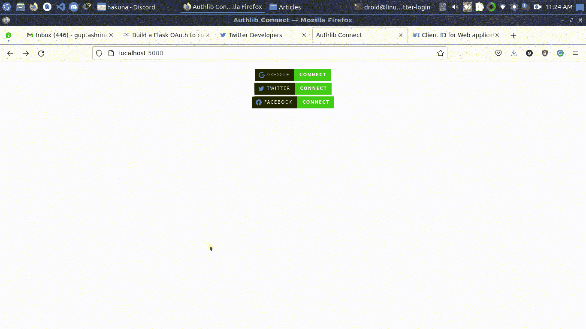

# 使用 Flask 进行 OAuth 身份验证–连接到谷歌、推特和脸书

> 原文:[https://www . geesforgeks . org/oauth-身份验证-带烧瓶-连接到 Google-Twitter-and-Facebook/](https://www.geeksforgeeks.org/oauth-authentication-with-flask-connect-to-google-twitter-and-facebook/)

在本文中，我们将构建一个 flask 应用程序，它将使用 OAuth 协议来获取用户信息。首先，我们需要了解 OAuth 协议及其过程。

## 什么是 OAuth？

OAuth 代表开放授权，是为了实现在线服务之间的连接而实现的。OAuth 社区网站将其定义为“**”一种开放协议，允许从网络、移动和桌面应用程序以简单和标准的方法进行安全授权。**”。OAuth 的一个流行例子是各种网站上的谷歌登录按钮。在这里，网站服务与谷歌服务相连接，为您提供一个简单的选项来授权您的资源使用所需的服务。OAuth OAuth1.0 和 OAuth2.0 现在有两个版本。

## OAuth 中的术语

*   **客户端:**是试图连接到其他服务的应用程序或服务。
*   **提供者:**是客户端连接的服务。
*   **授权** **URL:** 是客户端向其发送请求的提供方提供的 URL。
*   **客户端 ID 和秘密:**由提供方提供，客户端向提供方发送授权请求时使用。
*   **授权码:**是用户认证成功后，客户端检索到的代码，发送到提供商的授权服务器。
*   **回调 URL:** 是客户端设置的 URL，提供者向其发送授权码，客户端服务检索用户资源。

## 设置 OAuth 的步骤

**步骤 1:** 在提供商网站上将您的应用程序注册为客户端。您将收到包含客户端标识和客户端密码的客户端凭据。

**步骤 2:** 客户端应用程序向提供者的授权 URL 发送授权请求。

**步骤 3:** 用户在提供商的站点上进行身份验证，并允许客户端服务使用资源。

**步骤 4:** 提供者向客户端发送授权码

**第五步:**客户端将授权码发送给提供商的授权服务器。

**步骤 6:** 提供者发送可用于访问用户资源的客户端令牌。

现在 OAuth 的概念已经很清楚了，我们可以开始构建我们的应用程序了。我们有各种各样的库可以用来实现 OAuth。我们将使用的库是支持 OAuth 1.0 和 OAuth 2.0 的 AuthLib。

## 安装所需的依赖项

要安装所需的依赖项，请在终端中键入以下命令。

```
pip install -U Flask Authlib requests
```

**注意:**建议在安装这些依赖项之前先创建一个虚拟环境。

## 从提供程序检索客户端凭据

*   **谷歌:**在 https://console.cloud.google.com/apis/credentials,创建您的谷歌 OAuth 客户端确保将 http://localhost:5000/Google/auth/添加到授权重定向 URIs。
*   **推特:**通过创建应用程序，在 https://developer.twitter.com/创建你的推特 Oauth 1.0 客户端。将 http://localhost:5000/Twitter/auth/添加到授权重定向 URIs。
*   **脸书:**通过创建应用程序，在 https://developer.facebook.com/,创建您的脸书 OAuth 客户端。将 http://localhost:5000/Facebook/auth/添加到授权重定向 URIs。

客户端凭证可以直接在程序中使用，但是在实际生产中，这些凭证将存储在环境变量中。

## 创建用户界面

创建一个名为 templates 的文件夹，并在其中创建一个 index.html 文件。将以下代码粘贴到 index.html 文件中。这是一个为每个提供者创建按钮的简单代码。

## 超文本标记语言

```
<!DOCTYPE html>
<html lang="en">
   <head>
      <meta charset="UTF-8">
      <meta name="viewport" content="width=device-width, initial-scale=1.0">
      <title>Authlib Connect</title>
   </head>
   <body>
      <p align="center">
         <a href="google/">
          <br>
         </a>
         <a href="twitter/">
          <br>
         </a>
         <a href="facebook/">
          <br>
         </a>
      </p>

   </body>
</html>
```

## 创建烧瓶应用程序

### 初始化烧瓶应用程序

让我们创建一个简单的 flask 应用程序，它什么也不做，只是将上面创建的 HTML 文件呈现到主页上。

## 蟒蛇 3

```
from flask import Flask, render_template

app = Flask(__name__)

app.secret_key = '\xfd{H\xe5<\x95\xf9\xe3\x96.5\xd1\x01O<\
!\xd5\xa2\xa0\x9fR"\xa1\xa8'

'''
    Set SERVER_NAME to localhost as twitter callback
    url does not accept 127.0.0.1
    Tip : set callback origin(site) for facebook and twitter
    as http://domain.com (or use your domain name) as this provider
    don't accept 127.0.0.1 / localhost
'''

app.config['SERVER_NAME'] = 'localhost:5000'

@app.route('/')
def index():
    return render_template('index.html')

if __name__ == "__main__":
    app.run(debug=True)
```

使用以下命令运行服务器，以确保应用程序成功运行并显示 index.html 页面。

创建应用程序后，让我们看看如何为谷歌、推特和脸书添加 Oauth。但是首先让我们初始化 OAuth。

### 初始化 OAuth

## 蟒蛇 3

```
from flask import Flask, render_template
from authlib.integrations.flask_client import OAuth

app = Flask(__name__)

app.secret_key = '\xfd{H\xe5<\x95\xf9\xe3\x96.5\xd1\x01O<!/
\xd5\xa2\xa0\x9fR"\xa1\xa8'
'''
    Set SERVER_NAME to localhost as twitter callback
    url does not accept 127.0.0.1
    Tip : set callback origin(site) for facebook and twitter
    as http://domain.com (or use your domain name) as this provider
    don't accept 127.0.0.1 / localhost
'''

app.config['SERVER_NAME'] = 'localhost:5000'
oauth = OAuth(app)

@app.route('/')
def index():
    return render_template('index.html')

if __name__ == "__main__":
    app.run(debug=True)
```

在这里，我们已经使用 OAuth(app)类初始化了 OAuth，并且我们已经将我们的服务器名称更改为 localhost:5000。现在让我们看看如何为不同的平台创建 OAuth。

### 为谷歌创建 OAuth

## 蟒蛇 3

```
# The user details get print in the console.
# so you can do whatever you want to do instead
# of printing it

from flask import Flask, render_template, url_for, redirect
from authlib.integrations.flask_client import OAuth
import os

app = Flask(__name__)
app.secret_key = '\xfd{H\xe5<\x95\xf9\xe3\x96.5\xd1\x01O<!/
xd5\xa2\xa0\x9fR"\xa1\xa8'

'''
    Set SERVER_NAME to localhost as twitter callback
    url does not accept 127.0.0.1
    Tip : set callback origin(site) for facebook and twitter
    as http://domain.com (or use your domain name) as this provider
    don't accept 127.0.0.1 / localhost
'''

app.config['SERVER_NAME'] = 'localhost:5000'
oauth = OAuth(app)

@app.route('/')
def index():
    return render_template('index.html')

@app.route('/google/')
def google():

    # Google Oauth Config
    # Get client_id and client_secret from environment variables
    # For developement purpose you can directly put it
    # here inside double quotes
    GOOGLE_CLIENT_ID = os.environ.get('GOOGLE_CLIENT_ID')
    GOOGLE_CLIENT_SECRET = os.environ.get('GOOGLE_CLIENT_SECRET')

    CONF_URL = 'https://accounts.google.com/.well-known/openid-configuration'
    oauth.register(
        name='google',
        client_id=GOOGLE_CLIENT_ID,
        client_secret=GOOGLE_CLIENT_SECRET,
        server_metadata_url=CONF_URL,
        client_kwargs={
            'scope': 'openid email profile'
        }
    )

    # Redirect to google_auth function
    redirect_uri = url_for('google_auth', _external=True)
    return oauth.google.authorize_redirect(redirect_uri)

@app.route('/google/auth/')
def google_auth():
    token = oauth.google.authorize_access_token()
    user = oauth.google.parse_id_token(token)
    print(" Google User ", user)
    return redirect('/')

if __name__ == "__main__":
    app.run(debug=True)
```

### 为推特创建 OAuth

## 蟒蛇 3

```
# The user details get print in the console.
# so you can do whatever you want to do instead
# of printing it

from flask import Flask, render_template, url_for, redirect
from authlib.integrations.flask_client import OAuth
import os

app = Flask(__name__)
app.secret_key = '\xfd{H\xe5<\x95\xf9\xe3\x96.5\xd1\x01O/
<!\xd5\xa2\xa0\x9fR"\xa1\xa8'

'''
    Set SERVER_NAME to localhost as twitter callback
    url does not accept 127.0.0.1
    Tip : set callback origin(site) for facebook and twitter
    as http://domain.com (or use your domain name) as this provider
    don't accept 127.0.0.1 / localhost
'''

app.config['SERVER_NAME'] = 'localhost:5000'
oauth = OAuth(app)

@app.route('/')
def index():
    return render_template('index.html')

@app.route('/google/')
def google():

    # Google Oauth Config
    # Get client_id and client_secret from environment variables
    # For developement purpose you can directly put it here inside double quotes
    GOOGLE_CLIENT_ID = os.environ.get('GOOGLE_CLIENT_ID')
    GOOGLE_CLIENT_SECRET = os.environ.get('GOOGLE_CLIENT_SECRET')
    CONF_URL = 'https://accounts.google.com/.well-known/openid-configuration'
    oauth.register(
        name='google',
        client_id=GOOGLE_CLIENT_ID,
        client_secret=GOOGLE_CLIENT_SECRET,
        server_metadata_url=CONF_URL,
        client_kwargs={
            'scope': 'openid email profile'
        }
    )

    # Redirect to google_auth function
    redirect_uri = url_for('google_auth', _external=True)
    return oauth.google.authorize_redirect(redirect_uri)

@app.route('/google/auth/')
def google_auth():
    token = oauth.google.authorize_access_token()
    user = oauth.google.parse_id_token(token)
    print(" Google User ", user)
    return redirect('/')

@app.route('/twitter/')
def twitter():

    # Twitter Oauth Config
    TWITTER_CLIENT_ID = os.environ.get('TWITTER_CLIENT_ID')
    TWITTER_CLIENT_SECRET = os.environ.get('TWITTER_CLIENT_SECRET')
    oauth.register(
        name='twitter',
        client_id=TWITTER_CLIENT_ID,
        client_secret=TWITTER_CLIENT_SECRET,
        request_token_url='https://api.twitter.com/oauth/request_token',
        request_token_params=None,
        access_token_url='https://api.twitter.com/oauth/access_token',
        access_token_params=None,
        authorize_url='https://api.twitter.com/oauth/authenticate',
        authorize_params=None,
        api_base_url='https://api.twitter.com/1.1/',
        client_kwargs=None,
    )
    redirect_uri = url_for('twitter_auth', _external=True)
    return oauth.twitter.authorize_redirect(redirect_uri)

@app.route('/twitter/auth/')
def twitter_auth():
    token = oauth.twitter.authorize_access_token()
    resp = oauth.twitter.get('account/verify_credentials.json')
    profile = resp.json()
    print(" Twitter User", profile)
    return redirect('/')

if __name__ == "__main__":
    app.run(debug=True)
```

### 为脸书创建 OAuth

## 蟒蛇 3

```
# The user details get print in the console.
# so you can do whatever you want to do instead
# of printing it

from flask import Flask, render_template, url_for, redirect
from authlib.integrations.flask_client import OAuth
import os

app = Flask(__name__)
app.secret_key = '\xfd{H\xe5<\x95\xf9\xe3\x96.5\xd1\x01O/
<!\xd5\xa2\xa0\x9fR"\xa1\xa8'

'''
    Set SERVER_NAME to localhost as twitter callback
    url does not accept 127.0.0.1
    Tip : set callback origin(site) for facebook and twitter
    as http://domain.com (or use your domain name) as this provider
    don't accept 127.0.0.1 / localhost
'''

app.config['SERVER_NAME'] = 'localhost:5000'
oauth = OAuth(app)

@app.route('/')
def index():
    return render_template('index.html')

@app.route('/google/')
def google():

    # Google Oauth Config
    # Get client_id and client_secret from environment variables
    # For developement purpose you can directly put it here inside double quotes
    GOOGLE_CLIENT_ID = os.environ.get('GOOGLE_CLIENT_ID')
    GOOGLE_CLIENT_SECRET = os.environ.get('GOOGLE_CLIENT_SECRET')
    CONF_URL = 'https://accounts.google.com/.well-known/openid-configuration'
    oauth.register(
        name='google',
        client_id=GOOGLE_CLIENT_ID,
        client_secret=GOOGLE_CLIENT_SECRET,
        server_metadata_url=CONF_URL,
        client_kwargs={
            'scope': 'openid email profile'
        }
    )

    # Redirect to google_auth function
    redirect_uri = url_for('google_auth', _external=True)
    return oauth.google.authorize_redirect(redirect_uri)

@app.route('/google/auth/')
def google_auth():
    token = oauth.google.authorize_access_token()
    user = oauth.google.parse_id_token(token)
    print(" Google User ", user)
    return redirect('/')

@app.route('/twitter/')
def twitter():

    # Twitter Oauth Config
    TWITTER_CLIENT_ID = os.environ.get('TWITTER_CLIENT_ID')
    TWITTER_CLIENT_SECRET = os.environ.get('TWITTER_CLIENT_SECRET')
    oauth.register(
        name='twitter',
        client_id=TWITTER_CLIENT_ID,
        client_secret=TWITTER_CLIENT_SECRET,
        request_token_url='https://api.twitter.com/oauth/request_token',
        request_token_params=None,
        access_token_url='https://api.twitter.com/oauth/access_token',
        access_token_params=None,
        authorize_url='https://api.twitter.com/oauth/authenticate',
        authorize_params=None,
        api_base_url='https://api.twitter.com/1.1/',
        client_kwargs=None,
    )
    redirect_uri = url_for('twitter_auth', _external=True)
    return oauth.twitter.authorize_redirect(redirect_uri)

@app.route('/twitter/auth/')
def twitter_auth():
    token = oauth.twitter.authorize_access_token()
    resp = oauth.twitter.get('account/verify_credentials.json')
    profile = resp.json()
    print(" Twitter User", profile)
    return redirect('/')

@app.route('/facebook/')
def facebook():

    # Facebook Oauth Config
    FACEBOOK_CLIENT_ID = os.environ.get('FACEBOOK_CLIENT_ID')
    FACEBOOK_CLIENT_SECRET = os.environ.get('FACEBOOK_CLIENT_SECRET')
    oauth.register(
        name='facebook',
        client_id=FACEBOOK_CLIENT_ID,
        client_secret=FACEBOOK_CLIENT_SECRET,
        access_token_url='https://graph.facebook.com/oauth/access_token',
        access_token_params=None,
        authorize_url='https://www.facebook.com/dialog/oauth',
        authorize_params=None,
        api_base_url='https://graph.facebook.com/',
        client_kwargs={'scope': 'email'},
    )
    redirect_uri = url_for('facebook_auth', _external=True)
    return oauth.facebook.authorize_redirect(redirect_uri)

@app.route('/facebook/auth/')
def facebook_auth():
    token = oauth.facebook.authorize_access_token()
    resp = oauth.facebook.get(
        'https://graph.facebook.com/me?fields=id,name,email,picture{url}')
    profile = resp.json()
    print("Facebook User ", profile)
    return redirect('/')

if __name__ == "__main__":
    app.run(debug=True)
```

### 运行应用程序

启动服务器:

```
python app.py
```

然后访问:

```
http://localhost:5000/
```



**注意:**每个提供者的 OAuth 配置是不同的，取决于 OAuth 的版本。每个提供者都有自己的实现协议的文档，所以一定要检查一下。