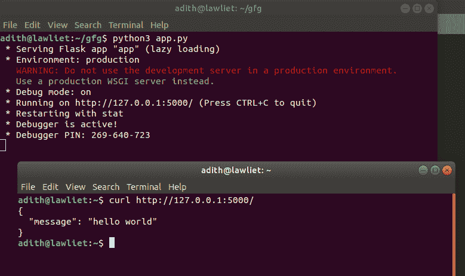
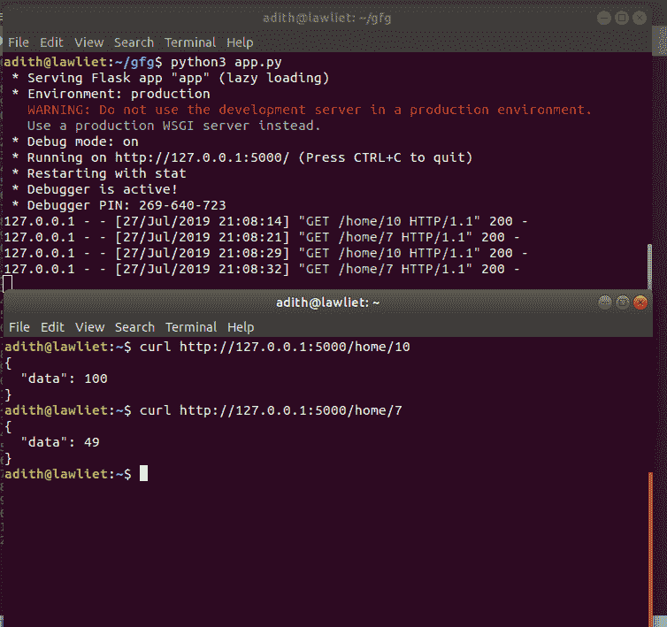
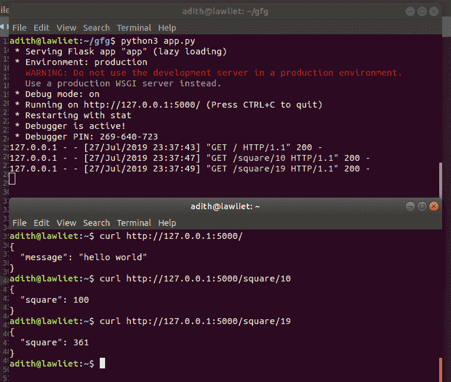

# Python |使用 Flask

构建 REST API

> 原文:[https://www . geesforgeks . org/python-build-a-rest-API-use-flask/](https://www.geeksforgeeks.org/python-build-a-rest-api-using-flask/)

前提:[休息 API 介绍](https://www.geeksforgeeks.org/rest-api-introduction/)

REST 代表代表性的状态转移，是现代网络开发中使用的一种架构风格。它为 web 应用程序定义了一组发送和接收数据的规则/约束。

在本文中，我们将使用 Flask 框架在 Python 中构建一个 REST API。Flask 是一个流行的构建 web 应用程序的微型框架。因为它是一个微框架，所以非常容易使用，并且缺少成熟框架中的大部分高级功能。因此，在 Flask 中构建 REST API 非常简单。

在 Flask 中创建 REST API 有两种方法:

1.  使用不带任何外部库的烧瓶
2.  使用 flask_restful 库

## 所需的库:

`flask_restful` 可以通过 pip 命令安装:

```
 sudo pip3 install flask-restful 
```

## 方法 1:仅使用烧瓶

这里有两个函数:一个函数只是返回或打印通过 GET 或 POST 发送的数据，另一个函数计算通过 GET 请求发送的数字的平方并打印。

```
# Using flask to make an api
# import necessary libraries and functions
from flask import Flask, jsonify, request

# creating a Flask app
app = Flask(__name__)

# on the terminal type: curl http://127.0.0.1:5000/
# returns hello world when we use GET.
# returns the data that we send when we use POST.
@app.route('/', methods = ['GET', 'POST'])
def home():
    if(request.method == 'GET'):

        data = "hello world"
        return jsonify({'data': data})

# A simple function to calculate the square of a number
# the number to be squared is sent in the URL when we use GET
# on the terminal type: curl http://127.0.0.1:5000 / home / 10
# this returns 100 (square of 10)
@app.route('/home/<int:num>', methods = ['GET'])
def disp(num):

    return jsonify({'data': num**2})

# driver function
if __name__ == '__main__':

    app.run(debug = True)
```

**输出:**


执行平方函数:


## 方法 2:使用烧瓶

Flask Restful 是 Flask 的扩展，它增加了对使用 Flask 作为后端在 Python 中构建 REST APIs 的支持。它鼓励最佳实践，并且非常容易设置。如果你已经熟悉了 Flask restful，就很容易拿起来。

在`flask_restful`中，主要构建块是资源。每个资源可以有几个相关联的方法，如 GET、POST、PUT、DELETE 等。例如，每当向某个资源发送 get 请求时，该资源都会计算一个数字的平方。每个资源都是一个继承自 flask_restful 的资源类的类。一旦创建并定义了资源，我们就可以将自定义资源添加到 api 中，并为相应的资源指定一个 URL 路径。

```
# using flask_restful
from flask import Flask, jsonify, request
from flask_restful import Resource, Api

# creating the flask app
app = Flask(__name__)
# creating an API object
api = Api(app)

# making a class for a particular resource
# the get, post methods correspond to get and post requests
# they are automatically mapped by flask_restful.
# other methods include put, delete, etc.
class Hello(Resource):

    # corresponds to the GET request.
    # this function is called whenever there
    # is a GET request for this resource
    def get(self):

        return jsonify({'message': 'hello world'})

    # Corresponds to POST request
    def post(self):

        data = request.get_json()     # status code
        return jsonify({'data': data}), 201

# another resource to calculate the square of a number
class Square(Resource):

    def get(self, num):

        return jsonify({'square': num**2})

# adding the defined resources along with their corresponding urls
api.add_resource(Hello, '/')
api.add_resource(square, '/square/<int:num>')

# driver function
if __name__ == '__main__':

    app.run(debug = True)
```

**输出:**
