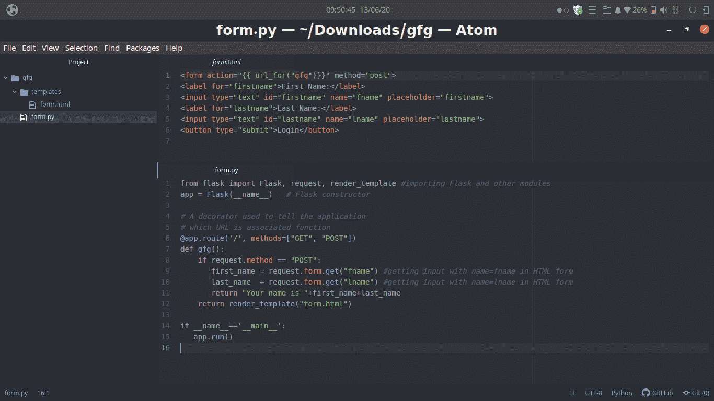
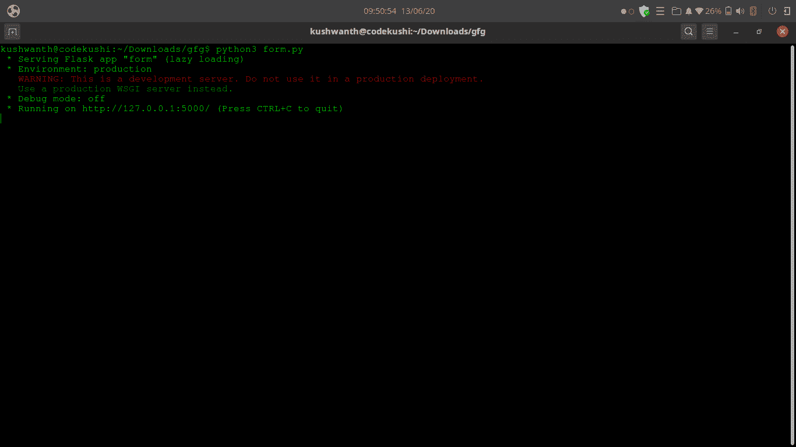
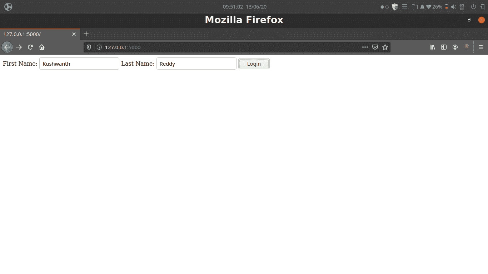
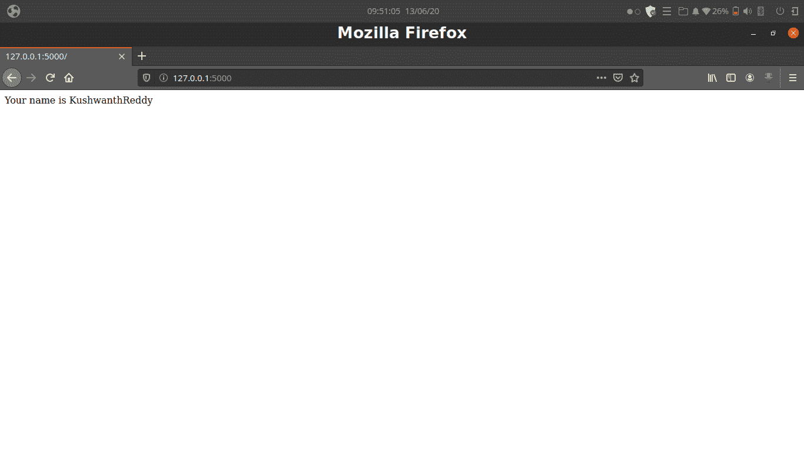

# 使用烧瓶从数据中检索 HTML】

> 原文:[https://www . geeksforgeeks . org/retrieving-html-from-data-use-flask/](https://www.geeksforgeeks.org/retrieving-html-from-data-using-flask/)

Flask 是一个轻量级的 WSGI web 应用框架。它旨在使入门变得快速简单，并能够扩展到复杂的应用程序。它最初是 Werkzeug 和 Jinja 的简单包装，现在已经成为最流行的 Python 网络应用程序框架之一。

[阅读本文了解更多关于 Flask](https://www.geeksforgeeks.org/python-introduction-to-web-development-using-flask)
**创建 HTML 形式**

我们将创建一个简单的 HTML 表单，非常简单的登录表单

```py
<form action="{{ url_for("gfg")}}" method="post">
<label for="firstname">First Name:</label>
<input type="text" id="firstname" name="fname" placeholder="firstname">
<label for="lastname">Last Name:</label>
<input type="text" id="lastname" name="lname" placeholder="lastname">
<button type="submit">Login</button>
```

这是一个简单的 HTML 表单，使用 post 方法，唯一独特的是动作 URL。URL_for 是 flask 创建动态 URL 的一种方式，其中第一个参数是指 Flask 中特定路由的功能。在我们的表单中，它将在 flask 应用程序中创建一个具有 gfg 功能的动态路由

**创建烧瓶应用程序**

启动您的虚拟环境

```py
pip install virtualenv
python3 -m venv env
pip install flask

```

现在我们将创建烧瓶后端，它将从 HTML 表单获得用户输入

```py
# importing Flask and other modules
from flask import Flask, request, render_template 

# Flask constructor
app = Flask(__name__)   

# A decorator used to tell the application
# which URL is associated function
@app.route('/', methods =["GET", "POST"])
def gfg():
    if request.method == "POST":
       # getting input with name = fname in HTML form
       first_name = request.form.get("fname")
       # getting input with name = lname in HTML form 
       last_name = request.form.get("lname") 
       return "Your name is "+first_name + last_name
    return render_template("form.html")

if __name__=='__main__':
   app.run()
```

**工作–**

几乎一切都很简单，我们已经创建了一个简单的 Flask 应用程序，如果我们研究代码

*   导入烧瓶并创建一个既有*获取方法又有*发布方法的主路径
*   定义名为 **gfg** 的函数
*   如果请求方法是 post，这是我们在表单中指定的方法，我们从 HTML 表单中获取输入数据
*   您可以使用 name 属性和 request.form.get()函数从 Form 获取 HTML 输入，方法是将该输入的名称作为参数传递
    *   `request.form.get("fname")`将从输入值获取输入，该输入值的名称属性为 fname，并存储在 first_name 变量中
    *   `request.form.get("lname")`将从输入值中获取输入，该输入值的名称属性为 lname，并存储在 last_name 变量中
*   POST 方法的返回值是通过将变量替换为它们的值`Your name is "+first_name+last_name`
*   返回 home.html 模板的函数 gfg id 的默认返回值
*   你可以从文章中回顾[what-if-then-name _ _-_ main _ _-do](https://www.geeksforgeeks.org/what-does-the-if-__name__-__main__-do/)

**输出–**
**代码在运行**

**烧瓶服务器运行**

**html 表单**

**从 html 模板**
返回数据