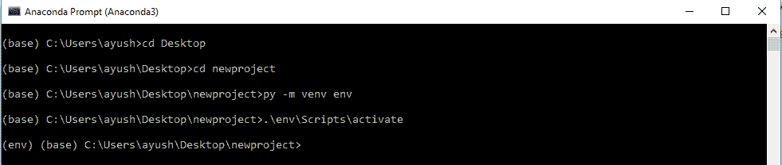

# 在烧瓶邮件中使用应用编程接口发送电子邮件

> 原文:[https://www . geesforgeks . org/sensing-emails-use-API-in-flask-mail/](https://www.geeksforgeeks.org/sending-emails-using-api-in-flask-mail/)

Python 作为一种强大的语言，不需要任何外部库来导入，并提供了一个本地库来发送电子邮件——“SMTP 库”。“smtplib”创建一个简单邮件传输协议客户端会话对象，用于向互联网上任何有效的电子邮件 id 发送电子邮件。本文围绕我们如何在 Flask 的帮助下向一群人发送批量定制的电子邮件展开。

**安装:**

烧瓶邮件需要三个包才能工作，然后使用 pip 安装，

1) virtualenv:

```py
pip install virtualenv
```

2)烧瓶:

```py
pip install Flask
```

3)烧瓶-邮件:

```py
pip install Flask-Mail
```

安装完软件包后，我们必须使用 **virtualenv** (可选)
1)创建一个 virtualenv
打开 cmd
转到您想要用于项目的文件夹。
编写以下代码:

```py

python3 -m venv env (macOS/Linux)
py -m venv env (Windows)

```

这里 **env** 是你的环境名称。
2)在窗口上激活环境
**:**

```py
.\env\Scripts\activate
```

在 macOS/ Linux 上:

```py
source env/bin/activate
```

3)确保你得到如下图所示的开头的(env):


#### 配置烧瓶邮件

烧瓶邮件是通过标准烧瓶配置应用编程接口配置的。这些是可用的选项(每个选项将在后面的文档中解释):

1) **MAIL_SERVER** :邮件服务器的名称/IP 地址。
2) **MAIL_PORT** :所用服务器的端口号。
3) **MAIL_USE_TLS** :启用/禁用传输安全层加密。
4) **MAIL_USE_SSL** :启用/禁用安全套接字层加密
5) **MAIL_DEBUG** :调试支持。默认值是 Flask 应用程序的调试状态。
6) **MAIL_USERNAME** :发件人用户名
7) **MAIL_PASSWORD** :发件人对应用户名的密码。
8) **邮件 _ ASCII _ 附件**:如果设置为真，附件文件名转换为 ASCII。
9)**MAIL _ DEFAULT _ SENDER**:设置默认发件人
10)**MAIL _ SUPPLIT _ SEND**:如果 app.testing 设置为 true
11)**MAIL _ MAX _ EMails**:设置最大发送邮件数

> 注意:并非所有配置都要设置。

#### 使用烧瓶邮件发送电子邮件

**Flask-Mail 中的类:**
Mail 类:管理电子邮件消息需求
消息类:封装电子邮件消息

**让我们拿到代码。**

```py
# importing libraries
from flask import Flask
from flask_mail import Mail, Message

app = Flask(__name__)
mail = Mail(app) # instantiate the mail class

# configuration of mail
app.config['MAIL_SERVER']='smtp.gmail.com'
app.config['MAIL_PORT'] = 465
app.config['MAIL_USERNAME'] = 'yourId@gmail.com'
app.config['MAIL_PASSWORD'] = '*****'
app.config['MAIL_USE_TLS'] = False
app.config['MAIL_USE_SSL'] = True
mail = Mail(app)

# message object mapped to a particular URL ‘/’
@app.route("/")
def index():
   msg = Message(
                'Hello',
                sender ='yourId@gmail.com',
                recipients = ['receiver’sid@gmail.com']
               )
   msg.body = 'Hello Flask message sent from Flask-Mail'
   mail.send(msg)
   return 'Sent'

if __name__ == '__main__':
   app.run(debug = True)
```

将其保存在文件中，然后在 Python Shell 或 CMD 中运行脚本&访问 http://localhost:5000/。

> 注意:
> 由于谷歌内置的安全功能，Gmail 服务可能会阻止此登录尝试。您可能需要降低安全级别。访问[https://myaccount.google.com/lesssecureapps?pli=1](https://myaccount.google.com/lesssecureapps?pli=1)降低安全性。