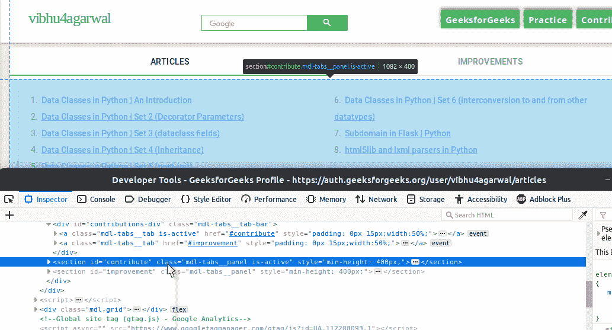
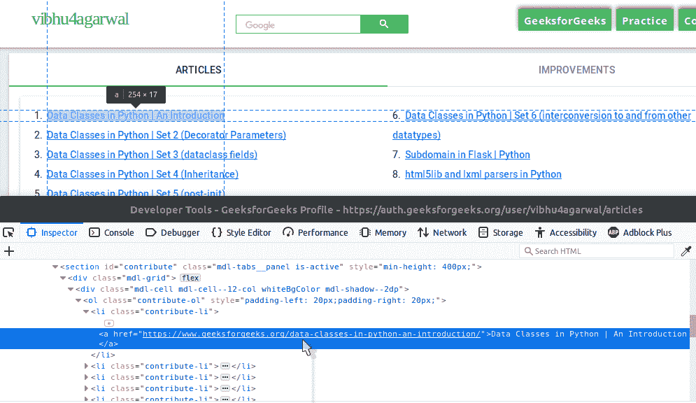
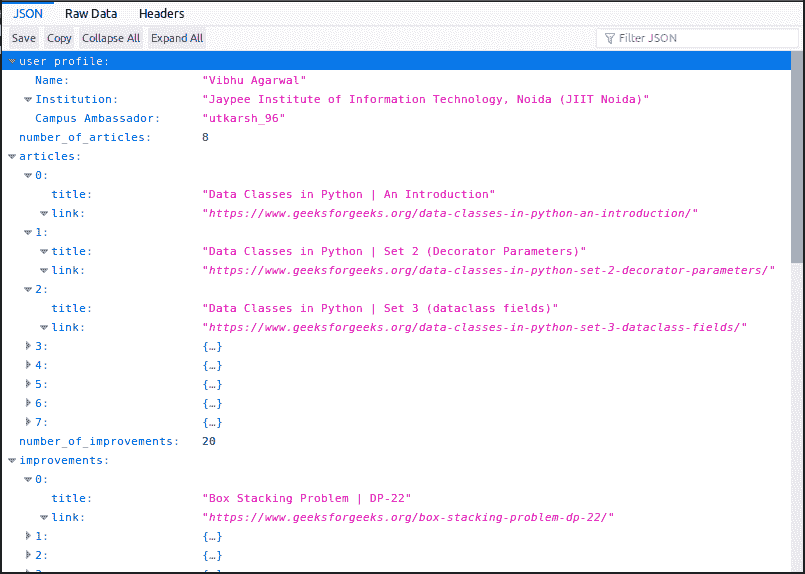

# 使用网络抓取和烧瓶为极客建立用户数据的应用编程接口

> 原文:[https://www . geesforgeeks . org/setup-API-for-geesforgeeks-user-data-use-web screen-and-flask/](https://www.geeksforgeeks.org/setup-api-for-geeksforgeeks-user-data-using-webscraping-and-flask/)

先决条件:[Python 网页抓取](https://www.geeksforgeeks.org/implementing-web-scraping-python-beautiful-soup/)、[烧瓶介绍](https://www.geeksforgeeks.org/python-introduction-to-web-development-using-flask/)

在这篇文章中，我们将讨论如何使用网络抓取获得极客博客用户的信息，并使用 Python 的微框架 **Flask** 将这些信息作为应用编程接口提供。

**步骤#1:** 访问授权配置文件

要刮网站，第一步是访问网站。


**第二步:**查看页面来源

在上图中，您可以看到包含用户数据的`descDiv`分区。在下图中，找出四条信息的四个`mdl-grid`div。
T3】

潜入深处，找到两个属性块及其对应的值。那是你的用户资料。

在下面的函数中找到这一切，这个函数以字典的形式返回所有的数据。

```py
def get_profile_detail(user_handle):

    url = "https://auth.geeksforgeeks.org/user/{}/profile".format(user_handle)

    response = requests.get(url)

    soup = BeautifulSoup(response.content, 'html5lib')

    description_div = soup.find('div', {'class': 'descDiv'})

    if not description_div:
        return None

    user_details_div = description_div.find('div', {'class': 'mdl-cell'})

    specific_details = user_details_div.find_all('div', {'class': 'mdl-grid'})

    user_profile = {}

    for detail_div in specific_details:

        block = detail_div.find_all('div', {'class': 'mdl-cell'})

        attribute = block[0].text.strip()
        value = block[1].text.strip()

        user_profile[attribute] = value

    return {'user profile': user_profile}
```

**第 3 步:**文章和改进列表

这一次，试着自己找出各种标签。


如果你能发现 HTML 的各种元素，你也可以很容易地编写代码来抓取它。
如果你做不到，这里有代码供你参考。

```py
def get_articles_and_improvements(user_handle):
    articles_and_improvements = {}

    url = "https://auth.geeksforgeeks.org/user/{}/articles".format(user_handle)

    response = requests.get(url)

    soup = BeautifulSoup(response.content, 'html5lib')

    contribute_section = soup.find('section', {'id': 'contribute'})
    improvement_section = soup.find('section', {'id': 'improvement'})

    contribution_list = contribute_section.find('ol')
    number_of_articles = 0
    articles = []
    if contribution_list:
        article_links = contribution_list.find_all('a')
        number_of_articles = len(article_links)
        for article in article_links:
            article_obj = {'title': article.text,
                           'link': article['href']}
            articles.append(article_obj)

    articles_and_improvements['number_of_articles'] = number_of_articles
    articles_and_improvements['articles'] = articles

    improvement_list = improvement_section.find('ol')
    number_of_improvements = 0
    improvements = []
    if improvement_list:
        number_of_improvements = len(improvement_list)
        improvement_links = improvement_list.find_all('a')
        for improvement in improvement_links:
            improvement_obj = {'title': improvement.text,
                               'link': improvement['href']}
            improvements.append(improvement_obj)

    articles_and_improvements['number_of_improvements'] = number_of_improvements
    articles_and_improvements['improvements'] = improvements

    return articles_and_improvements
```

**第四步:设置烧瓶**

刮网代码完成。现在是时候设置我们的烧瓶服务器了。下面是 Flask 应用程序的设置，以及整个脚本所需的所有必要库。

```py
from bs4 import BeautifulSoup
import requests
from flask import Flask, jsonify, make_response

app = Flask(__name__)
app.config['JSON_SORT_KEYS'] = False
```

**第五步:设置应用编程接口**

现在我们已经有了合适的函数，我们唯一的任务就是将它们的结果组合起来，将字典转换成 JSON，然后在服务器上提供。

下面是一个端点的代码，它根据接收到的用户句柄为应用编程接口提供服务。记住，我们需要处理不当的用户句柄，我们的端点可以随时接收。

```py
@app.route('/<user_handle>/')
def home(user_handle):

    response = get_profile_detail(user_handle)
    if response:
        response.update(get_articles_and_improvements(user_handle))
        api_response = make_response(jsonify(response), 200)
    else:
        response = {'message': 'No such user with the specified handle'}
        api_response = make_response(jsonify(response), 404)
    api_response.headers['Content-Type'] = 'application/json'
    return api_response
```

结合所有的代码，你就有了一个提供动态 API 的功能齐全的服务器。
