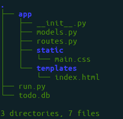
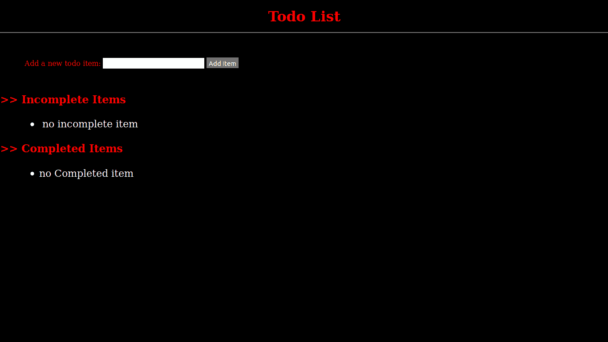

# 使用 Flask | Python 的待办事项列表应用

> 原文:[https://www . geesforgeks . org/todo-list-app-use-flask-python/](https://www.geeksforgeeks.org/todo-list-app-using-flask-python/)

有很多框架允许使用 Python 构建网页，比如 Django、flask 等。Flask 是一个用 Python 编写的网络应用框架。Flask 基于 WSGI(Web 服务器网关接口)工具包和 Jinja2 模板引擎。它的模块和库帮助开发人员编写应用程序，而无需编写底层代码，如协议、线程管理等。

在本文中，我们将学习如何使用 Flask 框架制作待办事项列表应用程序。在此应用程序中，您可以添加您的待办事项，并将其标记为完整或不完整。

**安装:**

```
 pip install Flask
```

**基本设置:**
**第一步:**首先制作基本文件夹

```
mkdir app && cd app && mkdir static && mkdir templates
```

**第二步:**制作一些基本的 python 文件来编写代码，并按照自己的意愿命名。

**步骤 3:** 运行以下命令启动服务器

```
touch run.py the app
```

**第 4 步:**将目录更改为*应用程序*–

```
 cd app
```

**第五步:**创建模型. py 用于数据库，routes.py 用于 urls 视图和 __init__ 文件来打包我们的应用程序

```
 touch models.py routes.py __init__.py 
```

**第 6 步:**转到*模板/* 目录，创建 index.html 文件

```
 cd templates && touch index.html 
```

**第 7 步:**转到*静态/* 目录并创建 main.css

```
 cd static && touch main.css
```

现在，使用文本编辑器打开项目文件夹。目录结构应该如下所示:



**run.py 文件**

```
from app import app

if __name__ == '__main__':
    app.run(debug=True)
```

**app/__init__。py 文件**

```
from flask import Flask
from flask_sqlalchemy import SQLAlchemy
import os

file_path = os.path.abspath(os.getcwd())+"/todo.db"

app = Flask(__name__)
app.config['SQLALCHEMY_DATABASE_URI'] = 'sqlite:///'+file_path
db = SQLAlchemy(app)

from app import routes
```

**app/routes.py 文件**

```
from flask import render_template, request, redirect, url_for
from app import app
from app.models import Todo
from app import db

@app.route('/')
def index():
    incomplete = Todo.query.filter_by(complete=False).all()
    complete = Todo.query.filter_by(complete=True).all()

    return render_template('index.html', incomplete=incomplete, complete=complete)

@app.route('/add', methods=['POST'])
def add():
    todo = Todo(text=request.form['todoitem'], complete=False)
    db.session.add(todo)
    db.session.commit()

    return redirect(url_for('index'))

@app.route('/complete/<id>')
def complete(id):

    todo = Todo.query.filter_by(id=int(id)).first()
    todo.complete = True
    db.session.commit()

    return redirect(url_for('index'))
```

**app/models.py 文件**

```
from app import db

class Todo(db.Model):
    id = db.Column(db.Integer, primary_key=True)
    text = db.Column(db.String(200))
    complete = db.Column(db.Boolean)

    def __repr__(self):
        return self.text
```

**app/main.html**

```
<!DOCTYPE html> 
<html lang="en"> 
<head> 
    <meta charset="UTF-8"> 
    <title>Todo App</title> 
    <link rel="stylesheet" type="text/css" href="{{url_for('static', filename='main.css')}}"> 

</head> 
<body> 
    <h1>Todo List</h1> 
    <div>Add a new todo item: 
        <form action="{{ url_for('add') }}" method="POST"> 
            <input type="text" name="todoitem"> 
            <input type="submit" value="Add Item" class="button"> 
        </form> 
    </div> 
    <div> 
        <h2>Incomplete Items</h2> 
        <ul> 
             
            <li style="font-size: 30pt" class='mark'>{{ todo.text }} <a href="{{ url_for('complete', id=todo.id) }}">Mark As Complete</a></li> 
                 
        </ul> 
        <h2>Completed Items</h2> 
        <ul> 
             
            <li style="font-size: 30pt">{{ todo.text }}</li> 
             
        </ul> 
    </div> 
</body> 
</html> 
```

app/main . CSS

```
body{ 
    background:black; 
    color:red; 
    margin-top: 5px; 
} 
.button{ 
    color:green; 
} 
.mark{font-size: 10px;} 
```

**使用以下命令运行待办事项应用程序**

```
python run.py
```

