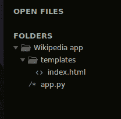
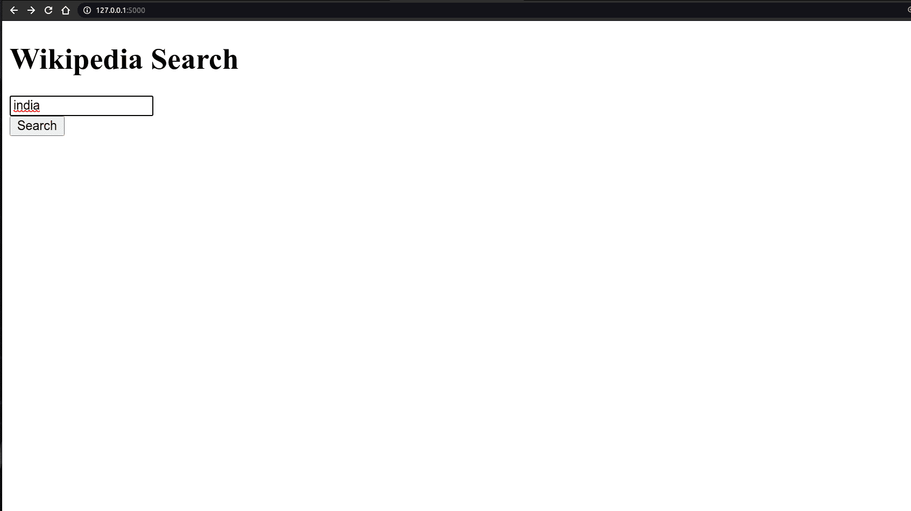
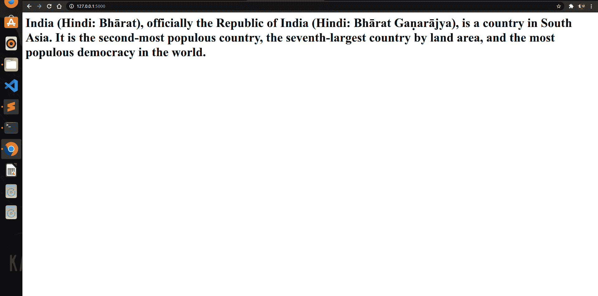

# 使用 Flask Framework–Python 的维基百科搜索应用

> 原文:[https://www . geesforgeks . org/Wikipedia-search-app-use-flask-framework-python/](https://www.geeksforgeeks.org/wikipedia-search-app-using-flask-framework-python/)

Flask 是一个用 Python 编写的微网络框架。它被归类为微框架，因为它不需要特定的工具或库。Flask 是一个轻量级的 WSGI web 应用框架。它旨在使入门变得快速简单，并能够扩展到复杂的应用程序。维基百科是一个 Python 库，可以轻松访问和解析来自 https://www.wikipedia.org/的数据。

**安装:**

1)为了创建烧瓶应用程序，我们必须首先安装烧瓶。

```py
pip install flask
```

2)为了从维基百科中提取数据，我们必须首先安装 Python 维基百科库。

```py
pip install wikipedia
```

**创建**一个**烧瓶应用程序:**

3)创建一个文件并将其命名为 app.py

4)创建模板文件夹来存储所有的 html 文件。

**文件夹结构:**



### 如何使用 Flask Framework 创建维基百科搜索应用？

现在，让我们开始编写应用程序

创建文件–**app . py**

## 蟒蛇 3

```py
# import necessary libraries
from flask import Flask, request, render_template
import wikipedia

app = Flask(__name__)

# create HOME View
@app.route("/", methods=["POST", "GET"])
def home():
    if request.method == "GET":
        return render_template("index.html")
    else:
        search = request.form["search"]

        # Fetch data from wikipedia
        result = wikipedia.summary(search, sentences=2)
        return f"<h1>{result}</h1>"

if __name__ == '__main__':
    app.run(debug=True)
```

创建一个文件**index.html**，该文件将被烧瓶使用–

## 超文本标记语言

```py
<!DOCTYPE html>
<html>
<head>
    <title>Wikipedia Search</title>
</head>
<body>
    <form method="post">
    <input type="text" name="search">
    <br>
    <button type="submit">Search</button>
    </form>
</body>
</html>
```

**输出:**



如果我们在这个输入标签中搜索印度，那么输出是:

