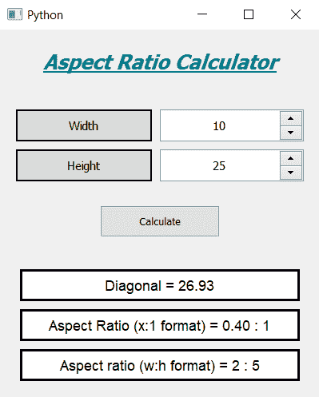

# 使用 PyQt5 的长宽比计算器

> 原文:[https://www . geesforgeks . org/长宽比-计算器-使用-pyqt5/](https://www.geeksforgeeks.org/aspect-ratio-calculator-using-pyqt5/)

在本文中，我们将看到如何使用 PyQt5 创建长宽比计算器。图像的长宽比是其宽度与高度的比率。它通常表示为由冒号分隔的两个数字，如 16:9。对于 x:y 纵横比，图像宽 x 单位，高 y 单位。以下是计算器的外观



**PyQt5** 是跨平台的 GUI 工具包，一套针对 Qt v5 的 python 绑定。由于该库提供的工具和简单性，人们可以非常容易地开发交互式桌面应用程序。以下是安装 PyQt5
的命令

```
pip install PyQt5
```

**概念:**
用户必须选择一个宽度和高度，计算器将为其找到对角线和长宽比值，下面是计算对角线的公式

```
diagonal = math.sqrt(width**2 + height**2)
```

以下是长宽比的计算公式(x:1 格式)

```
x = width / height
```

以下是长宽比(宽度:高度格式)
的计算公式

```
w = width / gcd
h = height / gcd
```

这里 gcd 是宽度和高度的最高公因数

> **GUI 实现步骤:**
> 1。创建显示计算器名称
> 2 的标题标签。创建两个标签，告诉用户输入宽度和高度
> 3。创建两个用于输入宽度和高度的旋转框
> 4。创建一个计算比率的按钮
> 5。创建三个结果标签，用于显示三种不同的结果
> **后端实现:**
> 1。将范围设置为每个旋转框的最小值等于 1，这样用户就不能输入 0 作为输入
> 2。在窗口
> 3 中为每个小部件设置各种属性，如对齐、几何。点击按钮时向按钮添加动作
> 4。在按钮动作中，从旋转框
> 5 中获取宽度和高度。计算对角线值并进行格式化，借助第一个结果标签
> 6 显示对角线值。通过相互下潜来计算长宽比这将证明 x : 1 格式的长宽比
> 7。借助第二个结果标签
> 8 显示该比率。借助欧几里德算法求宽高的 gcd
> 9。用 gcd
> 10 划分宽度和高度。借助第三个标签
> 以长宽比格式显示新的宽度和高度

下面是实现

## 蟒蛇 3

```
# importing libraries
from PyQt5.QtWidgets import * from PyQt5 import QtCore, QtGui
from PyQt5.QtGui import * from PyQt5.QtCore import * import math

import sys

class Window(QMainWindow):

    def __init__(self):
        super().__init__()

        # setting title
        self.setWindowTitle("Python ")

        # width of window
        self.w_width = 400

        # height of window
        self.w_height = 460

        # setting geometry
        self.setGeometry(100, 100, self.w_width, self.w_height)

        # calling method
        self.UiComponents()

        # showing all the widgets
        self.show()

    # method for components
    def UiComponents(self):

        # creating head label
        head = QLabel("Aspect Ratio Calculator", self)

        # setting geometry to the head
        head.setGeometry(0, 10, 400, 60)

        # font
        font = QFont('Times', 15)
        font.setBold(True)
        font.setItalic(True)
        font.setUnderline(True)

        # setting font to the head
        head.setFont(font)

        # setting alignment of the head
        head.setAlignment(Qt.AlignCenter)

        # setting color effect to the head
        color = QGraphicsColorizeEffect(self)
        color.setColor(Qt.darkCyan)
        head.setGraphicsEffect(color)

        # creating a label
        w_label = QLabel("Width", self)

        # setting properties to the  label
        w_label.setAlignment(Qt.AlignCenter)
        w_label.setGeometry(20, 100, 170, 40)
        w_label.setStyleSheet("QLabel"
                              "{"
                              "border : 2px solid black;"
                              "background : rgba(70, 70, 70, 35);"
                              "}")
        w_label.setFont(QFont('Times', 9))

        # creating a spin box
        self.w_spin = QSpinBox(self)

        # setting geometry to the spin box
        self.w_spin.setGeometry(200, 100, 180, 40)

        # setting range to the spin box
        self.w_spin.setRange(1, 999999)

        # setting font and alignment
        self.w_spin.setFont(QFont('Times', 9))
        self.w_spin.setAlignment(Qt.AlignCenter)

        # creating a label
        h_label = QLabel("Height", self)

        # setting properties to the label
        h_label.setAlignment(Qt.AlignCenter)
        h_label.setGeometry(20, 150, 170, 40)
        h_label.setStyleSheet("QLabel"
                              "{"
                              "border : 2px solid black;"
                              "background : rgba(70, 70, 70, 35);"
                              "}")
        h_label.setFont(QFont('Times', 9))

        # creating a spin box
        self.h_spin = QSpinBox(self)

        # setting geometry to the spin box
        self.h_spin.setGeometry(200, 150, 180, 40)

        # setting range
        self.h_spin.setRange(1, 999999)

        # setting font and alignment
        self.h_spin.setFont(QFont('Times', 9))
        self.h_spin.setAlignment(Qt.AlignCenter)

        # creating a push button
        calculate = QPushButton("Calculate", self)

        # setting geometry to the push button
        calculate.setGeometry(125, 220, 150, 40)

        # adding action to the calculate button
        calculate.clicked.connect(self.calculate_action)

        # creating a label
        self.result1 = QLabel(self)

        # setting properties to result label
        self.result1.setAlignment(Qt.AlignCenter)
        self.result1.setGeometry(25, 300, 350, 40)
        self.result1.setStyleSheet("QLabel"
                                  "{"
                                  "border : 3px solid black;"
                                  "background : white;"
                                  "}")
        self.result1.setFont(QFont('Arial', 11))

        # creating a label
        self.result2 = QLabel(self)

        # setting properties to result label
        self.result2.setAlignment(Qt.AlignCenter)
        self.result2.setGeometry(25, 350, 350, 40)
        self.result2.setStyleSheet("QLabel"
                                   "{"
                                   "border : 3px solid black;"
                                   "background : white;"
                                   "}")
        self.result2.setFont(QFont('Arial', 11))

        # creating a label
        self.result3 = QLabel(self)

        # setting properties to result label
        self.result3.setAlignment(Qt.AlignCenter)
        self.result3.setGeometry(25, 400, 350, 40)
        self.result3.setStyleSheet("QLabel"
                                   "{"
                                   "border : 3px solid black;"
                                   "background : white;"
                                   "}")
        self.result3.setFont(QFont('Arial', 11))

    def calculate_action(self):

        # getting width
        width = self.w_spin.value()

        # getting height
        height = self.h_spin.value()

        # calculating diagonal
        diagonal = width**2 + height**2
        diagonal = math.sqrt(diagonal)

        # doing formatting of diagonal
        diagonal = '%.2f' % diagonal

        # setting text to the result 1
        self.result1.setText("Diagonal = " + diagonal)

        # calculating aspect ratio (x:1 format)
        x = width / height

        # formatting X value
        x = '%.2f' % x

        # setting text to the result 2
        self.result2.setText("Aspect Ratio (x:1 format) = " + x + " : 1")

        # calculating aspect ratio (w:h format)
        # method to calculate GCD using Euclidean Algorithm
        def computeGCD(x, y):
            # looping
            while (y):
                x, y = y, x % y

            # returning gcd value
            return x

        gcd = computeGCD(width, height)

        # setting width and height value
        width = width//gcd
        height = height//gcd

        # setting text to the result 3
        self.result3.setText("Aspect ratio (w:h format) = " + str(width) + " : " + str(height))

# create pyqt5 app
App = QApplication(sys.argv)

# create the instance of our Window
window = Window()

# start the app
sys.exit(App.exec())
```

**输出:**

<video class="wp-video-shortcode" id="video-448426-1" width="640" height="360" preload="metadata" controls=""><source type="video/mp4" src="https://media.geeksforgeeks.org/wp-content/uploads/20200706150354/Python-2020-07-06-15-03-26.mp4?_=1">[https://media.geeksforgeeks.org/wp-content/uploads/20200706150354/Python-2020-07-06-15-03-26.mp4](https://media.geeksforgeeks.org/wp-content/uploads/20200706150354/Python-2020-07-06-15-03-26.mp4)</video>