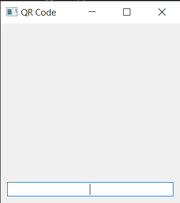

# 使用 PyQt5 构建二维码生成器应用

> 原文:[https://www . geesforgeks . org/building-QR-code-generator-application-use-pyqt 5/](https://www.geeksforgeeks.org/building-qr-code-generator-application-using-pyqt5/)

在本文中，我们将看到如何使用 PyQt5 制作一个二维码生成器应用程序。A **二维码**是 1994 年首次为日本汽车行业设计的一种矩阵条形码。条形码是一种机器可读的光学标签，包含与它所附着的物品有关的信息。下面是应用程序的外观


为了做到这一点，我们将使用下面给出的库

**PyQt5** 是跨平台的 GUI 工具包，一套针对 Qt v5 的 python 绑定。由于该库提供的工具和简单性，人们可以非常容易地开发交互式桌面应用程序。下面是安装 PyQt5 的命令

```py
pip install PyQt5
```

**二维码:**用于生成快速响应码是一种二维象形码，用于快速可读性和相对较大的存储容量。该代码由白色背景上以方形图案排列的黑色模块组成。编码的信息可以由任何类型的数据组成(例如，二进制、字母数字或汉字符号)。以下是安装二维码模块的命令

```py
pip install qrcode
```

> **实施步骤:**
> 1。创建一个继承二维码基础图像
> 2 的图像类。在图像类中，从边框和宽度获取尺寸，覆盖画师事件，创建一个初始图像并用白色填充
> 3。创建主窗口类
> 4。在窗口类中创建一个标签，显示二维码图像
> 5。创建行编辑以接收来自用户的文本
> 6。将标签和线编辑添加到垂直布局，并将布局设置到窗口
> 7。按下
> 8 时，在线编辑中添加动作。在行编辑动作内获取行编辑的文本
> 9。创建线编辑文本的位图图像，并使用图像类作为图像工厂
> 10。将位图(即二维码图像)设置为标签

下面是实现

```py
# importing libraries
from PyQt5.QtWidgets import * 
from PyQt5 import QtCore, QtGui
from PyQt5.QtGui import * 
from PyQt5.QtCore import * 
import qrcode
import sys

# Image class for QR code
class Image(qrcode.image.base.BaseImage):

    # constructor
    def __init__(self, border, width, box_size):

        # assigning border
        self.border = border

        # assigning  width
        self.width = width

        # assigning box size
        self.box_size = box_size

        # creating size
        size = (width + border * 2) * box_size

        # image
        self._image = QImage(size, size, QImage.Format_RGB16)

        # initial image as white
        self._image.fill(Qt.white)

    # pixmap method
    def pixmap(self):

        # returns image
        return QPixmap.fromImage(self._image)

    # drawrect method for drawing rectangle
    def drawrect(self, row, col):

        # creating painter object
        painter = QPainter(self._image)

        # drawing rectangle
        painter.fillRect(
            (col + self.border) * self.box_size,
            (row + self.border) * self.box_size,
            self.box_size, self.box_size,
            QtCore.Qt.black)

# Main Window class
class Window(QMainWindow):

    # constructor
    def __init__(self):
        QMainWindow.__init__(self)

        # setting window title
        self.setWindowTitle("QR Code")

        # setting geometry
        self.setGeometry(100, 100, 300, 300)

        # creating a label to show the qr code
        self.label = QLabel(self)

        # creating a line edit to receive text
        self.edit = QLineEdit(self)

        # adding action when entered is pressed
        self.edit.returnPressed.connect(self.handleTextEntered)

        # setting font to the line edit
        self.edit.setFont(QFont('Times', 9))

        # setting alignment
        self.edit.setAlignment(Qt.AlignCenter)

        # creating a vertical layout
        layout = QVBoxLayout(self)

        # adding label to the layput
        layout.addWidget(self.label)

        # adding line edit to the layout
        layout.addWidget(self.edit)

        # creating a QWidget object
        widget = QWidget()

        # setting layout to the widget
        widget.setLayout(layout)

        # setting widget as central widget to the main window
        self.setCentralWidget(widget)

    # method called by the line edit
    def handleTextEntered(self):

        # get the text
        text = self.edit.text()

        # creating a pix map of qr code
        qr_image = qrcode.make(text, image_factory = Image).pixmap()

        # set image to the label
        self.label.setPixmap(qr_image)

# create pyqt5 app
app = QApplication(sys.argv)

# create the instance of our Window
window = Window()

# showing window
window.show()

# start the app
sys.exit(app.exec_())
```

**输出:**


当用户在编辑行输入文本并按回车键时，将显示二维码，窗口大小将根据二维码的大小进行调整

