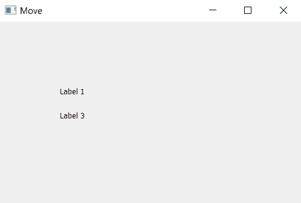

# 清除 PyQt5 中的()方法

> 原文:[https://www.geeksforgeeks.org/clear-method-in-pyqt5/](https://www.geeksforgeeks.org/clear-method-in-pyqt5/)

使用 PyQt5 时，需要移除或清除标签才能这样做【使用 T0】方法。该方法属于 **QLabel 类**，只能在标签小部件上使用。

> **语法:**label . clear()
> T3】参数:不需要参数。
> **执行的动作:**从主窗口清除(移除)标签。

下面是这个方法的实现。

**代码:**

```py
# importing the required libraries
from PyQt5.QtGui import * 
from PyQt5.QtWidgets import * 
import sys

class Window(QMainWindow):
    def __init__(self):
        super().__init__()

        # set the title
        self.setWindowTitle("Move")

        # setting  the geometry of window
        self.setGeometry(0, 0, 500, 300)

        # creating a label widget
        self.label1 = QLabel('Label 1', self)

        # moving the widget
        # move(left, top)
        self.label1.move(100, 100)

        # creating a label widget
        self.label2 = QLabel('Label 2 ', self)

        # moving the widget
        # move(left, top)
        self.label2.move(100, 120)

        # clearing label 2
        self.label2.clear()

        # creating a label widget
        self.label3 = QLabel('Label 3', self)

        # moving the widget
        # move(left, top)
        self.label3.move(100, 140)

        # show all the widgets
        self.show()

# create pyqt5 app
App = QApplication(sys.argv)

# create the instance of our Window
window = Window()

# start the app
sys.exit(App.exec())
```

**输出:**

如上图我们可以看到 Label2 因为`clear()`方法而不会被看到。